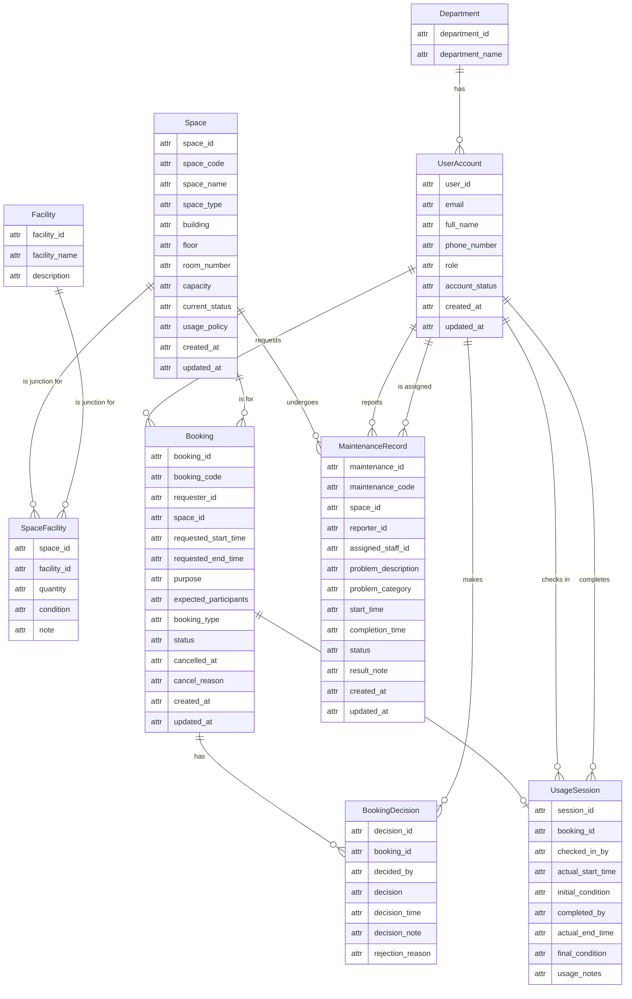

# Step 2: Conceptual ERD Design for G08

This document presents the conceptual Entity-Relationship Diagram (ERD) for the Campus Space Management System. The design is based on entities, attributes, and relationships identified in `01-business-req-analysis-G08.md` and the Project Specification (Spec §5). Per the project rules, this step is purely conceptual: `attr` is used as a generic placeholder type for Mermaid syntax, no PK/FK markers appear in the boxes, and identifying attributes are described in the narrative only. All attributes from Spec §5 are included, with `created_at` and `updated_at` present on core entities for traceability.

## 1. ERD Diagram

The following diagram uses Mermaid syntax with Crow's Foot notation. Entity boxes use a simple 2-column format with `attr` as a generic placeholder. Identifying attributes are documented in the narrative below, not marked inside the boxes.

## 2. Narrative Explanation

### Entities

- **Department**: Represents a university department, normalized into its own entity. A department may initially have zero users (lifecycle start-from-zero). **Identifying attribute:** `department_id`.

- **UserAccount**: Stores information about a system user. Every user belongs to a department and has a university account. Includes all attributes from Spec §5 (`user_id`, `email`, `full_name`, `phone_number`, `role`, `account_status`) plus `created_at` and `updated_at`. The department association is represented via the relationship line to Department, not as an attribute. **Identifying attribute:** `email` (a natural business identifier).

- **Space**: Represents a physical bookable room or area on campus. Includes all Spec §5 attributes (`space_id`, `space_code`, `space_name`, `space_type`, `building`, `floor`, `room_number`, `capacity`, `current_status`, `usage_policy`) plus `created_at` and `updated_at`. **Identifying attribute:** `space_code` (e.g., "B1-101").

- **Facility**: A master list of available equipment types or features. Includes `facility_id`, `facility_name`, and `description` per Spec §5. **Identifying attribute:** `facility_name` (e.g., "Projector", "Whiteboard").

- **SpaceFacility**: A junction entity resolving the many-to-many relationship between Space and Facility. Carries `space_id`, `facility_id`, `quantity`, `condition`, and `note` per Spec §5. No identifying attribute of its own — its identity is derived from the two connected entities. Per the Mermaid diagram, Space has a 1-N relationship to SpaceFacility, and Facility has a 1-N relationship to SpaceFacility.

- **Booking**: The core entity representing a request to use a space. Captures all Spec §5 attributes (`booking_id`, `booking_code`, `requester_id`, `space_id`, `requested_start_time`, `requested_end_time`, `purpose`, `expected_participants`, `booking_type`, `status`, `cancelled_at`, `cancel_reason`) plus `created_at` and `updated_at`. **Identifying attribute:** `booking_code`.

- **BookingDecision**: Records an approval or rejection event for a Booking. Includes `decision_id`, `booking_id`, `decided_by`, `decision`, `decision_time`, `decision_note`, and `rejection_reason` per Spec §5. The 1-N relationship with Booking (shown in the diagram as `Booking ||--o{ BookingDecision`) preserves a full audit trail. **Identifying attribute:** `decision_id`.

- **UsageSession**: Tracks the actual use of a space for a Booking, from check-in to completion. Includes `session_id`, `booking_id`, `checked_in_by`, `actual_start_time`, `initial_condition`, `completed_by`, `actual_end_time`, `final_condition`, and `usage_notes` per Spec §5. Has a 1-to-0..1 relationship with Booking (shown as `Booking ||--o| UsageSession`). **Identifying attribute:** `session_id`.

- **MaintenanceRecord**: Documents a maintenance issue for a specific Space. Includes all Spec §5 attributes (`maintenance_id`, `maintenance_code`, `space_id`, `reporter_id`, `assigned_staff_id`, `problem_description`, `problem_category`, `start_time`, `completion_time`, `status`, `result_note`) plus `created_at` and `updated_at`. **Identifying attribute:** `maintenance_code`.

### Relationships (with Cardinality and Participation)

The following table describes each relationship line exactly as it appears in the Mermaid diagram. Each row represents a direct connection between two entities, including connections to the junction table rather than the logical M-N between master entities.

| Left Entity | Crow's Foot | Right Entity | Explanation |
|---|---|---|---|
| Department | 1 -- 0..N | UserAccount | One department has zero or many users. Each user belongs to exactly one department. |
| UserAccount | 1 -- 0..N | Booking | One user requests zero or many bookings. Each booking is made by exactly one user. |
| Space | 1 -- 0..N | Booking | One space can be booked for zero or many sessions over time. Each booking is for exactly one space. |
| Booking | 1 -- 0..N | BookingDecision | One booking has zero or many decision records (audit trail). Each decision belongs to exactly one booking. |
| UserAccount | 1 -- 0..N | BookingDecision | One staff member makes zero or many booking decisions. Each decision is made by exactly one user. |
| Booking | 1 -- 0..1 | UsageSession | One booking results in at most one usage session. Each session belongs to exactly one booking. |
| UserAccount | 1 -- 0..N | UsageSession | One user checks in zero or many sessions. Each session is checked in by exactly one user. |
| UserAccount | 1 -- 0..N | UsageSession | One user completes zero or many sessions. Each session is completed by exactly one user. |
| Space | 1 -- 0..N | SpaceFacility | One space has zero or many facility entries in the junction table. |
| Facility | 1 -- 0..N | SpaceFacility | One facility appears in zero or many space-facility entries. |
| Space | 1 -- 0..N | MaintenanceRecord | One space has zero or many maintenance records over time. Each record is for exactly one space. |
| UserAccount | 1 -- 0..N | MaintenanceRecord | One user reports zero or many maintenance issues. Each record has exactly one reporter. |
| UserAccount | 1 -- 0..N | MaintenanceRecord | One user (staff) is assigned to zero or many maintenance tasks. Each record has exactly one assigned staff member. |

### Design Decisions

- **Full Spec §5 attribute coverage**: Every attribute listed in the Project Specification (Section 5) is included in the diagram as an `attr` descriptor. This includes technical identifiers (`user_id`, `space_id`, `booking_id`, etc.) which appear as regular descriptive attributes alongside business identifiers (`email`, `space_code`, `booking_code`). No PK/FK markers are used.

- **Consistency with Output 01 (Step Precedence Rule)**: Attribute names and entity structures align with `01-business-req-analysis-G08.md`. The `department` field is not duplicated as an attribute on UserAccount — the Department entity and the relationship line handle the association, matching Output 01's "Linked to Department" specification. The Department entity uses `department_id` per Output 01.

- **Business identifiers identified in narrative**: At the conceptual level, entities are identified by meaningful business fields (e.g., `email`, `space_code`, `facility_name`). These are documented in the entity descriptions above, not as PK markers in the diagram.

- **No PK/FK markers in diagram**: Entity boxes use only the `attr` placeholder type with no PK or FK markers.

- **No physical data types**: The `attr` placeholder type is used for all attributes; no `int`, `string`, `datetime`, or similar type annotations appear.

- **created_at and updated_at on core entities**: UserAccount, Space, Booking, and MaintenanceRecord all include `created_at` and `updated_at` attributes for lifecycle traceability.

- **Optionality for lifecycle start-from-zero**: All "one" sides use mandatory notation (`||`); all "many" and "zero-or-one" sides use optional notation (`o{` or `o|`).

- **Junction entity relationships described directly**: The narrative describes the Space-to-SpaceFacility and Facility-to-SpaceFacility 1-N connections exactly as drawn in the diagram, rather than describing a logical M-N between Space and Facility directly.

- **Booking-to-UsageSession as 1-to-0..1**: A booking produces at most one usage session; a session cannot exist without a booking.

- **BookingDecision 1-N for history**: One-to-many relationship allows full audit trail of approvals and rejections.
