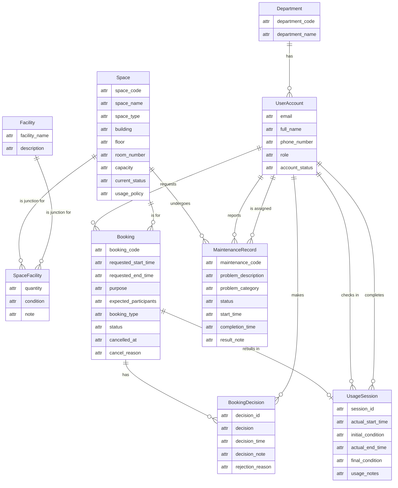

# Step 2: Conceptual ERD Design for G08

This document presents the conceptual Entity-Relationship Diagram (ERD) for the Campus Space Management System. The design is based on entities, attributes, and relationships identified in `01-business-req-analysis-G08.md`. Per the project rules, this step is purely conceptual: `attr` is used as a generic placeholder type for Mermaid syntax, no PK/FK markers appear in the boxes, and identifying attributes are described in the narrative only.

## 1. ERD Diagram

The following diagram uses Mermaid syntax with Crow's Foot notation. Entity boxes use a simple 2-column format with `attr` as a generic placeholder. Identifying attributes are documented in the narrative below, not marked inside the boxes.

## 2. Narrative Explanation

### Entities

- **Department**: Represents a university department. It is modeled as a mandatory, normalized entity. A department may initially have zero users (lifecycle start-from-zero). **Identifying attribute:** `department_code` (e.g., "CS", "EE").

- **UserAccount**: Stores information about a system user. Every user belongs to a department and has a university account. **Identifying attribute:** `email` (a natural business identifier, not a surrogate user_id).

- **Space**: Represents a physical bookable room or area on campus. **Identifying attribute:** `space_code` (e.g., "B1-101").

- **Facility**: A master list of available equipment types or features. **Identifying attribute:** `facility_name` (e.g., "Projector", "Whiteboard").

- **SpaceFacility**: A junction entity resolving the many-to-many relationship between Space and Facility. It carries descriptive attributes (quantity, condition, note) but no identifying attribute of its own — its identity is derived from the two connected entities. In the Mermaid diagram, the junction side (`SpaceFacility`) is mandatory while the master entity sides are optional, reflecting that a junction record always requires both a space and a facility.

- **Booking**: The core entity representing a request to use a space. It captures all request details, timing, purpose, status, and cancellation metadata. **Identifying attribute:** `booking_code` (a reference number assigned to each booking request).

- **BookingDecision**: Records an approval or rejection event for a Booking. The 1-N relationship with Booking preserves a full audit trail (a booking may be rejected then re-evaluated). **Identifying attribute:** `decision_id`, semantically a decision sequence number within the booking context.

- **UsageSession**: Tracks the actual use of a space for a Booking, from check-in to completion. It has a 1-to-0..1 relationship with Booking — a booking may never result in a session (e.g., if cancelled or a no-show), but a session cannot exist without a booking. **Identifying attribute:** `session_id`.

- **MaintenanceRecord**: Documents a maintenance issue for a specific Space. **Identifying attribute:** `maintenance_code` (a maintenance ticket reference number).

### Relationships (with Cardinality and Participation)

All relationships use **optional notation for the "many" side** per the lifecycle start-from-zero rule: entities start with zero dependent records.

| Left Entity | Relationship | Right Entity | Explanation |
|---|---|---|---|
| Department | 1 -- 0..N | UserAccount | A department exists independently and may have zero users initially. |
| UserAccount | 1 -- 0..N | Booking | A user may request zero or many bookings over time. |
| Space | 1 -- 0..N | Booking | A space may have zero bookings (e.g., newly created space). |
| Booking | 1 -- 0..N | BookingDecision | A booking may have zero decisions (still pending) or multiple decisions (audit trail). |
| UserAccount | 1 -- 0..N | BookingDecision | A staff member may make zero or many booking decisions. |
| Booking | 1 -- 0..1 | UsageSession | A booking may never produce a usage session (cancelled/no-show). Mandatory on the UsageSession side: each session belongs to exactly one booking. |
| UserAccount | 1 -- 0..N | UsageSession | A user may check in (or complete) zero or many sessions. |
| Space | 1 -- 0..N | SpaceFacility | A space may have zero or many facility entries. |
| Facility | 1 -- 0..N | SpaceFacility | A facility may be listed in zero or many spaces. |
| Space | 1 -- 0..N | MaintenanceRecord | A space may have zero or many maintenance records over time. |
| UserAccount | 1 -- 0..N | MaintenanceRecord | A user may report zero or many maintenance issues and be assigned to zero or many records. |

### Design Decisions

- **Business identifiers over surrogate keys**: At the conceptual level, entities are identified by meaningful business fields (e.g., `department_code`, `email`, `space_code`, `facility_name`, `booking_code`). Surrogate auto-increment IDs belong in Step 3 (Logical Design) and are intentionally absent here.

- **No PK/FK markers in diagram**: Per the latest AGENTS.md rule, entity boxes use only the `attr` placeholder type with no PK or FK markers. Identifying attributes are documented in the narrative, keeping the diagram clean and avoiding premature technical details.

- **No foreign key markers**: Relationships are represented solely through notation lines. Foreign key columns are a logical/physical implementation detail and do not appear at this stage.

- **No physical data types**: The `attr` placeholder type is used for all attributes in the Mermaid syntax; no `int`, `string`, `datetime`, or similar type annotations appear.

- **Optionality for lifecycle start-from-zero**: All "one" sides use mandatory notation (`||`) because those entities exist independently; all "many" and "zero-or-one" sides use optional notation (`o{` or `o|`) to reflect that dependent records accumulate over time and may start at zero.

- **Junction entity participation**: The `SpaceFacility` junction is treated as mandatory on the junction side (a junction record always requires both participating entities) but optional on the master entity sides (a space may have no facilities listed; a facility may not yet be installed in any space).

- **Booking-to-UsageSession as 1-to-0..1**: A booking produces at most one actual usage session, and a session cannot exist without a booking. This models the real-world constraint that check-in/check-out data is optional (a booking may be cancelled or result in a no-show).

- **BookingDecision 1-N for history**: Booking decision history is preserved via a one-to-many relationship, allowing a booking to be rejected and later approved, with each decision timestamped and attributed.
