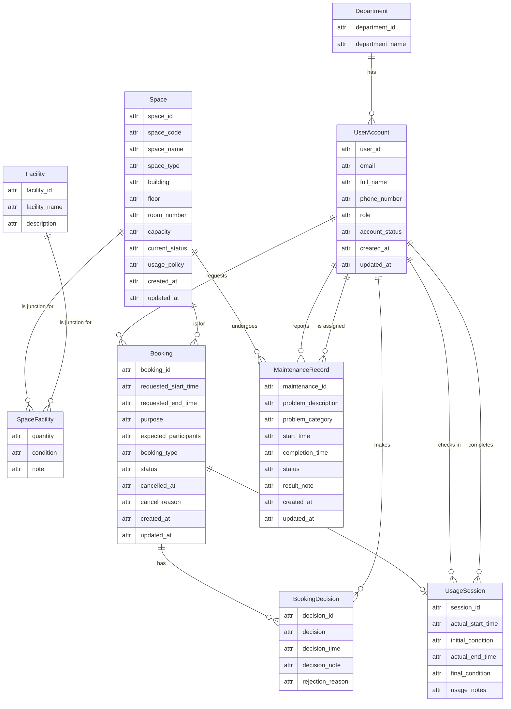

# Step 2: Conceptual ERD Design for G08

This document presents the conceptual Entity-Relationship Diagram (ERD) for the Campus Space Management System. The design is based on entities, attributes, and relationships identified in `01-business-req-analysis-G08.md`. Per the project rules, this step is purely conceptual: `attr` is used as a generic placeholder type for Mermaid syntax, no PK/FK markers appear in the boxes, and identifying attributes are described in the narrative only. Per the Home ID vs. Visitor ID rule, each entity contains only its own primary identifier and descriptive attributes; linking identifiers (Foreign Keys) are excluded and represented solely by Crow's Foot relationship lines. Core entities include `created_at` and `updated_at` as essential descriptive metadata per the Metadata Requirement.

## 1. ERD Diagram

The following diagram uses Mermaid syntax with Crow's Foot notation. Entity boxes use a simple 2-column format with `attr` as a generic placeholder. Identifying attributes are documented in the narrative below, not marked inside the boxes.

## 2. Narrative Explanation

### Entities

- **Department**: Represents a university department, normalized into its own entity. A department may initially have zero users (lifecycle start-from-zero). Its link to UserAccount is represented by the Crow's Foot line, not by an attribute inside either box. **Home ID:** `department_id`.

- **UserAccount**: Stores information about a system user. Every user belongs to a department and has a university account. The department association is represented by the relationship line to Department, not as a `department_id` attribute. Includes `created_at` and `updated_at` for lifecycle tracking. **Home ID:** `user_id`.

- **Space**: Represents a physical bookable room or area on campus. Includes `created_at` and `updated_at` for lifecycle tracking. **Home ID:** `space_id`.

- **Facility**: A master list of available equipment types or features. **Home ID:** `facility_id`.

- **SpaceFacility**: A junction entity resolving the many-to-many relationship between Space and Facility. Carries only descriptive junction attributes (quantity, condition, note). No `space_id` or `facility_id` appear in this box — the two relationship lines to Space and Facility represent those connections. As a junction, it has no independent Home ID; its identity is derived from the two connected entities.

- **Booking**: The core entity representing a request to use a space. Captures all request details (times, purpose, status, cancel info). Includes `created_at` and `updated_at` for lifecycle tracking. **Home ID:** `booking_id` (system ID only; `booking_code` is excluded per the Contextual Identifier Rule for transactional entities). The relationships to UserAccount ("requests") and Space ("is for") are handled by Crow's Foot lines — no `user_id` or `space_id` appear in the Booking box.

- **BookingDecision**: Records an approval or rejection event for a Booking. **Home ID:** `decision_id`. The link to Booking is represented by the `Booking ||--o{ BookingDecision` relationship line — no `booking_id` appears in this box. The link to the deciding staff member is represented by the `UserAccount ||--o{ BookingDecision` line.

- **UsageSession**: Tracks the actual use of a space for a Booking, from check-in to completion. **Home ID:** `session_id`. All links (to Booking, check-in staff, completion staff) are handled by Crow's Foot lines — no `booking_id`, `checked_in_by`, or `completed_by` appear in this box.

- **MaintenanceRecord**: Documents a maintenance issue for a specific Space. Includes `created_at` and `updated_at` for lifecycle tracking. **Home ID:** `maintenance_id` (system ID only; `maintenance_code` is excluded per the Contextual Identifier Rule for transactional entities). The relationships to Space, the reporter, and the assigned staff member are all handled by Crow's Foot lines — no `space_id`, `reporter_id`, or `assigned_staff_id` appear in this box.

### Relationships (with Cardinality and Participation)

Each row represents a direct connection between two entities exactly as drawn in the Mermaid diagram. Junction connections are described as 1-N to the junction table, not as the logical M-N between master entities.

| Left Entity | Crow's Foot | Right Entity | Explanation |
|---|---|---|---|
| Department | 1 -- 0..N | UserAccount | One department has zero or many users. Each user belongs to exactly one department. |
| UserAccount | 1 -- 0..N | Booking | One user requests zero or many bookings. Each booking is made by exactly one user. |
| Space | 1 -- 0..N | Booking | One space is booked for zero or many bookings. Each booking is for exactly one space. |
| Booking | 1 -- 0..N | BookingDecision | One booking has zero or many decisions (audit trail). Each decision belongs to exactly one booking. |
| UserAccount | 1 -- 0..N | BookingDecision | One staff member makes zero or many decisions. Each decision is made by exactly one user. |
| Booking | 1 -- 0..1 | UsageSession | One booking results in at most one session. Each session belongs to exactly one booking. |
| UserAccount | 1 -- 0..N | UsageSession | One user checks in zero or many sessions. Each session is checked in by exactly one user. |
| UserAccount | 1 -- 0..N | UsageSession | One user completes zero or many sessions. Each session is completed by exactly one user. |
| Space | 1 -- 0..N | SpaceFacility | One space has zero or many facility entries in the junction table. |
| Facility | 1 -- 0..N | SpaceFacility | One facility appears in zero or many space-facility entries. |
| Space | 1 -- 0..N | MaintenanceRecord | One space has zero or many maintenance records. Each record is for exactly one space. |
| UserAccount | 1 -- 0..N | MaintenanceRecord | One user reports zero or many issues. Each record has exactly one reporter. |
| UserAccount | 1 -- 0..N | MaintenanceRecord | One user (staff) is assigned to zero or many records. Each record is eventually assigned to a staff member for resolution. |

### Design Decisions

- **Home ID vs. Visitor ID applied strictly**: Each entity box contains only its own primary identifier (Home ID) and descriptive attributes. All Visitor IDs linking to other entities are purged — the relationship lines and narrative handle those connections.

- **SpaceFacility is purely descriptive**: The junction box carries only `quantity`, `condition`, and `note`. The two relationship lines to Space and Facility represent the linking logic that, in a physical schema, would become `space_id` and `facility_id` Foreign Key columns.

- **No physical implementation details**: The `attr` placeholder type is used for all attributes. No `int`, `string`, `datetime`, or `PK`/`FK` markers appear.

- **Metadata Requirement applied**: Core entities (UserAccount, Space, Booking, MaintenanceRecord) include `created_at` and `updated_at` as essential descriptive metadata per the SKILL.md Metadata Requirement. These are NOT linking IDs; they record when each record was created and last modified and are intrinsic to the domain's audit and traceability needs.

- **Contextual Identifier Rule applied**: Stable entities (Space) keep both system ID (`space_id`) and business code (`space_code`) — the room code is a stable, user-recognizable identifier. Transactional/event entities (Booking, MaintenanceRecord) carry only the system ID (`booking_id`, `maintenance_id`) — their identity is purely internal and does not need a human-readable code.

- **Consistency with Output 01**: Attribute names and entity structures align with `01-business-req-analysis-G08.md`. The `department` field is not an attribute on UserAccount — the relationship line handles the association.

- **Optionality for lifecycle start-from-zero**: All "one" sides use mandatory notation (`||`); all "many" and "zero-or-one" sides use optional notation (`o{` or `o|`).

- **Junction entity relationships described directly**: The narrative describes the Space-to-SpaceFacility and Facility-to-SpaceFacility 1-N connections exactly as drawn, rather than a logical M-N between Space and Facility.

- **Booking-to-UsageSession as 1-to-0..1**: A booking produces at most one usage session; a session cannot exist without a booking.

- **BookingDecision 1-N for history**: One-to-many relationship allows full audit trail of approvals and rejections.
