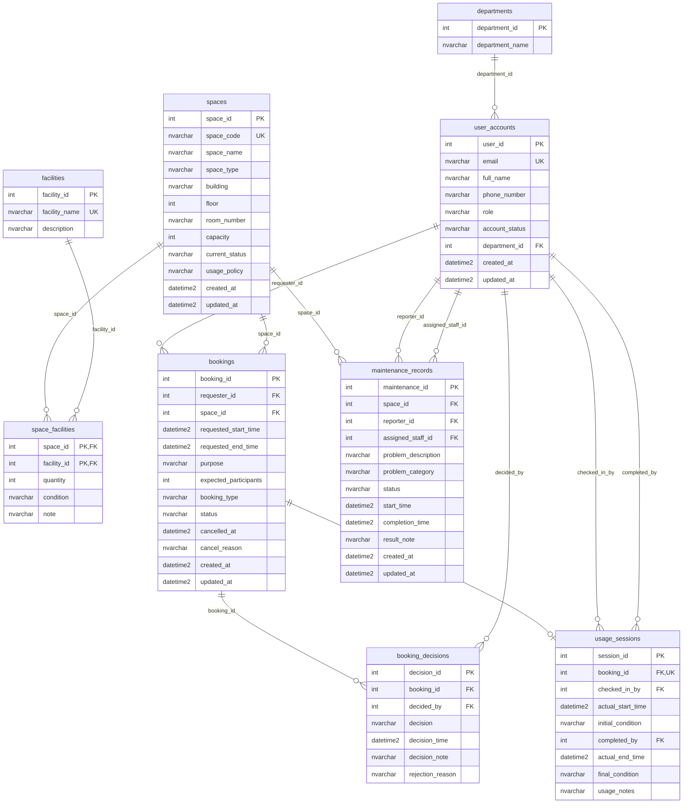

# Step 3: Logical Database Design for G08

This document presents the logical (relational) schema for the Campus Space Management System. It maps the conceptual entities and relationships from `02-erd-design-G08.md` into SQL Server tables. This is the stage where linking attributes (Foreign Keys), data types, constraints, and indexes are introduced. The Home IDs from the conceptual design become Primary Keys, and Visitor IDs (formerly Crow's Foot lines) become Foreign Key columns.

## 1. Schema Overview

The logical design consists of 9 tables derived from the 9 conceptual entities. Target DBMS: Microsoft SQL Server.

| Table | Conceptual Entity | Type | Description |
|---|---|---|---|
| `departments` | Department | Master | University departments |
| `user_accounts` | UserAccount | Master | System users with roles |
| `spaces` | Space | Master | Bookable campus spaces |
| `facilities` | Facility | Master | Equipment types catalogue |
| `space_facilities` | SpaceFacility | Junction | Facility assignments per space |
| `bookings` | Booking | Transaction | Space booking requests |
| `booking_decisions` | BookingDecision | Transaction | Approval/rejection audit trail |
| `usage_sessions` | UsageSession | Transaction | Actual check-in/check-out records |
| `maintenance_records` | MaintenanceRecord | Transaction | Space maintenance history |

## 2. Logical Schema Diagram

The following Mermaid `erDiagram` shows the logical schema with physical SQL Server types and constraint markers (`PK`, `FK`). This differs from the conceptual ERD by exposing data types, Foreign Key columns, and constraint markers.



## 3. Table Definitions

### 3.1 departments

| Column | Type | Constraints | Description |
|---|---|---|---|
| `department_id` | INT | `IDENTITY(1,1)`, `PRIMARY KEY` | Home ID / surrogate key |
| `department_name` | NVARCHAR(100) | `NOT NULL` | Full department name |

### 3.2 user_accounts

| Column | Type | Constraints | Description |
|---|---|---|---|
| `user_id` | INT | `IDENTITY(1,1)`, `PRIMARY KEY` | Home ID / surrogate key |
| `email` | NVARCHAR(255) | `NOT NULL`, `UNIQUE` | Natural business identifier |
| `full_name` | NVARCHAR(100) | `NOT NULL` | User's full name |
| `phone_number` | NVARCHAR(20) | `NULL` | Contact phone |
| `role` | NVARCHAR(30) | `NOT NULL`, `CHECK (role IN ('Student', 'Lecturer', 'TeachingAssistant', 'FacilityStaff', 'DepartmentAdministrator', 'FacilityManager'))` | System role |
| `account_status` | NVARCHAR(20) | `NOT NULL`, `DEFAULT 'Active'`, `CHECK (account_status IN ('Active', 'Inactive', 'Suspended'))` | Account state |
| `department_id` | INT | `NOT NULL`, `FOREIGN KEY REFERENCES departments(department_id)` | Visitor ID — links to Department |
| `created_at` | DATETIME2 | `NOT NULL`, `DEFAULT GETDATE()` | Record creation timestamp |
| `updated_at` | DATETIME2 | `NOT NULL`, `DEFAULT GETDATE()` | Last update timestamp |

### 3.3 spaces

| Column | Type | Constraints | Description |
|---|---|---|---|
| `space_id` | INT | `IDENTITY(1,1)`, `PRIMARY KEY` | Home ID / surrogate key |
| `space_code` | NVARCHAR(20) | `NOT NULL`, `UNIQUE` | Business identifier (e.g., B1-101) |
| `space_name` | NVARCHAR(100) | `NOT NULL` | Descriptive name |
| `space_type` | NVARCHAR(30) | `NOT NULL`, `CHECK (space_type IN ('Auditorium', 'Classroom', 'ComputerLaboratory', 'ProjectLaboratory', 'MeetingRoom', 'StudentWorkspace'))` | Type classification |
| `building` | NVARCHAR(100) | `NOT NULL` | Building name |
| `floor` | INT | `NOT NULL` | Floor number |
| `room_number` | NVARCHAR(20) | `NOT NULL` | Room identifier within building |
| `capacity` | INT | `NOT NULL`, `CHECK (capacity > 0)` | Maximum occupancy |
| `current_status` | NVARCHAR(20) | `NOT NULL`, `DEFAULT 'Available'`, `CHECK (current_status IN ('Available', 'InUse', 'UnderMaintenance', 'TemporarilyClosed', 'Retired'))` | Current space availability |
| `usage_policy` | NVARCHAR(MAX) | `NULL` | Rules for using this space |
| `created_at` | DATETIME2 | `NOT NULL`, `DEFAULT GETDATE()` | Record creation timestamp |
| `updated_at` | DATETIME2 | `NOT NULL`, `DEFAULT GETDATE()` | Last update timestamp |

### 3.4 facilities

| Column | Type | Constraints | Description |
|---|---|---|---|
| `facility_id` | INT | `IDENTITY(1,1)`, `PRIMARY KEY` | Home ID / surrogate key |
| `facility_name` | NVARCHAR(100) | `NOT NULL`, `UNIQUE` | Business identifier (e.g., Projector) |
| `description` | NVARCHAR(MAX) | `NULL` | Optional details |

### 3.5 space_facilities (Junction Table)

| Column | Type | Constraints | Description |
|---|---|---|---|
| `space_id` | INT | `NOT NULL`, `FOREIGN KEY REFERENCES spaces(space_id)` | Visitor ID — links to Space |
| `facility_id` | INT | `NOT NULL`, `FOREIGN KEY REFERENCES facilities(facility_id)` | Visitor ID — links to Facility |
| `quantity` | INT | `NOT NULL`, `DEFAULT 1`, `CHECK (quantity >= 0)` | Count of this facility in the space |
| `condition` | NVARCHAR(100) | `NULL` | Current condition description |
| `note` | NVARCHAR(MAX) | `NULL` | Additional notes |
| | | `PRIMARY KEY (space_id, facility_id)` | Composite PK |

### 3.6 bookings

| Column | Type | Constraints | Description |
|---|---|---|---|
| `booking_id` | INT | `IDENTITY(1,1)`, `PRIMARY KEY` | Home ID / surrogate key |
| `requester_id` | INT | `NOT NULL`, `FOREIGN KEY REFERENCES user_accounts(user_id)` | Visitor ID — the user who requested |
| `space_id` | INT | `NOT NULL`, `FOREIGN KEY REFERENCES spaces(space_id)` | Visitor ID — the space requested |
| `requested_start_time` | DATETIME2 | `NOT NULL` | Desired start time |
| `requested_end_time` | DATETIME2 | `NOT NULL`, `CHECK (requested_end_time > requested_start_time)` | Desired end time |
| `purpose` | NVARCHAR(MAX) | `NOT NULL` | Reason for booking |
| `expected_participants` | INT | `NOT NULL`, `CHECK (expected_participants > 0)` | Number of attendees |
| `booking_type` | NVARCHAR(30) | `NOT NULL`, `CHECK (booking_type IN ('Lecture', 'Examination', 'Seminar', 'Workshop', 'Meeting', 'StudentActivity', 'AdministrativeEvent', 'ResearchActivity', 'ProjectWork'))` | Type of event |
| `status` | NVARCHAR(20) | `NOT NULL`, `DEFAULT 'Pending'`, `CHECK (status IN ('Pending', 'Approved', 'Rejected', 'Cancelled', 'CheckedIn', 'Completed', 'NoShow'))` | Booking lifecycle status |
| `cancelled_at` | DATETIME2 | `NULL` | Timestamp of cancellation |
| `cancel_reason` | NVARCHAR(MAX) | `NULL` | Reason for cancellation |
| `created_at` | DATETIME2 | `NOT NULL`, `DEFAULT GETDATE()` | Record creation timestamp |
| `updated_at` | DATETIME2 | `NOT NULL`, `DEFAULT GETDATE()` | Last update timestamp |

### 3.7 booking_decisions

| Column | Type | Constraints | Description |
|---|---|---|---|
| `decision_id` | INT | `IDENTITY(1,1)`, `PRIMARY KEY` | Home ID / surrogate key |
| `booking_id` | INT | `NOT NULL`, `FOREIGN KEY REFERENCES bookings(booking_id)` | Visitor ID — the booking being decided |
| `decided_by` | INT | `NOT NULL`, `FOREIGN KEY REFERENCES user_accounts(user_id)` | Visitor ID — the staff member who decided |
| `decision` | NVARCHAR(10) | `NOT NULL`, `CHECK (decision IN ('Approved', 'Rejected'))` | Approval or rejection |
| `decision_time` | DATETIME2 | `NOT NULL`, `DEFAULT GETDATE()` | When the decision was made |
| `decision_note` | NVARCHAR(MAX) | `NULL` | Optional note explaining the decision |
| `rejection_reason` | NVARCHAR(MAX) | `NULL`, `CHECK (decision <> 'Rejected' OR rejection_reason IS NOT NULL)` | Required when decision = 'Rejected' |

### 3.8 usage_sessions

| Column | Type | Constraints | Description |
|---|---|---|---|
| `session_id` | INT | `IDENTITY(1,1)`, `PRIMARY KEY` | Home ID / surrogate key |
| `booking_id` | INT | `NOT NULL`, `UNIQUE`, `FOREIGN KEY REFERENCES bookings(booking_id)` | Visitor ID — 1-to-0..1 mapping |
| `checked_in_by` | INT | `NOT NULL`, `FOREIGN KEY REFERENCES user_accounts(user_id)` | Visitor ID — staff who checked in |
| `actual_start_time` | DATETIME2 | `NOT NULL` | Actual check-in time |
| `initial_condition` | NVARCHAR(MAX) | `NULL` | Space condition at check-in |
| `completed_by` | INT | `NULL`, `FOREIGN KEY REFERENCES user_accounts(user_id)`, `CHECK ((completed_by IS NULL AND actual_end_time IS NULL) OR (completed_by IS NOT NULL AND actual_end_time IS NOT NULL))` | Visitor ID — staff who completed |
| `actual_end_time` | DATETIME2 | `NULL`, `CHECK (actual_end_time IS NULL OR actual_end_time > actual_start_time)` | Actual check-out time |
| `final_condition` | NVARCHAR(MAX) | `NULL` | Space condition at check-out |
| `usage_notes` | NVARCHAR(MAX) | `NULL` | Notes from staff about the session |

### 3.9 maintenance_records

| Column | Type | Constraints | Description |
|---|---|---|---|
| `maintenance_id` | INT | `IDENTITY(1,1)`, `PRIMARY KEY` | Home ID / surrogate key |
| `space_id` | INT | `NOT NULL`, `FOREIGN KEY REFERENCES spaces(space_id)` | Visitor ID — the space needing maintenance |
| `reporter_id` | INT | `NOT NULL`, `FOREIGN KEY REFERENCES user_accounts(user_id)` | Visitor ID — who reported the issue |
| `assigned_staff_id` | INT | `NULL`, `FOREIGN KEY REFERENCES user_accounts(user_id)` | Visitor ID — staff assigned to fix |
| `problem_description` | NVARCHAR(MAX) | `NOT NULL` | Description of the issue |
| `problem_category` | NVARCHAR(50) | `NULL`, `CHECK (problem_category IN ('BrokenProjector', 'ACFailure', 'DamagedFurniture', 'CleaningIssue', 'NetworkProblem', 'Other'))` | Category of the problem |
| `status` | NVARCHAR(20) | `NOT NULL`, `DEFAULT 'Reported'`, `CHECK (status IN ('Reported', 'Assigned', 'InProgress', 'Completed', 'Cancelled'))` | Maintenance lifecycle status |
| `start_time` | DATETIME2 | `NOT NULL` | When maintenance started |
| `completion_time` | DATETIME2 | `NULL`, `CHECK (completion_time IS NULL OR completion_time > start_time)` | When maintenance was completed |
| `result_note` | NVARCHAR(MAX) | `NULL` | Outcome of the maintenance |
| `created_at` | DATETIME2 | `NOT NULL`, `DEFAULT GETDATE()` | Record creation timestamp |
| `updated_at` | DATETIME2 | `NOT NULL`, `DEFAULT GETDATE()` | Last update timestamp |

## 4. Relationship-to-Foreign-Key Mapping

This table traces each Crow's Foot relationship line from the conceptual ERD to its physical Foreign Key column(s).

| Left Entity | Right Entity | Cardinality | FK Column(s) | In Table | Notes |
|---|---|---|---|---|---|
| Department | UserAccount | 1 -- 0..N | `department_id` | `user_accounts` | |
| UserAccount | Booking | 1 -- 0..N | `requester_id` | `bookings` | |
| Space | Booking | 1 -- 0..N | `space_id` | `bookings` | |
| Booking | BookingDecision | 1 -- 0..N | `booking_id` | `booking_decisions` | |
| UserAccount | BookingDecision | 1 -- 0..N | `decided_by` | `booking_decisions` | |
| Booking | UsageSession | 1 -- 0..1 | `booking_id` | `usage_sessions` | `UNIQUE` constraint enforces 1-to-0..1 |
| UserAccount | UsageSession | 1 -- 0..N | `checked_in_by` | `usage_sessions` | "checks in" role |
| UserAccount | UsageSession | 1 -- 0..N | `completed_by` | `usage_sessions` | "completes" role |
| Space | SpaceFacility | 1 -- 0..N | `space_id` | `space_facilities` | Part of composite PK |
| Facility | SpaceFacility | 1 -- 0..N | `facility_id` | `space_facilities` | Part of composite PK |
| Space | MaintenanceRecord | 1 -- 0..N | `space_id` | `maintenance_records` | |
| UserAccount | MaintenanceRecord | 1 -- 0..N | `reporter_id` | `maintenance_records` | "reports" role |
| UserAccount | MaintenanceRecord | 1 -- 0..N | `assigned_staff_id` | `maintenance_records` | "is assigned" role |

## 5. Constraint Summary

### Primary Keys
| Table | PK Column(s) | Type |
|---|---|---|
| `departments` | `department_id` | Surrogate (IDENTITY) |
| `user_accounts` | `user_id` | Surrogate (IDENTITY) |
| `spaces` | `space_id` | Surrogate (IDENTITY) |
| `facilities` | `facility_id` | Surrogate (IDENTITY) |
| `space_facilities` | `(space_id, facility_id)` | Composite natural |
| `bookings` | `booking_id` | Surrogate (IDENTITY) |
| `booking_decisions` | `decision_id` | Surrogate (IDENTITY) |
| `usage_sessions` | `session_id` | Surrogate (IDENTITY) |
| `maintenance_records` | `maintenance_id` | Surrogate (IDENTITY) |

### Unique Constraints
| Table | Column(s) | Purpose |
|---|---|---|
| `user_accounts` | `email` | Natural business identifier |
| `spaces` | `space_code` | Business code uniqueness |
| `facilities` | `facility_name` | Business identifier |
| `usage_sessions` | `booking_id` | Enforces 1-to-0..1 relationship |

### Check Constraints
| Table | Constraint | Purpose |
|---|---|---|
| `user_accounts` | `role IN (...)` | Role whitelist |
| `user_accounts` | `account_status IN (...)` | Status whitelist |
| `spaces` | `space_type IN (...)` | Space type whitelist |
| `spaces` | `capacity > 0` | Valid capacity |
| `spaces` | `current_status IN (...)` | Status whitelist |
| `space_facilities` | `quantity >= 0` | Valid quantity |
| `bookings` | `requested_end_time > requested_start_time` | Valid time range |
| `bookings` | `expected_participants > 0` | Valid participant count |
| `bookings` | `booking_type IN (...)` | Booking type whitelist |
| `bookings` | `status IN (...)` | Status whitelist |
| `booking_decisions` | `decision IN ('Approved', 'Rejected')` | Decision values |
| `booking_decisions` | `decision <> 'Rejected' OR rejection_reason IS NOT NULL` | Rejection reason required when rejected |
| `usage_sessions` | `actual_end_time IS NULL OR actual_end_time > actual_start_time` | Valid time range |
| `usage_sessions` | `(completed_by IS NULL AND actual_end_time IS NULL) OR (completed_by IS NOT NULL AND actual_end_time IS NOT NULL)` | Paired null check for completion fields |
| `maintenance_records` | `problem_category IN (...)` | Category whitelist |
| `maintenance_records` | `status IN (...)` | Status whitelist |
| `maintenance_records` | `completion_time IS NULL OR completion_time > start_time` | Valid time range |

### Default Values
| Table | Column | Default | Purpose |
|---|---|---|---|
| `user_accounts` | `account_status` | `'Active'` | New users start active |
| `spaces` | `current_status` | `'Available'` | New spaces start available |
| `space_facilities` | `quantity` | `1` | Minimum reasonable default |
| `bookings` | `status` | `'Pending'` | New bookings start pending |
| `booking_decisions` | `decision_time` | `GETDATE()` | Decision time defaults to now |
| `maintenance_records` | `status` | `'Reported'` | New records start as reported |
| `user_accounts` | `created_at`, `updated_at` | `GETDATE()` | Record lifecycle |
| `spaces` | `created_at`, `updated_at` | `GETDATE()` | Record lifecycle |
| `bookings` | `created_at`, `updated_at` | `GETDATE()` | Record lifecycle |
| `maintenance_records` | `created_at`, `updated_at` | `GETDATE()` | Record lifecycle |

## 6. Index Recommendations

| Index | Table | Column(s) | Type | Rationale |
|---|---|---|---|---|
| `IX_user_accounts_department_id` | `user_accounts` | `department_id` | Non-clustered | FK lookup |
| `IX_spaces_current_status` | `spaces` | `current_status` | Non-clustered | Filter available spaces |
| `IX_spaces_space_type` | `spaces` | `space_type` | Non-clustered | Filter by type |
| `IX_bookings_requester_id` | `bookings` | `requester_id` | Non-clustered | FK lookup |
| `IX_bookings_space_id` | `bookings` | `space_id` | Non-clustered | FK lookup |
| `IX_bookings_status` | `bookings` | `status` | Non-clustered | Filter pending/approved |
| `IX_bookings_time_range` | `bookings` | `requested_start_time`, `requested_end_time` | Non-clustered | Overlap detection queries |
| `IX_bookings_requester_status` | `bookings` | `requester_id`, `status` | Non-clustered | User's booking history |
| `IX_booking_decisions_booking_id` | `booking_decisions` | `booking_id` | Non-clustered | FK lookup |
| `IX_usage_sessions_checked_in_by` | `usage_sessions` | `checked_in_by` | Non-clustered | FK lookup |
| `IX_maintenance_records_space_id` | `maintenance_records` | `space_id` | Non-clustered | FK lookup, space history |
| `IX_maintenance_records_status` | `maintenance_records` | `status` | Non-clustered | Filter active maintenance |
| `IX_space_facilities_facility_id` | `space_facilities` | `facility_id` | Non-clustered | FK lookup (PK covers space_id) |

## 7. Business Rule Enforcement Strategy

### Rule 1: No overlapping approved bookings for the same space

This rule cannot be enforced with a simple `CHECK` constraint because it requires comparing rows. Strategy:

**Application-layer enforcement** (recommended for this system):
Before inserting or updating a booking to `Approved` status, the application or stored procedure executes:

```sql
IF EXISTS (
    SELECT 1 FROM bookings
    WHERE space_id = @space_id
      AND status = 'Approved'
      AND booking_id <> @booking_id
      AND requested_start_time < @requested_end_time
      AND requested_end_time > @requested_start_time
)
BEGIN
    RAISERROR('Overlapping approved booking exists for this space.', 16, 1)
    ROLLBACK
END
```

An `AFTER INSERT, UPDATE` trigger on `bookings` can also enforce this at the database level. The trigger-based approach is the most robust for data integrity but may impact write performance under high concurrency.

### Rule 2: Cannot book a space that is under maintenance, closed, or retired

This can be enforced with a combination of a `CHECK` constraint and a trigger:

**Partial CHECK** — the booking's `status` values are already constrained via `CHECK`.

**Application/trigger logic** — before approving a booking, verify the space's `current_status` is `'Available'`:

```sql
IF EXISTS (
    SELECT 1 FROM spaces
    WHERE space_id = @space_id
      AND current_status IN ('UnderMaintenance', 'TemporarilyClosed', 'Retired')
)
BEGIN
    RAISERROR('Selected space is not available for booking.', 16, 1)
    ROLLBACK
END
```

### Selected Strategy

For this project, the accepted implementation (see Output 05) is a single **gated `AFTER INSERT, UPDATE` trigger** on `bookings` that enforces both rules:
- **Overlap check** applies only to rows that are or become `Approved`: it rejects a new/updated `Approved` booking that overlaps an existing `Approved` booking for the same space.
- **Unavailable-space check** applies only when a booking is placed into an active state (`Pending` or `Approved`); lifecycle updates such as `Completed`, `Cancelled`, or `NoShow` are **not** blocked merely because the space later became unavailable.
- On a violation the trigger rolls back the statement and raises an error.

An `AFTER` trigger is preferred over `INSTEAD OF` here because it keeps `IDENTITY` / `SCOPE_IDENTITY()` working and avoids manually re-implementing the INSERT/UPDATE. `INSTEAD OF` triggers, transaction-scoped stored procedures, or application-layer checks remain valid **alternative** strategies with different tradeoffs (e.g. `INSTEAD OF` validates before the write but breaks `SCOPE_IDENTITY()`).
