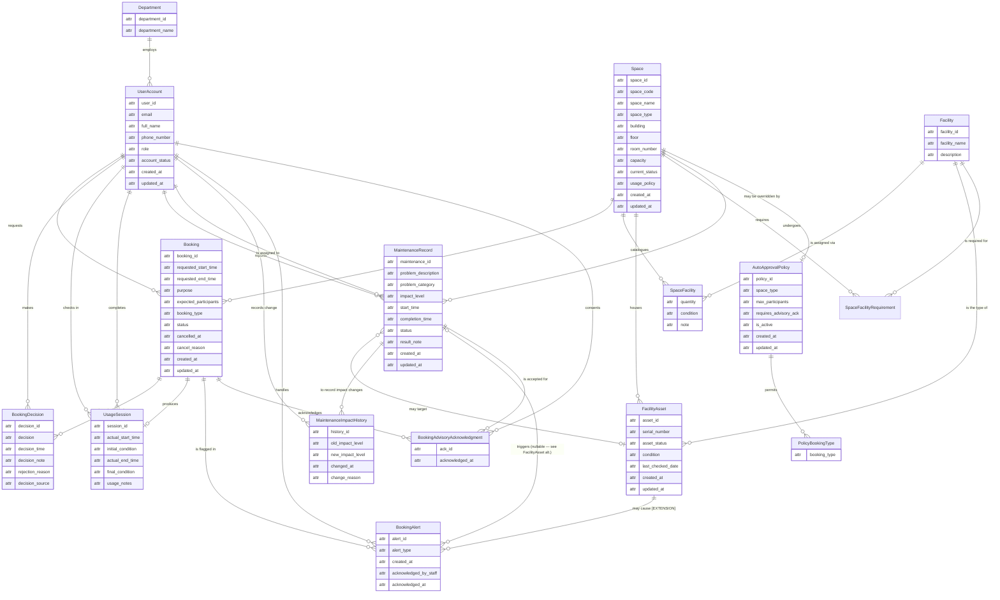
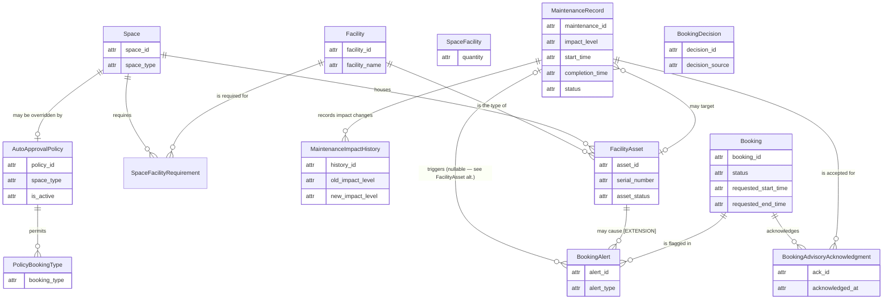

# Step 9: Updated ERD and Logical Design — G08 (Phase 2)

> **Document:** `outputs/09-updated-erd-and-logical-design-G08.md`
> **Phase:** Phase 2 — System Extension (CS486, Group G08)
> **Owner:** Trương Thị Mỹ Duyên — 24125028 (Senior Lead Database Architect & Concurrency Expert)
> **Inputs:** `08-requirement-change-analysis-G08.md` (Output 08), Phase 1 outputs 02–03 (`outputs/02-erd-design-G08.md`, `outputs/03-logical-design-G08.md`), `req/business-requirement-P2.md`, `CAMPUS_SPACE_MANAGEMENT_PROJECT_SPEC_P2.md`
> **Target DBMS:** Microsoft SQL Server (only permitted DBMS; 100% SQL Server syntax, no PostgreSQL constructs)
> **Status:** Final architectural baseline for Phase 2 — consumed by Tasks 10 (migration), 11–12 (concurrency), 14 (data generator), 15 (index tuning), 16 (analytical queries)

---

## 1. Purpose and Scope

This document is the **final architectural blueprint** of the Phase 2 system. It transforms the change analysis of Output 08 into a concrete, defensible design:

- An **updated Conceptual ERD** (16 entities, Mermaid Crow's Foot, conceptual purity preserved — `attr` placeholders, no PK/FK markers in boxes, Home ID / Visitor ID rule applied).
- A **Logical Schema Diagram** (16 tables, physical SQL Server types, PK/FK/UK markers, relationship lines labeled with the actual FK column names).
- A **table-by-table logical relational schema** with MS SQL Server types, PK/FK/UK markers, NULL/NOT NULL rules, defaults, and CHECK constraints.
- A **formal 3NF validation** for every added and modified table (1NF / 2NF / 3NF proofs with functional dependencies).
- A **professional indexing strategy** for high-load scenarios (semester-start concurrency peaks, room finder, escalation lookup).
- The **concurrency control design** (`SERIALIZABLE` + `UPDLOCK`/`HOLDLOCK` range locking, `sp_getapplock` alternative) embedded as logical-design notes.
- Edge-case coverage: race conditions, maintenance escalation, early check-out slot release, last-required-unit failure.

**Baseline integrity:** all 9 Phase 1 tables, their columns, and their status enums remain verbatim. Phase 2 only **adds** 7 tables and **extends** 2 tables; nothing is renamed or dropped. Historical records are preserved — no `ON DELETE CASCADE` anywhere.

**Scope discipline:** this document is design only — no DDL, no data, no trigger bodies. Physical implementation belongs to Task 10 (`10-schema-migration-G08.sql`); the locking procedures belong to Task 12.

---

## 2. Executive Summary of Architectural Changes

| # | Phase 1 (baseline) | Phase 2 (this design) | Primary deliverable |
|---|---|---|---|
| 1 | Facilities tracked as a quantity count (`space_facilities.quantity`) | Individual units in **`facility_assets`** with unique `serial_number` and per-unit `asset_status`; `space_facilities` remains a catalogue junction; counts **derived** via view `v_space_facility_summary` | `facility_assets` **[Added]** |
| 2 | Maintenance targets a space only; any maintenance blocks the space | Maintenance carries **`impact_level`** (`Advisory` / `OutOfService`); may optionally target a specific **`asset_id`**; only `OutOfService` blocks; `Advisory` requires per-booking acknowledgement | `maintenance_records` **[Modified]**, `facility_assets` **[Added]** |
| 3 | Reserved window (`requested_*_time`) used for all conflict checks | **Status-driven interval selection:** `Approved`/`CheckedIn` block with the reserved interval; `Completed` blocks nothing → **early check-out releases the remaining window immediately** (derived fact, no trigger/timer/flag) | no new columns — `bookings` + `usage_sessions` used as designed |
| 4 | Advisory consent not modeled | **`booking_advisory_acknowledgments`** records that the requester was shown and accepted each active advisory for a booking; `UNIQUE (booking_id, maintenance_id)` | `booking_advisory_acknowledgments` **[Added]** |
| 5 | Approval is staff-only (`booking_decisions.decided_by NOT NULL`) | **`decision_source`** (`Staff`/`System`) distinguishes auto-approval; `decided_by` nullable under a same-table CHECK pairing source with null-ness | `booking_decisions` **[Modified]** |
| 6 | Overlap prevented by `AFTER` trigger only (statement-time validation) | Trigger demoted to **backstop**; primary mechanism = `SERIALIZABLE` transactions with `WITH (UPDLOCK, HOLDLOCK)` key-range locking (or `sp_getapplock`) in stored procedures; retry on 1205/1222 | concurrency notes (Section 9), procedures in Task 12 |
| 7 | Escalation not modeled | **`maintenance_impact_history`** (audit trail) + **`booking_alerts`** (persisted escalation + [EXTENSION] required-asset relocation alerts) | 2 tables **[Added]** |
| 8 | Auto-approval not modeled | **`auto_approval_policies`** + **`policy_booking_types`** configure eligible space types/booking types | 2 tables **[Added]** |
| 9 | Required-facility semantics not modeled | **`space_facility_requirements`** (sparse list — presence = required) blocks booking when the last available unit of a required facility is down | `space_facility_requirements` **[Added]** |

**Table inventory after Phase 2: 16 tables** = 9 Phase 1 (2 modified, 7 untouched) + 7 new.

| Table | Status in Phase 2 |
|---|---|
| `departments`, `user_accounts`, `spaces`, `facilities`, `space_facilities`, `bookings`, `usage_sessions` | **[Unchanged]** Phase 1 |
| `maintenance_records`, `booking_decisions` | **[Modified]** — additive columns only |
| `facility_assets`, `space_facility_requirements`, `maintenance_impact_history`, `booking_advisory_acknowledgments`, `auto_approval_policies`, `policy_booking_types`, `booking_alerts` | **[Added]** |

---

## 3. Updated Conceptual ERD

### 3.1 Full conceptual diagram (16 entities)

Per Phase 1 conventions: 2-column entity boxes, `attr` as the generic placeholder type, **no PK/FK markers**, no linking identifiers inside boxes (Home ID / Visitor ID rule — relationship lines carry the connections), optional `o{`/`o|` on every many/zero-or-one side (lifecycle start-from-zero).



### 3.2 Phase 2 delta (new/modified entities only)



### 3.3 Narrative — new and modified conceptual entities

- **FacilityAsset** — an individual, uniquely identifiable unit of a Facility type (e.g., "Projector #001"). **Home ID:** `asset_id`; business identifier `serial_number` (Contextual Identifier Rule: a stable asset keeps both). `asset_status` is its availability (`Available`, `InUse`, `UnderMaintenance`, `Retired`). Each unit is "the type of" exactly one Facility and is "housed in" exactly one Space (its current location).

- **SpaceFacilityRequirement** — resolves the M–N "which facility types must be available for a space to be bookable" between Space and Facility. Sparse by design: **presence of a row means the facility type is required** — the junction carries no attribute column, so the semantics are purely structural: inserting a row declares "required"; absence means optional.

- **MaintenanceRecord (modified)** — now carries `impact_level` (`Advisory` / `OutOfService`) and **may target** one FacilityAsset (the `}o--o|` line reads: a record may target zero or one asset; an asset may be targeted by zero or many records). A record always refers to exactly one Space; when it also targets an asset, that asset must be currently housed in that space.

- **MaintenanceImpactHistory** — the audit trail of every `impact_level` change (escalation/downgrade) on a record. Each row records the previous level, the new level, when, by whom, and why. The first row of a record has `old_impact_level = NULL` (creation level).

- **BookingAdvisoryAcknowledgment** — the legal-consent junction between Booking and MaintenanceRecord: one row per (booking, advisory) pair records that the requester accepted that specific advisory. The M–N "bookings ↔ maintenance records" is resolved into two 1–N legs through this associative entity.

- **AutoApprovalPolicy** — configures which Space types (or a specific Space override) may auto-approve at submission time, plus eligibility limits. The link to Space is optional (`Space ||--o| AutoApprovalPolicy`): a policy applies either to a `space_type` (enum, no FK) or to exactly one specific space.

- **PolicyBookingType** — junction carrying the allowed `booking_type` values per policy (SQL Server has no array type).

- **BookingAlert** — a persisted alert row with two source scopes: (a) **escalation-result**: when a maintenance record is escalated to `OutOfService`, every already-`Approved`/`CheckedIn` booking overlapping the maintenance window is flagged here so staff can act on it (the escalation lookup of report (d), §1.3); (b) **[EXTENSION] relocation-result**: when a required asset is relocated out of a space, every `Approved`/`CheckedIn` booking of that space is flagged (`RequiredAssetRelocated`). Exactly one source column is set per row (`maintenance_id` XOR `asset_id`).

- **BookingDecision (modified)** — adds `decision_source` (`Staff` / `System`). A System decision (auto-approval) has no staff actor; the deciding-user relationship becomes 1 → 0..1.

### 3.4 Relationship table (conceptual, Crow's Foot)

| Left Entity | Crow's Foot | Right Entity | Explanation |
|---|---|---|---|
| Facility | 1 -- 0..N | FacilityAsset | One facility type has zero or many units; each unit is of exactly one type. |
| Space | 1 -- 0..N | FacilityAsset | One space houses zero or many units; each unit currently sits in exactly one space. |
| Space | 1 -- 0..N | SpaceFacilityRequirement | One space requires zero or many facility types. |
| Facility | 1 -- 0..N | SpaceFacilityRequirement | One facility type is required by zero or many spaces. |
| MaintenanceRecord | 0..N -- 0..1 | FacilityAsset | A record may target zero or one asset; an asset may be targeted by zero or many records. |
| MaintenanceRecord | 1 -- 0..N | MaintenanceImpactHistory | One record has zero or many impact-change entries; each entry belongs to exactly one record. |
| UserAccount | 1 -- 0..N | MaintenanceImpactHistory | One user records zero or many impact changes; each change is recorded by exactly one user. |
| MaintenanceRecord | 0..1 -- 0..N | BookingAlert | A record triggers zero or many alerts; an alert references zero or one record (NULL when the alert is asset-caused). |
| FacilityAsset | 1 -- 0..N | BookingAlert | [EXTENSION] One asset may cause zero or many relocation alerts. |
| Booking | 1 -- 0..N | BookingAlert | One booking is flagged in zero or many alerts. |
| UserAccount | 1 -- 0..N | BookingAlert | One staff user handles zero or many alerts. |
| Booking | 1 -- 0..N | BookingAdvisoryAcknowledgment | One booking acknowledges zero or many advisories. |
| MaintenanceRecord | 1 -- 0..N | BookingAdvisoryAcknowledgment | One advisory is accepted in zero or many bookings. |
| UserAccount | 1 -- 0..N | BookingAdvisoryAcknowledgment | One user consents to zero or many acknowledgements. |
| Space | 1 -- 0..1 | AutoApprovalPolicy | One space may have at most one specific-space override policy. |
| AutoApprovalPolicy | 1 -- 0..N | PolicyBookingType | One policy permits zero or many booking types. |

The 13 Phase 1 relationships (Output 02) are unchanged; the only cardinality "shape" change in Phase 2 is the deciding-user leg of BookingDecision becoming 1 → 0..1 (System decisions have no staff actor).

### 3.5 Home ID / Visitor ID mapping for new relationships

| Home ID (defining entity) | Visitor copies (linking columns) |
|---|---|
| `facility_id` (facilities) | `facility_assets.facility_id`, `space_facility_requirements.facility_id` |
| `space_id` (spaces) | `facility_assets.space_id`, `space_facility_requirements.space_id`, `auto_approval_policies.space_id` |
| `maintenance_id` (maintenance_records) | `maintenance_impact_history.maintenance_id`, `booking_alerts.maintenance_id`, `booking_advisory_acknowledgments.maintenance_id` |
| `booking_id` (bookings) | `booking_alerts.booking_id`, `booking_advisory_acknowledgments.booking_id` |
| `user_id` (user_accounts) | `maintenance_impact_history.changed_by`, `booking_advisory_acknowledgments.acknowledged_by`, `booking_alerts.acknowledged_by_staff_id` |
| `asset_id` (facility_assets) | `maintenance_records.asset_id`, `booking_alerts.asset_id` |

---

## 4. Logical Schema Diagram

Physical diagram with SQL Server types and `PK`/`FK`/`UK` markers; relationship lines are labeled with the **actual FK column name** (per the Step 3 labeling rule). Mermaid does not support marker modifiers, so the `FK` marker does not imply nullability — nullable FK columns are flagged with `%%` comments in the diagram, and the authoritative NULL/NOT NULL rules are given in the Section 5 table definitions.

```mermaid
erDiagram
    %% Mermaid does not support FK* markers, so the FK marker here does NOT imply nullability.
    %% Nullable FK columns (authoritative NULL/NOT NULL rules in the Section 5 table definitions):
    %%   booking_decisions.decided_by               (NULL when decision_source = N'System')
    %%   usage_sessions.completed_by                 (NULL until check-out)
    %%   maintenance_records.assigned_staff_id       (NULL until a staff member is assigned)
    %%   maintenance_records.asset_id                (NULL = space-level record)
    %%   auto_approval_policies.space_id             (NULL = type-wide policy)
    %%   booking_alerts.maintenance_id / asset_id    (NULL per source scope — exactly one set by alert_type)
    %%   booking_alerts.acknowledged_by_staff_id     (NULL until handled by staff)

    departments {
        int department_id PK
        nvarchar department_name
    }

    user_accounts {
        int user_id PK
        nvarchar email UK
        nvarchar full_name
        nvarchar phone_number
        nvarchar role
        nvarchar account_status
        int department_id FK
        datetime2 created_at
        datetime2 updated_at
    }

    spaces {
        int space_id PK
        nvarchar space_code UK
        nvarchar space_name
        nvarchar space_type
        nvarchar building
        int floor
        nvarchar room_number
        int capacity
        nvarchar current_status
        nvarchar usage_policy
        datetime2 created_at
        datetime2 updated_at
    }

    facilities {
        int facility_id PK
        nvarchar facility_name UK
        nvarchar description
    }

    space_facilities {
        int space_id PK, FK
        int facility_id PK, FK
        int quantity
        nvarchar condition
        nvarchar note
    }

    facility_assets {
        int asset_id PK
        int facility_id FK
        int space_id FK
        nvarchar serial_number UK
        nvarchar asset_status
        nvarchar condition
        date last_checked_date
        datetime2 created_at
        datetime2 updated_at
    }

    %% space_facility_requirements: sparse junction — presence of a row means "required"; no attribute column
    space_facility_requirements {
        int space_id PK, FK
        int facility_id PK, FK
    }

    bookings {
        int booking_id PK
        int requester_id FK
        int space_id FK
        datetime2 requested_start_time
        datetime2 requested_end_time
        nvarchar purpose
        int expected_participants
        nvarchar booking_type
        nvarchar status
        datetime2 cancelled_at
        nvarchar cancel_reason
        datetime2 created_at
        datetime2 updated_at
    }

    booking_decisions {
        int decision_id PK
        int booking_id FK
        int decided_by FK
        nvarchar decision
        datetime2 decision_time
        nvarchar decision_note
        nvarchar rejection_reason
        nvarchar decision_source
    }

    usage_sessions {
        int session_id PK
        int booking_id FK, UK
        int checked_in_by FK
        datetime2 actual_start_time
        nvarchar initial_condition
        int completed_by FK
        datetime2 actual_end_time
        nvarchar final_condition
        nvarchar usage_notes
    }

    maintenance_records {
        int maintenance_id PK
        int space_id FK
        int reporter_id FK
        int assigned_staff_id FK
        int asset_id FK
        nvarchar problem_description
        nvarchar problem_category
        nvarchar impact_level
        nvarchar status
        datetime2 start_time
        datetime2 completion_time
        nvarchar result_note
        datetime2 created_at
        datetime2 updated_at
    }

    maintenance_impact_history {
        int history_id PK
        int maintenance_id FK
        int changed_by FK
        nvarchar old_impact_level
        nvarchar new_impact_level
        datetime2 changed_at
        nvarchar change_reason
    }

    %% booking_advisory_acknowledgments: (booking_id, maintenance_id) together form ONE composite Unique Key
    %% (UQ_booking_advisory_acknowledgments_booking_maintenance), NOT two individual UNIQUE constraints.
    booking_advisory_acknowledgments {
        int ack_id PK
        int booking_id FK, UK
        int maintenance_id FK, UK
        int acknowledged_by FK
        datetime2 acknowledged_at
    }

    auto_approval_policies {
        int policy_id PK
        nvarchar space_type
        int space_id FK, UK
        int max_participants
        bit requires_advisory_ack
        bit is_active
        datetime2 created_at
        datetime2 updated_at
    }

    policy_booking_types {
        int policy_id PK, FK
        nvarchar booking_type PK
    }

    %% booking_alerts: source scope is exactly one of maintenance_id (alert_type = MaintenanceEscalated)
    %% or asset_id (alert_type = RequiredAssetRelocated) — XOR, enforced by CK_booking_alerts_source_scope.
    booking_alerts {
        int alert_id PK
        int maintenance_id FK
        int asset_id FK
        int booking_id FK
        nvarchar alert_type
        datetime2 created_at
        int acknowledged_by_staff_id FK
        datetime2 acknowledged_at
    }

    departments ||--o{ user_accounts : "department_id"
    user_accounts ||--o{ bookings : "requester_id"
    spaces ||--o{ bookings : "space_id"
    bookings ||--o{ booking_decisions : "booking_id"
    user_accounts ||--o{ booking_decisions : "decided_by"
    bookings ||--o| usage_sessions : "booking_id"
    user_accounts ||--o{ usage_sessions : "checked_in_by"
    user_accounts ||--o{ usage_sessions : "completed_by"
    spaces ||--o{ space_facilities : "space_id"
    facilities ||--o{ space_facilities : "facility_id"
    facilities ||--o{ facility_assets : "facility_id"
    spaces ||--o{ facility_assets : "space_id"
    spaces ||--o{ space_facility_requirements : "space_id"
    facilities ||--o{ space_facility_requirements : "facility_id"
    spaces ||--o{ maintenance_records : "space_id"
    user_accounts ||--o{ maintenance_records : "reporter_id"
    user_accounts ||--o{ maintenance_records : "assigned_staff_id"
    maintenance_records }o--o| facility_assets : "asset_id"
    maintenance_records ||--o{ maintenance_impact_history : "maintenance_id"
    user_accounts ||--o{ maintenance_impact_history : "changed_by"
    maintenance_records |o--o{ booking_alerts : "maintenance_id"
    facility_assets ||--o{ booking_alerts : "asset_id"
    bookings ||--o{ booking_alerts : "booking_id"
    user_accounts ||--o{ booking_alerts : "acknowledged_by_staff_id"
    bookings ||--o{ booking_advisory_acknowledgments : "booking_id"
    maintenance_records ||--o{ booking_advisory_acknowledgments : "maintenance_id"
    user_accounts ||--o{ booking_advisory_acknowledgments : "acknowledged_by"
    spaces ||--o| auto_approval_policies : "space_id"
    auto_approval_policies ||--o{ policy_booking_types : "policy_id"
```



---

## 5. Table-by-Table Logical Relational Schema

Conventions: `INT IDENTITY(1,1)` surrogate keys; `DATETIME2` timestamps; `NVARCHAR` text; enums as `NVARCHAR` + CHECK (PascalCase values); no `ON DELETE CASCADE` (historical preservation). **All constraints are explicitly named using the `CONSTRAINT [Name] [Type]` convention** (e.g., `CONSTRAINT UQ_booking_advisory_acknowledgments_booking_maintenance UNIQUE (booking_id, maintenance_id)`); DEFAULT constraints follow `CONSTRAINT DF_<table>_<column> DEFAULT <value>`. **[P1]** = Phase 1 baseline (verbatim), **[MOD]** = Phase 1 extended additively, **[NEW]** = Phase 2 addition.

### 5.1 departments [P1 — unchanged]

| Column | Type | Null | Constraints | Description |
|---|---|---|---|---|
| `department_id` | INT | NOT NULL | `IDENTITY(1,1)`, `CONSTRAINT PK_departments PRIMARY KEY (department_id)` | Home ID |
| `department_name` | NVARCHAR(100) | NOT NULL | | Full name |

### 5.2 user_accounts [P1 — unchanged]

| Column | Type | Null | Constraints | Description |
|---|---|---|---|---|
| `user_id` | INT | NOT NULL | `IDENTITY(1,1)`, `CONSTRAINT PK_user_accounts PRIMARY KEY (user_id)` | Home ID |
| `email` | NVARCHAR(255) | NOT NULL | `CONSTRAINT UQ_user_accounts_email UNIQUE (email)` | Natural business identifier |
| `full_name` | NVARCHAR(100) | NOT NULL | | |
| `phone_number` | NVARCHAR(20) | NULL | | |
| `role` | NVARCHAR(30) | NOT NULL | `CONSTRAINT CK_user_accounts_role CHECK (role IN (N'Student',N'Lecturer',N'TeachingAssistant',N'FacilityStaff',N'DepartmentAdministrator',N'FacilityManager'))` | |
| `account_status` | NVARCHAR(20) | NOT NULL | `CONSTRAINT DF_user_accounts_account_status DEFAULT N'Active'`, `CONSTRAINT CK_user_accounts_account_status CHECK (account_status IN (N'Active',N'Inactive',N'Suspended'))` | |
| `department_id` | INT | NOT NULL | `CONSTRAINT FK_user_accounts_department_id FOREIGN KEY (department_id) REFERENCES departments(department_id)` | Visitor ID |
| `created_at` | DATETIME2 | NOT NULL | `CONSTRAINT DF_user_accounts_created_at DEFAULT GETDATE()` | |
| `updated_at` | DATETIME2 | NOT NULL | `CONSTRAINT DF_user_accounts_updated_at DEFAULT GETDATE()` | |

### 5.3 spaces [P1 — unchanged]

| Column | Type | Null | Constraints | Description |
|---|---|---|---|---|
| `space_id` | INT | NOT NULL | `IDENTITY(1,1)`, `CONSTRAINT PK_spaces PRIMARY KEY (space_id)` | Home ID |
| `space_code` | NVARCHAR(20) | NOT NULL | `CONSTRAINT UQ_spaces_space_code UNIQUE (space_code)` | Business identifier (e.g., B1-101) |
| `space_name` | NVARCHAR(100) | NOT NULL | | |
| `space_type` | NVARCHAR(30) | NOT NULL | `CONSTRAINT CK_spaces_space_type CHECK (space_type IN (N'Auditorium',N'Classroom',N'ComputerLaboratory',N'ProjectLaboratory',N'MeetingRoom',N'StudentWorkspace'))` | |
| `building` | NVARCHAR(100) | NOT NULL | | |
| `floor` | INT | NOT NULL | | |
| `room_number` | NVARCHAR(20) | NOT NULL | | |
| `capacity` | INT | NOT NULL | `CONSTRAINT CK_spaces_capacity CHECK (capacity > 0)` | |
| `current_status` | NVARCHAR(20) | NOT NULL | `CONSTRAINT DF_spaces_current_status DEFAULT N'Available'`, `CONSTRAINT CK_spaces_current_status CHECK (current_status IN (N'Available',N'InUse',N'UnderMaintenance',N'TemporarilyClosed',N'Retired'))` | **UI display only** — never a booking-blocking predicate for maintenance (Output 08 §4.1) |
| `usage_policy` | NVARCHAR(MAX) | NULL | | |
| `created_at` | DATETIME2 | NOT NULL | `CONSTRAINT DF_spaces_created_at DEFAULT GETDATE()` | |
| `updated_at` | DATETIME2 | NOT NULL | `CONSTRAINT DF_spaces_updated_at DEFAULT GETDATE()` | |

### 5.4 facilities [P1 — unchanged]

| Column | Type | Null | Constraints | Description |
|---|---|---|---|---|
| `facility_id` | INT | NOT NULL | `IDENTITY(1,1)`, `CONSTRAINT PK_facilities PRIMARY KEY (facility_id)` | Home ID |
| `facility_name` | NVARCHAR(100) | NOT NULL | `CONSTRAINT UQ_facilities_facility_name UNIQUE (facility_name)` | Catalogue type name (e.g., 'Projector') |
| `description` | NVARCHAR(MAX) | NULL | | |

### 5.5 space_facilities [P1 — unchanged; role redefined as Catalogue Type Junction]

| Column | Type | Null | Constraints | Description |
|---|---|---|---|---|
| `space_id` | INT | NOT NULL | `CONSTRAINT PK_space_facilities PRIMARY KEY (space_id, facility_id)`, `CONSTRAINT FK_space_facilities_space_id FOREIGN KEY (space_id) REFERENCES spaces(space_id)` | Visitor ID |
| `facility_id` | INT | NOT NULL | `CONSTRAINT FK_space_facilities_facility_id FOREIGN KEY (facility_id) REFERENCES facilities(facility_id)` | Visitor ID |
| `quantity` | INT | NOT NULL | `CONSTRAINT DF_space_facilities_quantity DEFAULT 1`, `CONSTRAINT CK_space_facilities_quantity CHECK (quantity >= 0)` | **Catalogue metadata only** — not synchronized with asset rows |
| `condition` | NVARCHAR(100) | NULL | | |
| `note` | NVARCHAR(MAX) | NULL | | |

**Role note — Catalogue Type Junction:** `space_facilities` is now the **catalogue-type junction** between `spaces` and `facilities`: its row set declares *which facility types a space is equipped with* (and, via `quantity`, the catalogue metadata for that type). It holds **no unit identity** — the actual physical units are tracked individually in `facility_assets` (Section 5.6), which carry the `serial_number`, per-unit `asset_status`, and current location. Storing `quantity` (catalogue) alongside deriving unit counts from asset rows is intentional and documented (Output 08 §2.3) — the derived count is never written, avoiding a 3NF duplication.

### 5.6 facility_assets [NEW] — granular asset tracking

| Column | Type | Null | Constraints | Description |
|---|---|---|---|---|
| `asset_id` | INT | NOT NULL | `IDENTITY(1,1)`, `CONSTRAINT PK_facility_assets PRIMARY KEY (asset_id)` | Home ID |
| `facility_id` | INT | NOT NULL | `CONSTRAINT FK_facility_assets_facility_id FOREIGN KEY (facility_id) REFERENCES facilities(facility_id)` | Visitor ID — catalogue type |
| `space_id` | INT | NOT NULL | `CONSTRAINT FK_facility_assets_space_id FOREIGN KEY (space_id) REFERENCES spaces(space_id)` | Visitor ID — current location |
| `serial_number` | NVARCHAR(50) | NOT NULL | `CONSTRAINT UQ_facility_assets_serial_number UNIQUE (serial_number)` | Business identifier — unique per unit |
| `asset_status` | NVARCHAR(20) | NOT NULL | `CONSTRAINT DF_facility_assets_asset_status DEFAULT N'Available'`, `CONSTRAINT CK_facility_assets_asset_status CHECK (asset_status IN (N'Available',N'InUse',N'UnderMaintenance',N'Retired'))` | Per-unit availability |
| `condition` | NVARCHAR(MAX) | NULL | | Free-text condition |
| `last_checked_date` | DATE | NULL | | Last inspection date |
| `created_at` | DATETIME2 | NOT NULL | `CONSTRAINT DF_facility_assets_created_at DEFAULT GETDATE()` | |
| `updated_at` | DATETIME2 | NOT NULL | `CONSTRAINT DF_facility_assets_updated_at DEFAULT GETDATE()` | |

**Design notes:**
- `serial_number` is globally unique (a physical serial is unique in reality). `UQ_facility_assets_serial_number` is the business-identity constraint.
- An asset is always located in exactly one space. Moving a unit = `UPDATE facility_assets.space_id` (no history required in this phase).
- `asset_status` is authoritative staff-maintained state; Task 10 adds trigger `TR_maintenance_SyncAssetStatus` so that an active maintenance record targeting the asset flips it to `UnderMaintenance` (released back to `Available` on completion/cancellation). This keeps the status accurate without storing anything derived.
- This is the entity that makes advisory maintenance meaningful: "one of several AC units is down" is now a `serial_number` with `asset_status = 'UnderMaintenance'`, not a sentence in a note field.

### 5.7 space_facility_requirements [NEW] — required-facility semantics (sparse list)

| Column | Type | Null | Constraints | Description |
|---|---|---|---|---|
| `space_id` | INT | NOT NULL | `CONSTRAINT PK_space_facility_requirements PRIMARY KEY (space_id, facility_id)`, `CONSTRAINT FK_space_facility_requirements_space_id FOREIGN KEY (space_id) REFERENCES spaces(space_id)` | Visitor ID |
| `facility_id` | INT | NOT NULL | `CONSTRAINT FK_space_facility_requirements_facility_id FOREIGN KEY (facility_id) REFERENCES facilities(facility_id)` | Visitor ID |

**Design note:** the sparse-list convention is now purely structural — the table holds exactly the set of required (space, facility) pairs as its composite primary key, with no attribute column at all. Presence of a row means "required"; absence means non-required. There is no column left that could say `is_required = 0`, because the attribute was removed entirely (3NF: pure junction, no non-key attributes).

### 5.8 bookings [P1 — unchanged; interval semantics clarified]

| Column | Type | Null | Constraints | Description |
|---|---|---|---|---|
| `booking_id` | INT | NOT NULL | `IDENTITY(1,1)`, `CONSTRAINT PK_bookings PRIMARY KEY (booking_id)` | Home ID |
| `requester_id` | INT | NOT NULL | `CONSTRAINT FK_bookings_requester_id FOREIGN KEY (requester_id) REFERENCES user_accounts(user_id)` | Visitor ID |
| `space_id` | INT | NOT NULL | `CONSTRAINT FK_bookings_space_id FOREIGN KEY (space_id) REFERENCES spaces(space_id)` | Visitor ID |
| `requested_start_time` | DATETIME2 | NOT NULL | | **Reserved** start |
| `requested_end_time` | DATETIME2 | NOT NULL | `CONSTRAINT CK_bookings_time_range CHECK (requested_end_time > requested_start_time)` | **Reserved** end |
| `purpose` | NVARCHAR(MAX) | NOT NULL | | |
| `expected_participants` | INT | NOT NULL | `CONSTRAINT CK_bookings_expected_participants CHECK (expected_participants > 0)` | |
| `booking_type` | NVARCHAR(30) | NOT NULL | `CONSTRAINT CK_bookings_booking_type CHECK (booking_type IN (N'Lecture',N'Examination',N'Seminar',N'Workshop',N'Meeting',N'StudentActivity',N'AdministrativeEvent',N'ResearchActivity',N'ProjectWork'))` | |
| `status` | NVARCHAR(20) | NOT NULL | `CONSTRAINT DF_bookings_status DEFAULT N'Pending'`, `CONSTRAINT CK_bookings_status CHECK (status IN (N'Pending',N'Approved',N'Rejected',N'Cancelled',N'CheckedIn',N'Completed',N'NoShow'))` | Lifecycle status — **drives which interval blocks** (Section 9.4) |
| `cancelled_at` | DATETIME2 | NULL | | |
| `cancel_reason` | NVARCHAR(MAX) | NULL | | |
| `created_at` | DATETIME2 | NOT NULL | `CONSTRAINT DF_bookings_created_at DEFAULT GETDATE()` | |
| `updated_at` | DATETIME2 | NOT NULL | `CONSTRAINT DF_bookings_updated_at DEFAULT GETDATE()` | |

**Slot-release design (Early Return):** no new column is added. The conflict predicate filters on `status IN (N'Approved',N'CheckedIn')`; the moment check-out writes `actual_end_time` and the booking becomes `Completed`, the row drops out of that filter and the remainder of the reserved window is immediately bookable. `is_early_checkout` is a derived fact (`actual_end_time < requested_end_time`), computed at query time, never stored (3NF).

### 5.9 booking_decisions [MOD — auto-approval support]

| Column | Type | Null | Constraints | Description |
|---|---|---|---|---|
| `decision_id` | INT | NOT NULL | `IDENTITY(1,1)`, `CONSTRAINT PK_booking_decisions PRIMARY KEY (decision_id)` | Home ID |
| `booking_id` | INT | NOT NULL | `CONSTRAINT FK_booking_decisions_booking_id FOREIGN KEY (booking_id) REFERENCES bookings(booking_id)` | Visitor ID |
| `decided_by` | INT | **NULL** (was NOT NULL) | `CONSTRAINT FK_booking_decisions_decided_by FOREIGN KEY (decided_by) REFERENCES user_accounts(user_id)`; paired with `decision_source` by `CONSTRAINT CK_booking_decisions_source_actor CHECK ((decision_source = N'System' AND decided_by IS NULL) OR (decision_source = N'Staff' AND decided_by IS NOT NULL))` | Visitor ID — NULL only for System decisions |
| `decision` | NVARCHAR(10) | NOT NULL | `CONSTRAINT CK_booking_decisions_decision CHECK (decision IN (N'Approved',N'Rejected'))` | |
| `decision_time` | DATETIME2 | NOT NULL | `CONSTRAINT DF_booking_decisions_decision_time DEFAULT GETDATE()` | |
| `decision_note` | NVARCHAR(MAX) | NULL | | |
| `rejection_reason` | NVARCHAR(MAX) | NULL | `CONSTRAINT CK_booking_decisions_rejection_reason CHECK (decision <> N'Rejected' OR rejection_reason IS NOT NULL)` | Required when rejected |
| `decision_source` | NVARCHAR(10) | NOT NULL | `CONSTRAINT DF_booking_decisions_decision_source DEFAULT N'Staff'`, `CONSTRAINT CK_booking_decisions_decision_source CHECK (decision_source IN (N'Staff',N'System'))` | **New** — who/what made the decision |

**New CHECK (pairing source with actor):**
```sql
CONSTRAINT CK_booking_decisions_source_actor CHECK (
    (decision_source = N'System' AND decided_by IS NULL)
    OR (decision_source = N'Staff'  AND decided_by IS NOT NULL)
)
```
A nullable FK was chosen over a sentinel "SYSTEM" user row so that `user_accounts` reporting is not polluted. Existing Phase 1 rows are unaffected (all are `Staff` with a real `decided_by`; the migration backfills `decision_source = 'Staff'` and adds the CHECK after the backfill).

### 5.10 usage_sessions [P1 — unchanged; actual-occupancy counterpart]

| Column | Type | Null | Constraints | Description |
|---|---|---|---|---|
| `session_id` | INT | NOT NULL | `IDENTITY(1,1)`, `CONSTRAINT PK_usage_sessions PRIMARY KEY (session_id)` | Home ID |
| `booking_id` | INT | NOT NULL | `CONSTRAINT UQ_usage_sessions_booking_id UNIQUE (booking_id)`, `CONSTRAINT FK_usage_sessions_booking_id FOREIGN KEY (booking_id) REFERENCES bookings(booking_id)` | 1-to-0..1 with bookings |
| `checked_in_by` | INT | NOT NULL | `CONSTRAINT FK_usage_sessions_checked_in_by FOREIGN KEY (checked_in_by) REFERENCES user_accounts(user_id)` | Visitor ID |
| `actual_start_time` | DATETIME2 | NOT NULL | | **Actual** occupancy start |
| `initial_condition` | NVARCHAR(MAX) | NULL | | |
| `completed_by` | INT | NULL | `CONSTRAINT FK_usage_sessions_completed_by FOREIGN KEY (completed_by) REFERENCES user_accounts(user_id)` | Visitor ID |
| `actual_end_time` | DATETIME2 | NULL | `CONSTRAINT CK_usage_sessions_end_time CHECK (actual_end_time IS NULL OR actual_end_time > actual_start_time)` | **Actual** occupancy end |
| `final_condition` | NVARCHAR(MAX) | NULL | | |
| `usage_notes` | NVARCHAR(MAX) | NULL | | |
| | | | `CONSTRAINT CK_usage_sessions_completion CHECK ((completed_by IS NULL AND actual_end_time IS NULL) OR (completed_by IS NOT NULL AND actual_end_time IS NOT NULL))` | Completion fields paired |

**Role note:** `bookings.requested_*` (reserved) and `usage_sessions.actual_*` (actual) together implement the Reserved-vs-Actual model of Output 08 §4.4 — utilization reports use `COALESCE(us.actual_start_time, b.requested_start_time)`.

**Reporting time policy:** reports (a) **Total approved booking hours** and (b) **weekday/hour counts** use **Reserved Time** (`bookings.requested_start_time` / `requested_end_time`) to strictly match the requirement "approved booking hours". Actual occupancy (`usage_sessions.actual_*`) is reserved for **Utilization Efficiency** reports only.

### 5.11 maintenance_records [MOD — impact levels + asset targeting]

| Column | Type | Null | Constraints | Description |
|---|---|---|---|---|
| `maintenance_id` | INT | NOT NULL | `IDENTITY(1,1)`, `CONSTRAINT PK_maintenance_records PRIMARY KEY (maintenance_id)` | Home ID |
| `space_id` | INT | NOT NULL | `CONSTRAINT FK_maintenance_records_space_id FOREIGN KEY (space_id) REFERENCES spaces(space_id)` | Visitor ID — the space |
| `reporter_id` | INT | NOT NULL | `CONSTRAINT FK_maintenance_records_reporter_id FOREIGN KEY (reporter_id) REFERENCES user_accounts(user_id)` | Visitor ID |
| `assigned_staff_id` | INT | NULL | `CONSTRAINT FK_maintenance_records_assigned_staff_id FOREIGN KEY (assigned_staff_id) REFERENCES user_accounts(user_id)` | Visitor ID |
| `asset_id` | INT | NULL | `CONSTRAINT FK_maintenance_records_asset_id FOREIGN KEY (asset_id) REFERENCES facility_assets(asset_id)` | **New** — Visitor ID; NULL = space-level record |
| `problem_description` | NVARCHAR(MAX) | NOT NULL | | |
| `problem_category` | NVARCHAR(50) | NULL | `CONSTRAINT CK_maintenance_records_problem_category CHECK (problem_category IN (N'BrokenProjector',N'ACFailure',N'DamagedFurniture',N'CleaningIssue',N'NetworkProblem',N'Other'))` | |
| `impact_level` | NVARCHAR(20) | NOT NULL | `CONSTRAINT DF_maintenance_records_impact_level DEFAULT N'OutOfService'`, `CONSTRAINT CK_maintenance_records_impact_level CHECK (impact_level IN (N'Advisory',N'OutOfService'))` | **New** — blocking semantics live here; `DEFAULT N'OutOfService'` is the migration backfill value for legacy Phase 1 rows (then dropped — see below) |
| `status` | NVARCHAR(20) | NOT NULL | `CONSTRAINT DF_maintenance_records_status DEFAULT N'Reported'`, `CONSTRAINT CK_maintenance_records_status CHECK (status IN (N'Reported',N'Assigned',N'InProgress',N'Completed',N'Cancelled'))` | Active = status NOT IN (N'Completed',N'Cancelled') |
| `start_time` | DATETIME2 | NOT NULL | | |
| `completion_time` | DATETIME2 | NULL | `CONSTRAINT CK_maintenance_records_completion_time CHECK (completion_time IS NULL OR completion_time > start_time)` | |
| `result_note` | NVARCHAR(MAX) | NULL | | |
| `created_at` | DATETIME2 | NOT NULL | `CONSTRAINT DF_maintenance_records_created_at DEFAULT GETDATE()` | |
| `updated_at` | DATETIME2 | NOT NULL | `CONSTRAINT DF_maintenance_records_updated_at DEFAULT GETDATE()` | |
| | | | `CONSTRAINT CK_maintenance_records_asset_scope_level CHECK (asset_id IS NULL OR impact_level = N'Advisory')` | **New** — only space-level records may be `OutOfService`; asset-scoped records are always `Advisory` |

**Blocking semantics (the core Phase 2 rule):**
- `impact_level = N'OutOfService'` + active (`status NOT IN (N'Completed',N'Cancelled')`) + window overlap (`start_time < @new_end AND COALESCE(completion_time, '9999-12-31 23:59:59') > @new_start`) ⇒ **blocks booking/approval** — space-level rule, enforced by the concurrency-safe impact-level check (Section 9.5), never by `spaces.current_status`.
- `impact_level = N'Advisory'` ⇒ **never blocks**; it only demands per-booking acknowledgement (Section 5.12).
- `asset_id` scoping: NULL = space-level record; non-NULL = record scoped to one unit. **An asset-scoped record never blocks the space by itself — and cannot escalate to `OutOfService`: `CK_maintenance_records_asset_scope_level` forces every asset-scoped row to `Advisory`.** The blocking query (Section 9.5.2) is therefore safe by construction — it can only ever see space-level blocking rows, so a single broken microphone can never close an entire room through this path. Asset-scoped records feed the required-facility availability check (Section 7, rule R8) and advisory display. Cross-consistency (`asset.space_id = space_id`) cannot be a CHECK (cross-table) — it is enforced in the Task 10 trigger/procedure path and documented as an application invariant.
- **Migration path (Task 10):** `impact_level` is added `NOT NULL`; `CONSTRAINT DF_maintenance_records_impact_level DEFAULT N'OutOfService'` guarantees the `ALTER TABLE ... ADD` succeeds on the populated Phase 1 table — legacy rows are backfilled with `'OutOfService'` (Phase 1's blanket rule ≡ out-of-service). After the backfill, Task 10 drops the default (`ALTER TABLE ... DROP CONSTRAINT DF_maintenance_records_impact_level`) so future inserts must state the level explicitly (Output 08 §2.2).

### 5.12 booking_advisory_acknowledgments [NEW] — legal consent record

| Column | Type | Null | Constraints | Description |
|---|---|---|---|---|
| `ack_id` | INT | NOT NULL | `IDENTITY(1,1)`, `CONSTRAINT PK_booking_advisory_acknowledgments PRIMARY KEY (ack_id)` | Surrogate key (FK ergonomics) |
| `booking_id` | INT | NOT NULL | `CONSTRAINT FK_booking_advisory_acknowledgments_booking_id FOREIGN KEY (booking_id) REFERENCES bookings(booking_id)` | Visitor ID |
| `maintenance_id` | INT | NOT NULL | `CONSTRAINT FK_booking_advisory_acknowledgments_maintenance_id FOREIGN KEY (maintenance_id) REFERENCES maintenance_records(maintenance_id)` | Visitor ID |
| `acknowledged_by` | INT | NOT NULL | `CONSTRAINT FK_booking_advisory_acknowledgments_acknowledged_by FOREIGN KEY (acknowledged_by) REFERENCES user_accounts(user_id)` | Visitor ID — the consenting requester |
| `acknowledged_at` | DATETIME2 | NOT NULL | `CONSTRAINT DF_booking_advisory_acknowledgments_acknowledged_at DEFAULT GETDATE()` | When consent was recorded |
| | | | `CONSTRAINT UQ_booking_advisory_acknowledgments_booking_maintenance UNIQUE (booking_id, maintenance_id)` | Natural key: one ack per advisory per booking |

**Design notes:**
- The natural candidate key is `(booking_id, maintenance_id)`; `ack_id` is a surrogate convenience for stable FK references.
- On the **manual path**, the requester acknowledges each active advisory in-app; on the **auto-approval path**, the system inserts the ack rows **on the requester's behalf** (`acknowledged_by = requester_id` of the booking — the consenting party is always the requester; only the recording mechanism differs). The `decision_source` column of `booking_decisions` disambiguates the surrounding approval path.
- Legal requirement satisfied: every active advisory overlapping the booking window must have exactly one ack row before the booking may become `Approved` (enforced by trigger `TR_bookings_AdvisoryAckRequired`, Task 10).

### 5.13 maintenance_impact_history [NEW] — escalation/downgrade audit trail

| Column | Type | Null | Constraints | Description |
|---|---|---|---|---|
| `history_id` | INT | NOT NULL | `IDENTITY(1,1)`, `CONSTRAINT PK_maintenance_impact_history PRIMARY KEY (history_id)` | Home ID |
| `maintenance_id` | INT | NOT NULL | `CONSTRAINT FK_maintenance_impact_history_maintenance_id FOREIGN KEY (maintenance_id) REFERENCES maintenance_records(maintenance_id)` | Visitor ID |
| `changed_by` | INT | NOT NULL | `CONSTRAINT FK_maintenance_impact_history_changed_by FOREIGN KEY (changed_by) REFERENCES user_accounts(user_id)` | Visitor ID — actor (fallback chain, below) |
| `old_impact_level` | NVARCHAR(20) | NULL | `CONSTRAINT CK_maintenance_impact_history_old_level CHECK (old_impact_level IS NULL OR old_impact_level IN (N'Advisory',N'OutOfService'))` (NULL only on creation) | Previous level |
| `new_impact_level` | NVARCHAR(20) | NOT NULL | `CONSTRAINT CK_maintenance_impact_history_new_level CHECK (new_impact_level IN (N'Advisory',N'OutOfService'))` | New level |
| `changed_at` | DATETIME2 | NOT NULL | `CONSTRAINT DF_maintenance_impact_history_changed_at DEFAULT GETDATE()` | |
| `change_reason` | NVARCHAR(MAX) | NULL | | |

**Design notes:**
- Populated by trigger `TR_maintenance_impact_history` (Task 10): INSERT writes the creation row with `old_impact_level = NULL`; UPDATE writes a row only when `impact_level` actually changed.
- **Actor fallback chain** (a trigger has no application identity): `changed_by = COALESCE(CONVERT(INT, SESSION_CONTEXT(N'current_user_id')), assigned_staff_id, reporter_id)` on UPDATE and `COALESCE(..., reporter_id)` on INSERT — never NULL, never fabricated.
- This table is the answer to "who escalated, when, and why" — required by the escalation lookup workflow (§7.4 of the Phase 2 addendum).

### 5.14 auto_approval_policies [NEW] — instant-booking eligibility

| Column | Type | Null | Constraints | Description |
|---|---|---|---|---|
| `policy_id` | INT | NOT NULL | `IDENTITY(1,1)`, `CONSTRAINT PK_auto_approval_policies PRIMARY KEY (policy_id)` | Home ID |
| `space_type` | NVARCHAR(30) | NULL | `CONSTRAINT CK_auto_approval_policies_space_type CHECK (space_type IN (N'Auditorium',N'Classroom',N'ComputerLaboratory',N'ProjectLaboratory',N'MeetingRoom',N'StudentWorkspace'))` | Enum reference (no FK — Phase 1 enum) |
| `space_id` | INT | NULL | `CONSTRAINT FK_auto_approval_policies_space_id FOREIGN KEY (space_id) REFERENCES spaces(space_id)`, `CONSTRAINT UQ_auto_approval_policies_space_id UNIQUE (space_id)` | Visitor ID — specific-space override |
| `max_participants` | INT | NULL | `CONSTRAINT CK_auto_approval_policies_max_participants CHECK (max_participants > 0)` | Eligibility cap |
| `requires_advisory_ack` | BIT | NOT NULL | `CONSTRAINT DF_auto_approval_policies_requires_advisory_ack DEFAULT 1` | Advisory ack gate (always on for `Approved`; kept as explicit policy knob) |
| `is_active` | BIT | NOT NULL | `CONSTRAINT DF_auto_approval_policies_is_active DEFAULT 1` | Enable/disable the policy |
| `created_at` | DATETIME2 | NOT NULL | `CONSTRAINT DF_auto_approval_policies_created_at DEFAULT GETDATE()` | |
| `updated_at` | DATETIME2 | NOT NULL | `CONSTRAINT DF_auto_approval_policies_updated_at DEFAULT GETDATE()` | |
| | | | `CONSTRAINT CK_auto_approval_policies_scope CHECK ((space_type IS NULL AND space_id IS NOT NULL) OR (space_type IS NOT NULL AND space_id IS NULL))` | **Exactly one** of `space_type` / `space_id` is set (XOR) |

**Design notes:**
- Scope CHECK guarantees no policy is both type-wide and space-specific, and none is empty.
- The auto-approval eligibility test (Section 9.6) reads: active policy for the space's `space_type` (or the space-specific override), `booking_type` in `policy_booking_types`, `expected_participants <= max_participants` (and `<= spaces.capacity`), no overlapping `Approved`/`CheckedIn` booking, no active `OutOfService` overlap, all active advisories acknowledged.
- A space can have at most one specific-space policy — enforced by `CONSTRAINT UQ_auto_approval_policies_space_id UNIQUE (space_id)` on the nullable column (SQL Server treats multiple NULLs as distinct, which is exactly right for type-wide rows, so this unique only constrains the non-NULL specific-space overrides).

### 5.15 policy_booking_types [NEW] — allowed booking types per policy

| Column | Type | Null | Constraints | Description |
|---|---|---|---|---|
| `policy_id` | INT | NOT NULL | `CONSTRAINT PK_policy_booking_types PRIMARY KEY (policy_id, booking_type)`, `CONSTRAINT FK_policy_booking_types_policy_id FOREIGN KEY (policy_id) REFERENCES auto_approval_policies(policy_id)` | Visitor ID |
| `booking_type` | NVARCHAR(30) | NOT NULL | `CONSTRAINT CK_policy_booking_types_booking_type CHECK (booking_type IN (N'Lecture',N'Examination',N'Seminar',N'Workshop',N'Meeting',N'StudentActivity',N'AdministrativeEvent',N'ResearchActivity',N'ProjectWork'))` | Allowed type |

**Design note:** exists because SQL Server has no array type; this junction mirrors the `policy_booking_types` shape specified in Output 08 §2.1.

### 5.16 booking_alerts [NEW] — persisted escalation lookup

| Column | Type | Null | Constraints | Description |
|---|---|---|---|---|
| `alert_id` | INT | NOT NULL | `IDENTITY(1,1)`, `CONSTRAINT PK_booking_alerts PRIMARY KEY (alert_id)` | Home ID |
| `maintenance_id` | INT | NULL | `CONSTRAINT FK_booking_alerts_maintenance_id FOREIGN KEY (maintenance_id) REFERENCES maintenance_records(maintenance_id)` | Visitor ID — NULL when the alert is asset-caused (`RequiredAssetRelocated`) |
| `asset_id` | INT | NULL | `CONSTRAINT FK_booking_alerts_asset_id FOREIGN KEY (asset_id) REFERENCES facility_assets(asset_id)` | **New** — Visitor ID; NULL when the alert is escalation-caused (`MaintenanceEscalated`) |
| `booking_id` | INT | NOT NULL | `CONSTRAINT FK_booking_alerts_booking_id FOREIGN KEY (booking_id) REFERENCES bookings(booking_id)` | Visitor ID |
| `alert_type` | NVARCHAR(30) | NOT NULL | `CONSTRAINT DF_booking_alerts_alert_type DEFAULT N'MaintenanceEscalated'`, `CONSTRAINT CK_booking_alerts_alert_type CHECK (alert_type IN (N'MaintenanceEscalated',N'RequiredAssetRelocated'))` | Extensible enumeration — source-scope discriminator |
| `created_at` | DATETIME2 | NOT NULL | `CONSTRAINT DF_booking_alerts_created_at DEFAULT GETDATE()` | When the alert was raised |
| `acknowledged_by_staff_id` | INT | NULL | `CONSTRAINT FK_booking_alerts_staff_id FOREIGN KEY (acknowledged_by_staff_id) REFERENCES user_accounts(user_id)` | Visitor ID — handler |
| `acknowledged_at` | DATETIME2 | NULL | | |
| | | | `CONSTRAINT CK_booking_alerts_handled CHECK ((acknowledged_by_staff_id IS NULL AND acknowledged_at IS NULL) OR (acknowledged_by_staff_id IS NOT NULL AND acknowledged_at IS NOT NULL))` | Handling fields paired |
| | | | `CONSTRAINT CK_booking_alerts_source_scope CHECK ((alert_type = N'MaintenanceEscalated' AND maintenance_id IS NOT NULL AND asset_id IS NULL) OR (alert_type = N'RequiredAssetRelocated' AND asset_id IS NOT NULL AND maintenance_id IS NULL))` | **New** — source-scope XOR: exactly one of `maintenance_id` / `asset_id` is set, matching `alert_type` |

**Design notes:**
- Escalation rows are populated by trigger `TR_maintenance_escalation` (Task 10): on escalation to `OutOfService`, one row per already-`Approved`/`CheckedIn` booking overlapping the maintenance window.
- **[EXTENSION]** Relocation rows are populated by trigger `TR_facility_assets_RelocationAlert` (Task 10): on `UPDATE facility_assets.space_id`, one row per `Approved`/`CheckedIn` booking of the origin space when the moved unit's facility type is required there (R8 set). Staff resolve both alert kinds from the same open action list (I11).
- Persisted so the action list survives after the report runs and staff can mark items handled — this is the escalation lookup of report (d), §1.3 (and the relocation alert list of rule R12). Notifying requesters remains a manual staff action (out of scope, consistent with Phase 1 §17).
- **Per-scope duplicate prevention (filtered unique indexes, SQL Server):** one UNIQUE over `(maintenance_id, booking_id, alert_type)` can no longer be used — with the source column nullable per scope, SQL Server treats NULLs as distinct, so it could never deduplicate asset-caused rows. Two filtered unique indexes replace it, each enforcing "at most one alert per (source, booking) event" within its own scope:
```sql
CREATE UNIQUE INDEX UQ_booking_alerts_maint
    ON dbo.booking_alerts (maintenance_id, booking_id)
    WHERE alert_type = N'MaintenanceEscalated';

CREATE UNIQUE INDEX UQ_booking_alerts_asset
    ON dbo.booking_alerts (asset_id, booking_id)
    WHERE alert_type = N'RequiredAssetRelocated';
```

---

## 6. Derived Objects (Views)

**`v_space_facility_summary`** — unit counts are derived, never stored (3NF; Output 08 §2.3). Reference definition (physical form in Task 10):

```sql
CREATE VIEW dbo.v_space_facility_summary AS
SELECT
    sf.space_id,
    sf.facility_id,
    f.facility_name,
    COUNT(fa.asset_id)                                AS total_units,
    SUM(CASE WHEN fa.asset_status = N'Available' THEN 1 ELSE 0 END) AS available_units,
    CASE WHEN r.facility_id IS NULL THEN 0 ELSE 1 END AS is_required
FROM dbo.space_facilities sf
JOIN dbo.facilities f          ON f.facility_id = sf.facility_id
LEFT JOIN dbo.facility_assets fa
       ON fa.facility_id = sf.facility_id
      AND fa.space_id   = sf.space_id
LEFT JOIN dbo.space_facility_requirements r
       ON r.space_id = sf.space_id
      AND r.facility_id = sf.facility_id
GROUP BY sf.space_id, sf.facility_id, f.facility_name,
         CASE WHEN r.facility_id IS NULL THEN 0 ELSE 1 END;
```

Consumers: the room finder (report (c)), the required-facility availability check (rule R8), and the Facility Manager's impact-level judgment screen (§7.5 of the addendum).

**Derived facts policy (3NF):** `available_units`, `is_early_checkout`, and "active maintenance" are always computed from base tables at query time. No stored counters, flags, or mirrors of these facts exist anywhere.

---

## 7. Business Rule Enforcement Strategy

| ID | Rule | Enforcement mechanism |
|---|---|---|
| R1 | No two `Approved`/`CheckedIn` bookings overlap on the same space (path-independent, concurrency-safe) | `SERIALIZABLE` + `WITH (UPDLOCK, HOLDLOCK)` conflict check inside every booking/approval procedure (Section 9.5); `sp_getapplock` alternative; trigger `TR_bookings_PreventOverlapAndUnavailable` kept as validation backstop only |
| R2 | `OutOfService` active maintenance overlapping the window blocks booking | Impact-level check inside the same procedures (Section 9.5.2), querying `maintenance_records` directly; `spaces.current_status` NOT used for maintenance blocking (Output 08 §4.1); backstop trigger re-check. Safe by construction: `CK_maintenance_records_asset_scope_level` guarantees every `OutOfService` row is space-level, so the blocking query never sees asset-scoped rows |
| R3 | `Advisory` maintenance does not block; every active advisory on the space must be acknowledged per booking before `Approved`/`CheckedIn` | `booking_advisory_acknowledgments` + `UQ_booking_advisory_acknowledgments_booking_maintenance` + trigger `TR_bookings_AdvisoryAckRequired` comparing distinct active advisories vs. distinct acknowledged; documented statement order (Pending → acks → Approved) inside the transaction |
| R4 | `Completed` bookings block nothing; early check-out releases the remaining reserved window immediately | Status-driven interval selection (no stored flag, no timer): conflict filter is `status IN ('Approved','CheckedIn')` (Section 9.4) |
| R5 | Escalation to `OutOfService` makes overlapping `Approved`/`CheckedIn` bookings identifiable to staff | `maintenance_impact_history` (audit) + `booking_alerts` via trigger `TR_maintenance_escalation`; report (d) over `booking_alerts` |
| R6 | Auto-approval decision stored in the same decision-record shape, distinguished by source | `booking_decisions.decision_source` + `CK_booking_decisions_source_actor` (Section 5.9) |
| R7 | Facilities tracked as individual units; counts derived | `facility_assets` (unique `serial_number`) + `v_space_facility_summary`; `space_facilities.quantity` stays catalogue metadata |
| R8 | Booking blocked when a facility marked `required` has no available unit (even without a space-level `OutOfService` record) | Trigger `TR_bookings_RequiredAssetCheck` on placement into `Approved`/`CheckedIn`: `EXISTS` on `space_facility_requirements r` with `NOT EXISTS` of an `Available` asset for that (space, facility); the sparse-list structure (presence = required, Section 5.7) keeps the set honest |
| R9 | Impact level changes audited; actor never NULL/fabricated | Trigger `TR_maintenance_impact_history` + `SESSION_CONTEXT` fallback chain (Section 5.13) |
| R10 | Approval requires rejection reason when rejected; System decisions have no actor | CHECK constraints `CK_booking_decisions_rejection_reason`, `CK_booking_decisions_source_actor` |
| R11 | Historical preservation; no cascading deletes | No `ON DELETE CASCADE` on any FK (Phase 1 + Phase 2) |
| R12 | **[EXTENSION]** Relocating a required asset out of a space that has `Approved`/`CheckedIn` bookings triggers a relocation alert | Trigger `TR_facility_assets_RelocationAlert` on `UPDATE facility_assets.space_id`: inserts `booking_alerts` rows (`alert_type = N'RequiredAssetRelocated'`) for every `Approved`/`CheckedIn` booking of the origin space when the moved unit's facility type is required there; `CK_booking_alerts_source_scope` + filtered unique `UQ_booking_alerts_asset` keep the alert set unambiguous |

**Trigger ↔ procedure layering (defense in depth):** the stored procedures are the *concurrency* mechanism (they serialize the check-and-act); the triggers are the *rule-validation* backstop that catches any path that bypasses the procedures. Both layers coexist; neither replaces the other (Output 08 §5.5).

---

## 8. Formal 3NF Validation (added and modified tables)

Method: for each relation R, (a) list attributes and the functional dependencies (FDs) implied by the business semantics; (b) give the candidate key(s); (c) prove 1NF (atomic, single-valued, no repeating groups), 2NF (every non-key attribute fully functionally dependent on the **whole** candidate key — no partial dependencies), 3NF (no transitive dependency — no non-key attribute depends on another non-key attribute). Composite-key tables use the natural key for the analysis; surrogate PKs are FK-ergonomics conveniences that cannot create or remove partial/transitive dependencies because they are single-attribute keys.

### 8.1 facility_assets

- **Attributes:** `asset_id`, `facility_id`, `space_id`, `serial_number`, `asset_status`, `condition`, `last_checked_date`, `created_at`, `updated_at`.
- **FDs:** `asset_id → (all)`; `serial_number → (all)` (a real serial identifies the unit); `asset_id ↔ serial_number` (both are keys).
- **Candidate keys:** `asset_id` (surrogate PK), `serial_number` (business key, `UQ_facility_assets_serial_number`).
- **1NF:** all columns atomic (IDs, single strings, one date, scalar status); no repeating groups — one row per unit.
- **2NF:** single-attribute keys ⇒ no partial dependencies by construction.
- **3NF:** every non-key attribute (`asset_status`, `condition`, `last_checked_date`, timestamps) is determined by the key; no non-key attribute determines another non-key attribute (status is not derivable from `condition`; timestamps are independent). **Pass.**

### 8.2 space_facility_requirements

- **Attributes:** `space_id`, `facility_id`.
- **FDs:** none beyond the key — the relation has no non-key attributes at all (presence of a row means "required"; there is no attribute column).
- **Candidate key:** `(space_id, facility_id)` (natural composite PK).
- **1NF:** two atomic columns, one row per required (space, facility) pair.
- **2NF / 3NF:** vacuously satisfied — there are no non-key attributes, so partial and transitive dependencies are impossible. **Pass.**

### 8.3 maintenance_records (modified)

- **Attributes (added):** `impact_level`, `asset_id`.
- **FDs:** `maintenance_id → (all incl. impact_level, asset_id)`. **Important non-FDs:** `asset_id ↛ impact_level` (impact is a Facility Manager judgment call, not derived from the asset); `space_id ↛ impact_level`.
- **Candidate key:** `maintenance_id` (unchanged).
- **1NF:** `impact_level` is a single scalar enum; `asset_id` a single nullable scalar — atomic.
- **2NF:** single-attribute key ⇒ no partial dependencies.
- **3NF:** no transitive dependency: `impact_level` depends on the record, not on another non-key attribute; `asset_id` is a pure visitor reference (a relation attribute, not a derived fact). The Phase 1 non-key attributes were already 3NF-validated in Output 04. **Pass.**

### 8.4 booking_decisions (modified)

- **Attributes (changed):** `decided_by` (now nullable), `decision_source`.
- **FDs:** `decision_id → (all)`. The pairing `(decision_source = N'System' ↔ decided_by IS NULL)` is a CHECK constraint, **not** an FD — the null-ness is a value constraint, and `decided_by IS NULL` is not an attribute.
- **Candidate key:** `decision_id` (unchanged). `booking_id` is deliberately NOT a candidate key — the 1–N audit-trail design requires multiple decisions per booking.
- **1NF:** scalar, atomic.
- **2NF:** single-attribute key.
- **3NF:** no transitive dependency — `decision_source` and `decided_by` are independent facts about the decision itself. **Pass.**

### 8.5 booking_advisory_acknowledgments

- **Attributes:** `ack_id`, `booking_id`, `maintenance_id`, `acknowledged_by`, `acknowledged_at`.
- **FDs:** `(booking_id, maintenance_id) → (acknowledged_by, acknowledged_at)`; `ack_id → (all)`.
- **Candidate keys:** natural composite `(booking_id, maintenance_id)`; surrogate `ack_id`.
- **1NF:** all scalar and single-valued — one row per (booking, advisory) pair, enforced by `UQ_booking_advisory_acknowledgments_booking_maintenance`.
- **2NF:** `acknowledged_by` and `acknowledged_at` depend on the *whole* pair — neither `booking_id` alone nor `maintenance_id` alone determines who consented or when. No partial dependency.
- **3NF:** the advisory's descriptive text stays in the parent `maintenance_records`; this relation stores only keys and the consent timestamp — no non-key attribute depends on another non-key attribute. **Pass.** (Matches the worked mini-validation in Output 08 §1.5.)

### 8.6 maintenance_impact_history

- **Attributes:** `history_id`, `maintenance_id`, `changed_by`, `old_impact_level`, `new_impact_level`, `changed_at`, `change_reason`.
- **FDs:** `history_id → (all)`.
- **Candidate key:** `history_id`. (`maintenance_id` is intentionally not unique — a record has many history rows.)
- **1NF:** scalar; `old_impact_level` NULL only on the creation row (allowed null, still atomic).
- **2NF:** single-attribute key.
- **3NF:** no non-key attribute determines another (`new_impact_level` is a recorded fact of the change, not derivable from `change_reason` or `changed_at`). **Pass.**

### 8.7 auto_approval_policies

- **Attributes:** `policy_id`, `space_type`, `space_id`, `max_participants`, `requires_advisory_ack`, `is_active`, `created_at`, `updated_at`.
- **FDs:** `policy_id → (all)`. The scope rule (`space_type XOR space_id`) is a CHECK, not an FD.
- **Candidate key:** `policy_id`. `space_id` is **not** a candidate key — it is nullable, and candidate keys cannot contain NULL (entity integrity); it carries only a **supplementary UNIQUE constraint** (`UQ_auto_approval_policies_space_id`) so a specific space can have at most one override policy.
- **1NF:** scalar, atomic.
- **2NF:** single-attribute key.
- **3NF:** no transitive dependency — eligibility limits and flags are facts of the policy itself. **Pass.**

### 8.8 policy_booking_types

- **Attributes:** `policy_id`, `booking_type`.
- **FDs:** none beyond the key (no non-key attributes at all).
- **Candidate key:** `(policy_id, booking_type)` composite PK.
- **1NF:** two atomic columns, one row per allowed type.
- **2NF / 3NF:** vacuously satisfied — there are no non-key attributes, so partial and transitive dependencies are impossible. **Pass.**

### 8.9 booking_alerts

- **Attributes:** `alert_id`, `maintenance_id`, `asset_id`, `booking_id`, `alert_type`, `created_at`, `acknowledged_by_staff_id`, `acknowledged_at`.
- **FDs:** `alert_id → (all)`. Within each source scope, the pair `(maintenance_id, booking_id)` (for `MaintenanceEscalated`) and `(asset_id, booking_id)` (for `RequiredAssetRelocated`) each determine the alert — a booking is flagged at most once per escalation event and at most once per relocation event. **The mutual exclusivity (`maintenance_id` XOR `asset_id`) is enforced by a CHECK constraint, not a functional dependency** — like the scope rules in 8.4/8.7, the null-ness pairing is a value constraint, and null-ness is not an attribute.
- **Candidate key:** `alert_id`; the two filtered unique indexes `UQ_booking_alerts_maint` / `UQ_booking_alerts_asset` are the per-scope natural keys (Section 5.16).
- **1NF:** scalar; `maintenance_id`/`asset_id` are NULL in the other source scope (allowed null, still atomic).
- **2NF:** single-attribute surrogate key.
- **3NF:** handling fields (`acknowledged_by_staff_id`, `acknowledged_at`) depend on the alert, not on the source (`maintenance_id`/`asset_id`) or `booking_id` content — no transitive dependency. **Pass.**

**Validation conclusion:** all 7 new relations and both modified relations are in **3NF** (indeed all satisfy the stronger BCNF condition except where the surrogate key coexists with an equivalent business key, which is allowed). No stored derived facts (counts, `is_early_checkout`, active-maintenance flags) exist anywhere in the schema.

---

## 9. Concurrency Control Design (Logical-Design Notes)

### 9.1 The failure mode (recap from Output 08 §5.1)

The Phase 1 `AFTER` trigger is **statement-time validation**, not serialization. Two concurrent check-then-act sequences (double approval; manual vs. auto; instant vs. instant) can both pass their checks, both commit, and the invariant "no two `Approved`/`CheckedIn` bookings overlap on a space" is silently lost (TOCTOU / check-then-act / lost-update race).

### 9.2 The mechanism (mandatory, both paths)

Every booking-creation and approval path — instant and manual — runs inside a `SERIALIZABLE` transaction and issues the conflict check with `WITH (UPDLOCK, HOLDLOCK)` hints:

```sql
SELECT 1
FROM dbo.bookings b WITH (UPDLOCK, HOLDLOCK)
WHERE b.space_id = @space_id
  AND b.status IN (N'Approved', N'CheckedIn')
  AND b.requested_start_time < @new_end_time
  AND b.requested_end_time   > @new_start_time;
```

- `UPDLOCK` takes update locks on matching rows; `HOLDLOCK` under `SERIALIZABLE` takes **key-range locks covering the gap** where a new conflicting row would be inserted. The check-then-insert is atomic **per (space, window)**.
- A concurrent attempt on the same space/window **waits at its own conflict check**; after the first transaction commits, it re-reads under `SERIALIZABLE`, sees the committed conflict, and fails cleanly.
- Deadlock (1205) / lock timeout (1222) ⇒ application retry with bounded backoff; a retry that then hits the overlap error means the slot is genuinely gone.
- Different spaces / disjoint windows take disjoint locks — concurrency is sacrificed only where the invariant requires it.
- **`sp_getapplock` alternative:** `EXEC sp_getapplock @Resource = CONCAT(N'booking_space_', @space_id), @LockMode = N'Exclusive', @LockOwner = N'Transaction', @LockTimeout = 10000;` — simpler mental model, but serializes all bookings on a space and relies on every code path remembering the lock. May be combined as belt-and-braces.

### 9.3 The multi-statement instant-booking flow

The auto-approval path (read policy → eligibility checks → insert booking → insert acknowledgements → insert System decision → status `Approved`) is a read-then-write sequence with its own race potential — it is **one `SERIALIZABLE` transaction**, and the same conflict/impact checks run inside it. Escalation racing with approval (Output 08 §7, open question 5) is mitigated by taking the same per-space serialization resource in the escalation workflow (Task 12).

### 9.4 Status-driven interval selection (Early Return / Reserved vs. Actual)

| Booking status | Blocks new bookings? | Interval used by conflict checks |
|---|---|---|
| `Pending` | No | — |
| `Approved` | **Yes** | `[requested_start_time, requested_end_time)` |
| `CheckedIn` | **Yes** | `[requested_start_time, requested_end_time)` |
| `Completed` | **No** | historical only: `[actual_start_time, actual_end_time)` |
| `Rejected` / `Cancelled` / `NoShow` | No | — |

The conflict predicate (Section 9.2) reads only `status IN (N'Approved',N'CheckedIn')` — so the instant a check-out writes `actual_end_time` and the status becomes `Completed`, the remaining reserved window is released **immediately** (no trigger, no timer, no stored flag). Overlap on half-open intervals: `s1 < e2 AND e1 > s2`.

### 9.5 Shared concurrency-safe checks inside the procedures

Every booking/approval procedure (manual `usp_ApproveBooking`, instant `usp_CreateBookingAutoApproved`, check-out `usp_CompleteBooking`) executes, inside one `SERIALIZABLE` transaction:

1. **Overlap check** (Section 9.2) with `UPDLOCK, HOLDLOCK` on the filtered index.
2. **Impact-level check** — active `OutOfService` overlap on `maintenance_records`, run with the same range-lock discipline as the overlap check:
   ```sql
   SELECT 1 FROM dbo.maintenance_records m WITH (UPDLOCK, HOLDLOCK)
   WHERE m.space_id = @space_id
     AND m.status NOT IN (N'Completed', N'Cancelled')
     AND m.impact_level = N'OutOfService'
     AND m.start_time < @new_end_time
     AND COALESCE(m.completion_time, '9999-12-31 23:59:59') > @new_start_time;
   ```
   This query is safe by construction: `CK_maintenance_records_asset_scope_level` (Section 5.11) guarantees every `OutOfService` row is space-level, so an asset-scoped record can never block here — a single broken microphone can never close a room through this path.
   `WITH (UPDLOCK, HOLDLOCK)` here **seals the approval-vs-escalation race** (Output 08 §7, open question 5): while a booking-approval transaction holds update/key-range locks on the space's active out-of-service rows (or the gap where one would appear), a concurrent escalation (`Advisory` → `OutOfService`) on the same space must wait for those locks — and vice versa. Approval and escalation therefore cannot interleave: a booking can never be approved against an out-of-service window that is being created at the same instant, and an escalation can never silently miss a booking that is being approved concurrently. Granular key-range locking is supported by the filtered index `IX_maintenance_blocking` (I3, Section 10); the Task 12 escalation workflow uses the same per-space serialization resource (Section 9.3).
3. **Advisory-ack completeness** — `COUNT(DISTINCT active advisory)` vs. `COUNT(DISTINCT acknowledged)` for the booking (also enforced by trigger R3).
4. **Required-asset availability** (R8) for the space's required facility types.
5. `spaces.current_status` used only for `TemporarilyClosed` / `Retired` (non-maintenance closures).

The Phase 1 trigger remains as the backstop for any bypass path.

### 9.6 Auto-approval eligibility test (evaluated inside the serializable transaction)

1. Active policy exists for `space_type` (or `space_id` override).
2. `booking_type` ∈ `policy_booking_types` for the policy.
3. `expected_participants <= max_participants` and `<= spaces.capacity`.
4. No overlapping `Approved`/`CheckedIn` booking (Section 9.2).
5. No active `OutOfService` overlap (Section 9.5.2).
6. All active advisories acknowledged (Section 9.5.3).
7. If all pass ⇒ insert booking (`Approved`), ack rows, System decision (`decision_source = N'System'`, `decided_by = NULL`). Else ⇒ fall through to the Phase 1 manual workflow (`Pending`).

---

## 10. Indexing Strategy (High-Load Scenarios)

Semester-start peaks (many simultaneous requests for popular spaces), the room finder, and the escalation lookup all need targeted indexes. Phase 1 indexes remain; the following are the Phase 2 additions. **Key principle:** the filtered indexes below are load-bearing for the concurrency mechanism — `SERIALIZABLE` key-range locking is only granular if an index matches the range predicate; without it SQL Server may escalate to table locks (still correct, less concurrent).

| # | Index | Table | Keys / Predicate | Type | Purpose |
|---|---|---|---|---|---|
| I1 | `IX_bookings_space_status_time` | `bookings` | `(space_id, requested_start_time, requested_end_time)` `WHERE status IN (N'Approved',N'CheckedIn')` | Filtered non-clustered | **Overlap-check range locking** (Sections 9.2/9.5) — key-range locks per space/window; also serves report (a) per-space hours and report (b) weekday/hour grouping within the semester range |
| I2 | `IX_bookings_space_status_start` | `bookings` | `(space_id, status, requested_start_time)` `WHERE status IN (N'Approved',N'CheckedIn',N'Completed')` | Filtered non-clustered | Semester-range scans for reports (a)/(b): space + status + time seek over the semester window |
| I3 | `IX_maintenance_blocking` | `maintenance_records` | `(space_id, start_time, completion_time)` `WHERE impact_level = N'OutOfService' AND status NOT IN (N'Completed',N'Cancelled')` | Filtered non-clustered | Impact-level check (Section 9.5.2) — tiny active blocking set, seek per space |
| I4 | `IX_maintenance_advisory` | `maintenance_records` | `(space_id, start_time, completion_time)` `WHERE impact_level = N'Advisory' AND status NOT IN (N'Completed',N'Cancelled')` | Filtered non-clustered | Advisory display + ack-completeness checks (R3); room finder maintenance filter |
| I5 | `IX_maintenance_escalation_window` | `maintenance_records` | `(impact_level, status, start_time, completion_time)` | Non-clustered | Escalation trigger: find overlapping `Approved`/`CheckedIn` bookings for a newly escalated record (window overlap join) |
| I6 | `IX_assets_location_status` | `facility_assets` | `(space_id, facility_id, asset_status)` | Non-clustered | Required-asset availability (R8) and `v_space_facility_summary` aggregation |
| I7 | `IX_assets_facility_id` | `facility_assets` | `(facility_id)` | Non-clustered | FK lookup, catalogue-type drill-downs |
| I8 | `IX_ack_booking` | `booking_advisory_acknowledgments` | `(booking_id, maintenance_id)` | Non-clustered (covers the UNIQUE) | Ack-completeness join: active advisories vs. acknowledged (R3) |
| I9 | `IX_ack_maintenance` | `booking_advisory_acknowledgments` | `(maintenance_id)` | Non-clustered | Advisory lookup per maintenance record |
| I10 | `IX_alerts_maintenance` | `booking_alerts` | `(maintenance_id, booking_id)` | Non-clustered | Escalation lookup / report (d) — retrieve affected bookings per record |
| I11 | `IX_alerts_open` | `booking_alerts` | `(acknowledged_at)` `WHERE acknowledged_at IS NULL` | Filtered non-clustered | Open action list for staff |
| I12 | `IX_history_maintenance` | `maintenance_impact_history` | `(maintenance_id, changed_at)` | Non-clustered | Impact-change audit trail per record |
| I13 | `IX_roomfinder_capacity_type` | `spaces` | `(capacity, space_type)` `WHERE current_status IN (N'Available',N'InUse')` | Filtered non-clustered | Room finder (report (c)): capacity + type seek, excludes permanently closed/retired spaces |
| I14 | `IX_policies_scope` | `auto_approval_policies` | `(space_type, is_active)` | Non-clustered | Auto-approval eligibility lookup by space type |
| I15 | `IX_policies_booking_types` | `policy_booking_types` | `(booking_type, policy_id)` | Non-clustered | Reverse lookup: which policies permit a booking type |
| I16 | `UQ_usage_sessions_booking_id` (Implicit Unique Non-Clustered) | `usage_sessions` | `(booking_id)` | Implicit unique non-clustered — created by `CONSTRAINT UQ_usage_sessions_booking_id UNIQUE (booking_id)`, no explicit `CREATE INDEX` needed | **Early Check-out flow (Section 9.4):** high-speed lookup of the single `usage_sessions` row by `booking_id` so check-out can write `actual_end_time` and flip the booking to `Completed` immediately, releasing the remaining reserved window; also enforces the 1-to-0..1 booking–session mapping |

**Indexing notes for Task 15 (tuning):** I1 is the concurrency-critical index and must be validated with execution plans under concurrent load; the four §1.3 reports are the other tuning targets (room finder = I13+I4+I6; escalation report = I10; per-space hours = I2; weekday/hour = I2). **Reporting time policy:** reports (a) total approved booking hours and (b) weekday/hour counts use **Reserved Time** (`requested_start_time` / `requested_end_time`) to strictly match the requirement "approved booking hours"; actual occupancy (`usage_sessions`) is reserved for Utilization Efficiency reports only — so I2 remains focused on `requested_start_time`. No index duplicates Phase 1 indexes; `IX_bookings_time_range` (P1) is retained for history scans but is **not** the conflict-check index (unfiltered, status-agnostic). The filtered unique indexes `UQ_booking_alerts_maint` / `UQ_booking_alerts_asset` (Section 5.16) double as per-source alert lookups for report (d) and the relocation alert list (R12).

---

## 11. Edge-Case Resilience

| Edge case | Design response |
|---|---|
| **Double approval** (two staff, same slot) | Both approvals serialize on the I1 range lock; the second fails cleanly (Section 9.2, scenario from Output 08 §5.2) |
| **Manual vs. auto race** | Both paths share the same serialized conflict check; instant flow is one `SERIALIZABLE` transaction (Output 08 §5.3) |
| **Escalation racing an approval** | Escalation and approval take the same per-space serialization resource (Task 12); `booking_alerts` persisted so late-identified bookings can be appended; recorded as the known limitation from Output 08 §7 (open question 5) with the mitigation defined |
| **Early check-out** | Booking → `Completed` drops out of the blocking filter instantly; remaining window bookable; early user has no claim (Sections 5.8, 9.4) |
| **Advisory on a bookable space** | Space bookable; booking cannot reach `Approved`/`CheckedIn` without ack rows for every active advisory (R3) |
| **Asset-level `OutOfService` attempted** | Structurally impossible — `CK_maintenance_records_asset_scope_level` forces asset-scoped records to `Advisory`. An asset's outage is expressed as an `Advisory` record + `asset_status = 'UnderMaintenance'`; it blocks only when the asset is the **last available unit of a required facility type** (R8) — the space closes through the asset path, never through `spaces.current_status` or the space-level blocking query |
| **Space-level `OutOfService`** | Blocks any overlapping window via the impact-level check (R2) |
| **Escalation after bookings approved** | `TR_maintenance_escalation` writes `booking_alerts` rows; staff action list survives (R5) |
| **Required asset relocated after approval [EXTENSION]** | `TR_facility_assets_RelocationAlert` flags every overlapping `Approved`/`CheckedIn` booking of the origin space (moved unit's facility type required there — R8) as `RequiredAssetRelocated`; staff act from the same open alert list (R12). The space stays bookable only while substitute units cover the requirement — otherwise R8 blocks future placements |
| **Multiple active records, mixed levels** | Rules compose per record: any `OutOfService` overlap blocks; every `Advisory` overlap needs an ack — no extra storage needed |
| **Ack inserted twice for same advisory** | `UQ_booking_advisory_acknowledgments_booking_maintenance` rejects duplicates |
| **Policy with no booking types** | Valid lifecycle state (start-from-zero); such a policy simply never auto-approves |
| **System decision with actor / staff decision without actor** | `CK_booking_decisions_source_actor` rejects both |

---

## 12. Traceability to Output 08

| Output 08 section | Implemented in Output 09 |
|---|---|
| §2.1 new tables (7) | Sections 5.6, 5.7, 5.12–5.16 — identical shapes; `space_facility_requirements` is a pure sparse junction (presence = required, no attribute column) |
| §2.2 modified tables | Sections 5.9, 5.11 — `decision_source`/nullable `decided_by` with source-actor CHECK; `impact_level` + `asset_id` on `maintenance_records` |
| §2.3 quantity → asset | Section 5.5–5.6 + `v_space_facility_summary` (Section 6) |
| §3 relationship changes | Section 3.4–3.5 (conceptual) + Section 4 (physical FK labels) |
| §4.1 status vs. impact reconciliation | Rule R2, Section 9.5.2, `spaces.current_status` display-only note |
| §4.2 impact levels | Rule R2/R3, Sections 5.11–5.12 |
| §4.3 escalation/downgrade | Rules R5/R9, Sections 5.13, 5.16 |
| §4.4 reserved vs. actual | Section 5.8, 5.10, 9.4 |
| §4.5 auto-approval | Section 5.14–5.15, 9.6 |
| §4.6 required-asset block | Rules R8 + R12 ([EXTENSION] relocation alerts), Sections 5.7, 5.16 |
| §5 concurrency | Section 9 (SERIALIZABLE + UPDLOCK/HOLDLOCK, sp_getapplock, filtered index I1, retry 1205/1222) |
| §1.5 3NF deferral | Section 8 (full formal validation) |

---

## 13. Quality Checklist

- [x] **Early Return:** Reserved (`bookings.requested_*`) vs. Actual (`usage_sessions.actual_*`) times explicitly distinguished; `Completed` releases the window immediately — derived fact, no flag/trigger/timer (Sections 5.8, 9.4).
- [x] **Maintenance blocking vs. advisory:** `impact_level` on `maintenance_records`; only `OutOfService` blocks (impact-level check), `Advisory` requires per-booking acknowledgements; asset-scoped records are structurally forced to `Advisory` (`CK_maintenance_records_asset_scope_level`) (Section 5.11–5.12).
- [x] **Granular assets:** `facility_assets` with unique `serial_number` tracks a specific broken projector without closing the room; `space_facilities` redefined as catalogue junction; counts derived via `v_space_facility_summary` (Sections 5.5–5.6, 6).
- [x] **Conceptual ERD:** 16-entity Crow's Foot diagram with verb-phrase relationship labels; conceptual purity (attr placeholders, no PK/FK markers, Home ID/Visitor ID rule) preserved (Section 3).
- [x] **Logical diagram:** FK-column-labeled relationship lines; SQL Server types + PK/FK/UK markers (Section 4).
- [x] **100% SQL Server syntax:** `IDENTITY`, `DATETIME2`, `NVARCHAR`, `BIT`, `DATETIME2`, filtered unique indexes (`CREATE UNIQUE INDEX ... WHERE ...`); no PostgreSQL constructs (`tsrange`, GiST, `DEFERRABLE`, `'infinity'`, arrays — replaced by junction tables / `COALESCE('9999-12-31')` patterns).
- [x] **3NF:** formal 1NF/2NF/3NF proofs for all 7 new + 2 modified relations (Section 8); no stored derived facts.
- [x] **Concurrency:** locking strategy documented in the logical design (SERIALIZABLE + UPDLOCK/HOLDLOCK; sp_getapplock alternative; filtered index I1 for key-range locking; 1205/1222 retry; trigger backstop) (Section 9).
- [x] **Indexing:** 15 new indexes incl. filtered indexes for the conflict check, room finder, maintenance impact lookups (Section 10).
- [x] **Edge cases:** race conditions, escalation, early return, last-required-unit, mixed-level records, required-asset relocation (Section 11).
- [x] **Baseline preservation:** no Phase 1 table/column renamed or dropped; no cascading deletes.

**Downstream:** Task 10 consumes Sections 5–6 (additive DDL + views), Task 11–12 consume Section 9 (concurrency design), Task 14 consumes Section 5 (data generator), Task 15 consumes Section 10 (tuning targets), Task 16 consumes Sections 3–7 (report queries).
