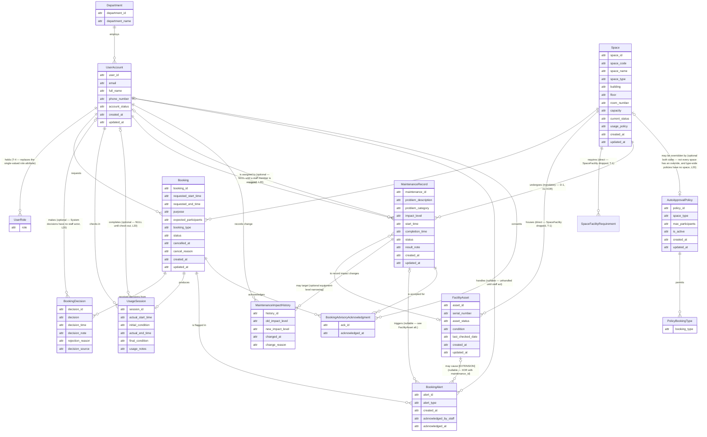
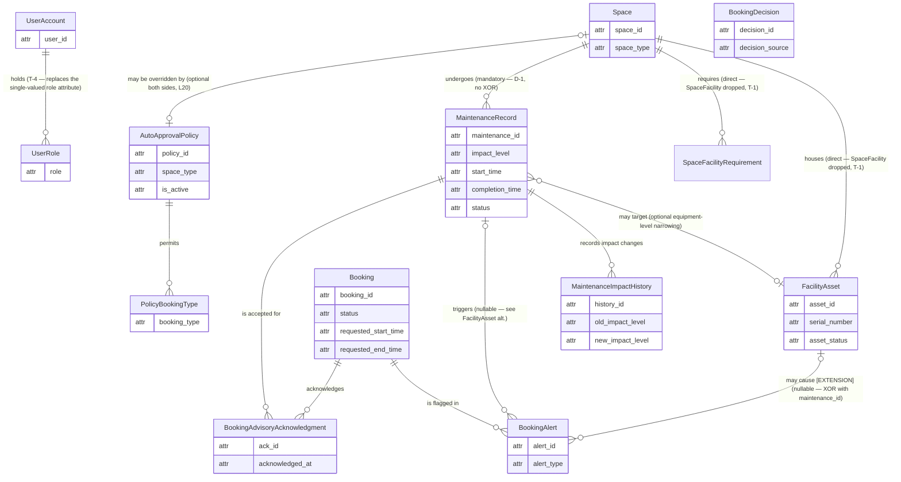

# Step 9: Updated ERD and Logical Design — G08 (Phase 2)

> **Document:** `outputs/09-updated-erd-and-logical-design-G08.md`
> **Phase:** Phase 2 — System Extension (CS486, Group G08)
> **Owner:** Trương Thị Mỹ Duyên — 24125028 (Senior Lead Database Architect & Concurrency Expert)
> **Inputs:** `08-requirement-change-analysis-G08.md` (Output 08), Phase 1 outputs 02–03 (`outputs/02-erd-design-G08.md`, `outputs/03-logical-design-G08.md`), `req/business-requirement-P2.md`, `CAMPUS_SPACE_MANAGEMENT_PROJECT_SPEC_P2.md`
> **Target DBMS:** Microsoft SQL Server (only permitted DBMS; 100% SQL Server syntax, no PostgreSQL constructs)
> **Status:** Final architectural baseline for Phase 2 — consumed by Tasks 10 (migration), 11–12 (concurrency), 14 (data generator), 15 (index tuning), 16 (analytical queries)

---

## 1. Purpose and Scope

This document is the **final architectural blueprint** of the Phase 2 system. It transforms the change analysis of Output 08 into a concrete, defensible design:

- An **updated Conceptual ERD** (15 entities, Mermaid Crow's Foot, conceptual purity preserved — `attr` placeholders, no PK/FK markers in boxes, Home ID / Visitor ID rule applied).
- A **Logical Schema Diagram** (15 tables, physical SQL Server types, PK/FK/UK markers, relationship lines labeled with the actual FK column names).
- A **table-by-table logical relational schema** with MS SQL Server types, PK/FK/UK markers, NULL/NOT NULL rules, defaults, and CHECK constraints.
- A **formal 3NF validation** for every added and modified table (1NF / 2NF / 3NF proofs with functional dependencies).
- A **professional indexing strategy** for high-load scenarios (semester-start concurrency peaks, room finder, escalation lookup).
- The **concurrency control design** (`SERIALIZABLE` + `UPDLOCK`/`HOLDLOCK` range locking, `sp_getapplock` alternative) embedded as logical-design notes.
- Edge-case coverage: race conditions, maintenance escalation, early check-out slot release, last-required-unit failure.

**Baseline integrity (T-5 — recomputed):** 7 of the 9 Phase 1 tables are **retained**; 3 of them carry the column-level changes described below, and 4 are untouched. Two tables are **dropped** under documented, explicitly authorized Phase 2 baseline amendments: `facilities` (`AGENTS.md` §1a) and `space_facilities` (`AGENTS.md` §1b, Section 5.4 below) — these are the only two recorded exceptions to the otherwise-inviolable "no drops of Phase 1 tables" rule. Both are **deliberate redundancy removals**, not 3NF requirements on the tables themselves: `facilities` was already in BCNF (Output 08 §2.3b), and `space_facilities`'s key pair was a stored projection of `facility_assets` (Output 08 §2.3c). Of the 7 retained tables, **3 are modified**: `user_accounts` loses `role`, replaced by a `user_roles` junction (`AGENTS.md` §1c, T-4 — a cardinality correction, not a normalization fix); `maintenance_records` gains a nullable `asset_id` column while `space_id` **stays `NOT NULL`**, unchanged from Phase 1 (D-1, Section 8.3); `booking_decisions` gains `decision_source` and a relaxed `decided_by`. The 4 untouched tables are `departments`, `spaces`, `bookings`, `usage_sessions`. Phase 2 additively **adds** 8 tables (the original 7 plus `user_roles`), **modifies** the 3 above, and **drops** 2 tables (`facilities`, `space_facilities`, both documented exceptions). **Total: 15 tables = 7 retained + 8 new.** Historical records are otherwise preserved — no `ON DELETE CASCADE` anywhere.

**Scope discipline:** this document is design only — no DDL, no data, no trigger bodies. Physical implementation belongs to Task 10 (`10-schema-migration-G08.sql`); the locking procedures belong to Task 12.

---

## 2. Executive Summary of Architectural Changes

| # | Phase 1 (baseline) | Phase 2 (this design) | Primary deliverable |
|---|---|---|---|
| 1 | Facilities tracked as a quantity count (`space_facilities.quantity`), with a separate `facilities` catalogue table (`facility_id` PK) | `facilities` **dropped** (`AGENTS.md` §1a); `space_facilities` itself is **also dropped** (`AGENTS.md` §1b, T-1) — its key pair was a stored projection of `facility_assets`; individual units live in **`facility_assets`**, linked **directly to `spaces`** with an independent `CHECK` whitelist on `facility_name`; counts are **derived-only** via view `v_space_facility_summary`, now a `UNION` of `facility_assets` and `space_facility_requirements` (Section 6) | `facility_assets` **[Added]**, `space_facilities` **[Removed]**, `facilities` **[Removed]** |
| 2 | Maintenance targets a space only; any maintenance blocks the space | Maintenance carries **`impact_level`** (`Advisory` / `OutOfService`); `space_id` **stays `NOT NULL`** (an immutable historical snapshot) and an optional `asset_id` may additionally narrow the issue to one unit — **no XOR** (D-1, Section 8.3: the FD `asset_id → space_id` is refuted by a relocation counterexample); only `OutOfService` blocks; `Advisory` requires per-booking acknowledgement | `maintenance_records` **[Modified]**, `facility_assets` **[Added]** |
| 3 | Reserved window (`requested_*_time`) used for all conflict checks | **Status-driven interval selection:** `Approved`/`CheckedIn` block with the reserved interval; `Completed` blocks nothing → **early check-out releases the remaining window immediately** (derived fact, no trigger/timer/flag) | no new columns — `bookings` + `usage_sessions` used as designed |
| 4 | Advisory consent not modeled | **`booking_advisory_acknowledgments`** records that the requester was shown and accepted each active advisory for a booking; `UNIQUE (booking_id, maintenance_id)` | `booking_advisory_acknowledgments` **[Added]** |
| 5 | Approval is staff-only (`booking_decisions.decided_by NOT NULL`) | **`decision_source`** (`Staff`/`System`) distinguishes auto-approval; `decided_by` nullable under a same-table CHECK pairing source with null-ness | `booking_decisions` **[Modified]** |
| 6 | Overlap prevented by `AFTER` trigger only (statement-time validation) | Trigger demoted to **backstop**; primary mechanism = `SERIALIZABLE` transactions with `WITH (UPDLOCK, HOLDLOCK)` key-range locking (or `sp_getapplock`) in stored procedures; retry on 1205/1222 | concurrency notes (Section 9), procedures in Task 12 |
| 7 | Escalation not modeled | **`maintenance_impact_history`** (audit trail) + **`booking_alerts`** (persisted escalation + [EXTENSION] required-asset relocation alerts) | 2 tables **[Added]** |
| 8 | Auto-approval not modeled | **`auto_approval_policies`** + **`policy_booking_types`** configure eligible space types/booking types | 2 tables **[Added]** |
| 9 | Required-facility semantics not modeled | **`space_facility_requirements`** (sparse list — presence = required) blocks booking when the last available unit of a required facility is down; kept because the policy must be expressible at zero available units, not for sparsity/permissions reasons (T-2) | `space_facility_requirements` **[Added]** |
| 10 | A user's role is single-valued (`user_accounts.role`) | `role` **dropped**; **`user_roles(user_id, role)`** junction added — one person may hold several roles (documented amendment, `AGENTS.md` §1c, T-4). A **cardinality correction, not a normalization fix** — the single-valued column violated neither 1NF nor 3NF | `user_roles` **[Added]**, `user_accounts` **[Modified]** |

**Table inventory after Phase 2 (T-5 — recomputed): 15 tables** = 7 Phase 1 tables retained (3 modified: `user_accounts`, `maintenance_records`, `booking_decisions`; 4 untouched: `departments`, `spaces`, `bookings`, `usage_sessions`) + 8 new. (Of the original 9 Phase 1 tables, 2 are dropped — `facilities`, `space_facilities`, both documented exceptions — leaving the 7 retained; the drops are already reflected in that count, not subtracted again.)

| Table | Status in Phase 2 |
|---|---|
| `departments`, `spaces`, `bookings`, `usage_sessions` | **[Unchanged]** Phase 1 |
| `facilities` | **[Removed — documented exception, §1a]** — dropped entirely; `facility_name` briefly absorbed into `space_facilities` |
| `space_facilities` | **[Removed — documented exception, §1b]** — dropped entirely (T-1, Section 5.5); its key pair was a stored projection of `facility_assets` |
| `user_accounts` | **[Modified — documented exception, §1c]** — `role` and `CK_user_accounts_role` **dropped**; every other column unchanged; replaced by `user_roles` (T-4) |
| `maintenance_records` | **[Modified]** — `asset_id`, `impact_level` added; `space_id` **unchanged, stays `NOT NULL`** — no XOR constraint (D-1, Section 8.3) |
| `booking_decisions` | **[Modified]** — additive columns only (`decision_source`; `decided_by` changed `NOT NULL` → `NULL`) |
| `facility_assets`, `space_facility_requirements`, `maintenance_impact_history`, `booking_advisory_acknowledgments`, `auto_approval_policies`, `policy_booking_types`, `booking_alerts`, `user_roles` | **[Added]** |

---

## 3. Updated Conceptual ERD

### 3.1 Full conceptual diagram (15 entities)

Per Phase 1 conventions: 2-column entity boxes, `attr` as the generic placeholder type, **no PK/FK markers**, no linking identifiers inside boxes (Home ID / Visitor ID rule — relationship lines carry the connections), optional `o{`/`o|` on every many/zero-or-one side (lifecycle start-from-zero).



### 3.2 Phase 2 delta (new/modified entities only)



### 3.3 Narrative — new and modified conceptual entities

- **SpaceFacility — dropped entirely (T-1).** Under the documented Phase 2 baseline amendment `AGENTS.md` §1a, the separate `Facility` entity was eliminated and its one substantive attribute, `facility_name`, was absorbed into SpaceFacility. Under the further amendment `AGENTS.md` §1b, **SpaceFacility itself is now dropped**: its key pair `(space_id, facility_name)` was exactly the distinct projection of FacilityAsset — a stored fact derivable from another entity, the same category of redundancy `quantity` removal targeted (Output 08 §2.3a), now applied to the entity itself (Output 08 §2.3c). FacilityAsset and SpaceFacilityRequirement now attach **directly to Space**; `facility_name` has no defining entity of its own — it is an independent `CHECK`-constrained attribute appearing separately on each.

- **FacilityAsset** — an individual, uniquely identifiable unit of a facility type (e.g., "Projector #001"). **Home ID:** `asset_id`; business identifier `serial_number` (Contextual Identifier Rule: a stable asset keeps both). `asset_status` is its availability (`Available`, `InUse`, `UnderMaintenance`, `Retired`). Each unit "houses" directly under exactly one Space (T-1: no longer via a SpaceFacility catalogue entry); `facility_name` is its own `CHECK`-constrained attribute, not part of the link to Space.

- **SpaceFacilityRequirement** — resolves "which facility types must be available for a space to be bookable." Sparse by design: **presence of a row means the facility type is required** — the junction carries no attribute column, so the semantics are purely structural: inserting a row declares "required"; absence means optional. It attaches **directly to Space** (T-1), with `facility_name` as its own `CHECK`-constrained attribute rather than a reference into a catalogue. **Why it must remain a separate table (T-2):** "space A may not be booked without a working projector" is a policy about the space that must hold when the space has *zero* projectors — it cannot live on FacilityAsset (units come and go) and, after the SpaceFacility drop, there is no catalogue entity left to host it either.

- **UserRole (new — T-4)** — records every role a user holds. Replaces the single-valued `role` attribute previously on UserAccount (documented amendment, `AGENTS.md` §1c) because one person may legitimately hold several roles (e.g., a Facility Manager who also books rooms as a requester). Pure junction, no non-key attributes — the same shape as PolicyBookingType. This is a **cardinality/domain-fidelity correction, not a normalization fix**: the single-valued `role` violated neither 1NF nor 3NF.

- **MaintenanceRecord (modified)** — now carries `impact_level` (`Advisory` / `OutOfService`). **Corrected targeting model (D-1, no XOR):** every record **always** names a Space — `space_id` stays `NOT NULL`, an immutable historical snapshot of where the problem was reported — and **may additionally** name a FacilityAsset via an optional `asset_id` to narrow an equipment-level issue to one unit. The `Space ||--o{ MaintenanceRecord` line reads: a space undergoes zero or many records, and every record refers to exactly one space (mandatory); the `MaintenanceRecord }o--o| FacilityAsset` line reads: a record may optionally target zero or one asset, in addition to its space. Storing both is not a transitive dependency: the FD `asset_id → space_id` is refuted by a counterexample — an asset relocated between spaces produces two maintenance records with the same `asset_id` but different `space_id` — so `space_id` is an independent fact, not a redundant derivation (full proof in Section 8.3; Appendix A, D-1).

- **MaintenanceImpactHistory** — the audit trail of every `impact_level` change (escalation/downgrade) on a record. Each row records the previous level, the new level, when, by whom, and why. The first row of a record has `old_impact_level = NULL` (creation level).

- **BookingAdvisoryAcknowledgment** — the legal-consent junction between Booking and MaintenanceRecord: one row per (booking, advisory) pair records that the requester accepted that specific advisory. The M–N "bookings ↔ maintenance records" is resolved into two 1–N legs through this associative entity.

- **AutoApprovalPolicy** — configures which Space types (or a specific Space override) may auto-approve at submission time, plus eligibility limits. **The link to Space is optional on both sides:** `Space |o--o| AutoApprovalPolicy`, matching the §3.1/§3.2 diagrams and the `0..1 -- 0..1` row of §3.4 — a space has **at most one** specific-space override policy, and a policy references **zero spaces** (type-wide, `space_type` set, no FK) **or exactly one** specific space (`space_id` set); because `auto_approval_policies.space_id` is nullable, neither side is mandatory (Appendix A, R6).

- **PolicyBookingType** — junction carrying the allowed `booking_type` values per policy (SQL Server has no array type).

- **BookingAlert** — a persisted alert row with three `alert_type` scopes over two source columns: (a) **escalation-result** (`MaintenanceEscalated`): when a maintenance record is escalated to `OutOfService`, every already-`Approved`/`CheckedIn` booking overlapping the maintenance window is flagged here so staff can act on it (the escalation lookup of report (d), §1.3); (b) **[EXTENSION] relocation-result** (`RequiredAssetRelocated`): when a required asset is relocated out of a space, every `Approved`/`CheckedIn` booking of that space is flagged; (c) **[EXTENSION] advisory-added-after-approval** (`AdvisoryAddedAfterApproval`, L11): when a new advisory is filed against a space with already-`Approved` bookings, staff (and through them the requester) are informed rather than the booking being retroactively invalidated. Exactly one source column is set per row (`maintenance_id` XOR `asset_id`) — types (a) and (c) set `maintenance_id`; type (b) sets `asset_id`.

- **BookingDecision (modified)** — adds `decision_source` (`Staff` / `System`). A System decision (auto-approval) has no staff actor; the deciding-user relationship becomes 1 → 0..1.

### 3.4 Relationship table (conceptual, Crow's Foot)

| Left Entity | Crow's Foot | Right Entity | Explanation |
|---|---|---|---|
| Space | 1 -- 0..N | FacilityAsset | **(T-1)** Every unit belongs to exactly one space, directly — `SpaceFacility` is dropped (Output 08 §2.3c); `facility_name` is an independent `CHECK`-constrained attribute of `FacilityAsset`, not part of this FK. |
| Space | 1 -- 0..N | SpaceFacilityRequirement | **(T-1)** Every requirement belongs to exactly one space, directly — `SpaceFacility` is dropped; `facility_name` is an independent `CHECK`-constrained attribute here too, kept identical to `FacilityAsset`'s whitelist by convention, not by a shared FK. |
| Space | 1 -- 0..N | MaintenanceRecord | **(D-1)** Every maintenance record targets exactly one space — `space_id` stays `NOT NULL`, an immutable historical snapshot, unchanged from Phase 1; a space undergoes zero or many maintenance records over its lifetime. **No XOR** — see Section 8.3 for the refuted-FD analysis. |
| MaintenanceRecord | 0..N -- 0..1 | FacilityAsset | A record may **additionally** target zero or one asset (not exclusive with the space above); an asset may be targeted by zero or many records. |
| MaintenanceRecord | 1 -- 0..N | MaintenanceImpactHistory | One record has zero or many impact-change entries; each entry belongs to exactly one record. |
| UserAccount | 1 -- 0..N | MaintenanceImpactHistory | One user records zero or many impact changes; each change is recorded by exactly one user. |
| MaintenanceRecord | 0..1 -- 0..N | BookingAlert | A record triggers zero or many alerts; an alert references zero or one record (NULL when the alert is asset-caused). |
| FacilityAsset | 0..1 -- 0..N | BookingAlert | **(L17, corrected)** [EXTENSION] One asset may cause zero or many relocation alerts; an alert references zero or one asset (NULL when the alert is maintenance-caused) — `asset_id` is nullable, XOR with `maintenance_id`. |
| Booking | 1 -- 0..N | BookingAlert | One booking is flagged in zero or many alerts. |
| UserAccount | 0..1 -- 0..N | BookingAlert | **(L18, corrected)** One staff user handles zero or many alerts; an alert is handled by zero or one staff user — `acknowledged_by_staff_id` is nullable until staff act. |
| Booking | 1 -- 0..N | BookingAdvisoryAcknowledgment | One booking acknowledges zero or many advisories. |
| MaintenanceRecord | 1 -- 0..N | BookingAdvisoryAcknowledgment | One advisory is accepted in zero or many bookings. |
| UserAccount | 1 -- 0..N | BookingAdvisoryAcknowledgment | One user consents to zero or many acknowledgements. |
| Space | 0..1 -- 0..1 | AutoApprovalPolicy | **(L20, corrected)** One space may have at most one specific-space override policy; conversely a policy references zero space (type-wide) or one specific space — `auto_approval_policies.space_id` is nullable, so the Space side is `0..1`, not mandatory `1`. |
| AutoApprovalPolicy | 1 -- 0..N | PolicyBookingType | One policy permits zero or many booking types. |
| UserAccount | 1 -- 0..N | UserRole | **(T-4)** Each role row belongs to exactly one user; a user holds zero or many roles. Zero is a valid lifecycle state (§11) — a junction table cannot declaratively require "at least one row" (no PK/FK/CHECK expresses it, and SQL Server has no deferred constraints), so "every user has a role" is a **data-seeding guarantee** from the Phase 1 migration, not a schema constraint. |

The 13 Phase 1 relationships (Output 02) are unchanged, including `Space → MaintenanceRecord`, which remains mandatory (1 → 0..N) — no XOR constraint governs it (Section 8.3; Appendix A, D-1). Two relationships change cardinality "shape" in Phase 2: the deciding-user leg of BookingDecision becomes 1 → 0..1 (System decisions have no staff actor), and `UserAccount → role` (a single-valued attribute) is replaced by `UserAccount → UserRole` (1 → 0..N, T-4).

### 3.5 Home ID / Visitor ID mapping for new relationships

| Home ID (defining entity) | Visitor copies (linking columns) |
|---|---|
| — (`facilities` dropped, §1a; `space_facilities` also dropped, §1b, T-1) | — |
| — (`facility_name` — **no defining entity of its own** (T-1): an independent `CHECK`-constrained attribute appearing separately on `facility_assets` and `space_facility_requirements`, with no Home ID/Visitor ID relationship between the two, since there is no longer a shared composite key linking them) | — |
| `space_id` (spaces) | `facility_assets.space_id` (direct FK, T-1), `space_facility_requirements.space_id` (direct FK, T-1), `maintenance_records.space_id` (**mandatory, `NOT NULL`, immutable snapshot — no XOR, D-1/Section 8.3**), `auto_approval_policies.space_id` |
| `maintenance_id` (maintenance_records) | `maintenance_impact_history.maintenance_id`, `booking_alerts.maintenance_id`, `booking_advisory_acknowledgments.maintenance_id` |
| `booking_id` (bookings) | `booking_alerts.booking_id`, `booking_advisory_acknowledgments.booking_id` |
| `user_id` (user_accounts) | `maintenance_impact_history.changed_by`, `booking_advisory_acknowledgments.acknowledged_by`, `booking_alerts.acknowledged_by_staff_id` (nullable — unhandled until staff act, L18), `user_roles.user_id` (T-4 — new) |
| `asset_id` (facility_assets) | `maintenance_records.asset_id` (nullable, optional equipment-level narrowing — no XOR, D-1), `booking_alerts.asset_id` (nullable, XOR with `maintenance_id` — unrelated to the maintenance-records XOR removal) |

---

## 4. Logical Schema Diagram

Physical diagram with SQL Server types and `PK`/`FK`/`UK` markers; relationship lines are labeled with the **actual FK column name(s)** (per the Step 3 labeling rule). Mermaid does not support marker modifiers, so the `FK` marker does not imply nullability — nullable FK columns are flagged with `%%` comments in the diagram, and the authoritative NULL/NOT NULL rules are given in the Section 5 table definitions. `facility_assets.facility_name` and `space_facility_requirements.facility_name` are **independent `CHECK`-constrained columns** (T-1), not FKs — `space_facilities` is dropped, so there is no longer a composite-FK relationship for either. The `facilities` and `space_facilities` tables both have no box in this diagram — both are dropped under documented Phase 2 baseline amendments (`AGENTS.md` §1a, §1b).

```mermaid
erDiagram
    %% Mermaid does not support FK* markers, so the FK marker here does NOT imply nullability.
    %% Nullable FK columns (authoritative NULL/NOT NULL rules in the Section 5 table definitions):
    %%   booking_decisions.decided_by               (NULL when decision_source = N'System')
    %%   usage_sessions.completed_by                 (NULL until check-out)
    %%   maintenance_records.assigned_staff_id       (NULL until a staff member is assigned)
    %%   maintenance_records.asset_id                (NULL = space-level-only record; NOT XOR with space_id — D-1, Section 8.3)
    %%   auto_approval_policies.space_id             (NULL = type-wide policy)
    %%   booking_alerts.maintenance_id / asset_id    (NULL per source scope — exactly one set by alert_type)
    %%   booking_alerts.acknowledged_by_staff_id     (NULL until handled by staff)
    %% facility_assets.facility_name and space_facility_requirements.facility_name are independent
    %% CHECK whitelists (T-1) — space_facilities is dropped, so neither is part of a composite FK.
    %% The Phase 1 `facilities` and `space_facilities` tables are both DROPPED
    %% (documented amendments, AGENTS.md §1a and §1b) — no box for either below.

    departments {
        int department_id PK
        nvarchar department_name
    }

    user_accounts {
        int user_id PK
        nvarchar email UK
        nvarchar full_name
        nvarchar phone_number
        nvarchar account_status
        int department_id FK
        datetime2 created_at
        datetime2 updated_at
    }

    %% user_roles: (user_id, role) composite PK — replaces the single-valued user_accounts.role (T-4, AGENTS.md §1c).
    user_roles {
        int user_id PK, FK
        nvarchar role PK
    }

    spaces {
        int space_id PK
        nvarchar space_code UK
        nvarchar space_name
        nvarchar space_type
        nvarchar building
        int floor
        nvarchar room_number
        int capacity
        nvarchar current_status
        nvarchar usage_policy
        datetime2 created_at
        datetime2 updated_at
    }

    %% facility_assets: space_id is a direct FK to spaces (T-1 — space_facilities dropped, AGENTS.md §1b).
    %% facility_name is an independent CHECK whitelist, not an FK.
    facility_assets {
        int asset_id PK
        int space_id FK
        nvarchar facility_name
        nvarchar serial_number UK
        nvarchar asset_status
        nvarchar condition
        date last_checked_date
        datetime2 created_at
        datetime2 updated_at
    }

    %% space_facility_requirements: sparse junction — presence of a row means "required"; no attribute column.
    %% space_id is a direct FK to spaces (T-1); facility_name is its own independent CHECK whitelist,
    %% kept identical to facility_assets' whitelist by convention (two copies of one domain — maintenance note, §5.7).
    space_facility_requirements {
        int space_id PK, FK
        nvarchar facility_name PK
    }

    bookings {
        int booking_id PK
        int requester_id FK
        int space_id FK
        datetime2 requested_start_time
        datetime2 requested_end_time
        nvarchar purpose
        int expected_participants
        nvarchar booking_type
        nvarchar status
        datetime2 cancelled_at
        nvarchar cancel_reason
        datetime2 created_at
        datetime2 updated_at
    }

    booking_decisions {
        int decision_id PK
        int booking_id FK
        int decided_by FK
        nvarchar decision
        datetime2 decision_time
        nvarchar decision_note
        nvarchar rejection_reason
        nvarchar decision_source
    }

    usage_sessions {
        int session_id PK
        int booking_id FK, UK
        int checked_in_by FK
        datetime2 actual_start_time
        nvarchar initial_condition
        int completed_by FK
        datetime2 actual_end_time
        nvarchar final_condition
        nvarchar usage_notes
    }

    maintenance_records {
        int maintenance_id PK
        int space_id FK
        int reporter_id FK
        int assigned_staff_id FK
        int asset_id FK
        nvarchar problem_description
        nvarchar problem_category
        nvarchar impact_level
        nvarchar status
        datetime2 start_time
        datetime2 completion_time
        nvarchar result_note
        datetime2 created_at
        datetime2 updated_at
    }

    maintenance_impact_history {
        int history_id PK
        int maintenance_id FK
        int changed_by FK
        nvarchar old_impact_level
        nvarchar new_impact_level
        datetime2 changed_at
        nvarchar change_reason
    }

    %% booking_advisory_acknowledgments: (booking_id, maintenance_id) together form ONE composite Unique Key
    %% (UQ_booking_advisory_acknowledgments_booking_maintenance), NOT two individual UNIQUE constraints.
    booking_advisory_acknowledgments {
        int ack_id PK
        int booking_id FK, UK
        int maintenance_id FK, UK
        int acknowledged_by FK
        datetime2 acknowledged_at
    }

    %% requires_advisory_ack removed (L9) — advisory acknowledgement is a mandatory legal
    %% constraint on every approval path (Section 4.2 / Output 08 §4.2), not a per-policy knob.
    auto_approval_policies {
        int policy_id PK
        nvarchar space_type
        int space_id FK, UK
        int max_participants
        bit is_active
        datetime2 created_at
        datetime2 updated_at
    }

    %% policy_booking_types: (policy_id, booking_type) together form the composite PK
    policy_booking_types {
        int policy_id PK, FK
        nvarchar booking_type PK
    }

    %% booking_alerts: source scope is exactly one of maintenance_id (alert_type IN
    %% ('MaintenanceEscalated','AdvisoryAddedAfterApproval'), L11) or asset_id
    %% (alert_type = 'RequiredAssetRelocated') — XOR, enforced by CK_booking_alerts_source_scope.
    booking_alerts {
        int alert_id PK
        int maintenance_id FK
        int asset_id FK
        int booking_id FK
        nvarchar alert_type
        datetime2 created_at
        int acknowledged_by_staff_id FK
        datetime2 acknowledged_at
    }

    departments ||--o{ user_accounts : "department_id"
    user_accounts ||--o{ user_roles : "user_id (T-4 — replaces user_accounts.role)"
    user_accounts ||--o{ bookings : "requester_id"
    spaces ||--o{ bookings : "space_id"
    bookings ||--o{ booking_decisions : "booking_id"
    user_accounts |o--o{ booking_decisions : "decided_by (nullable — NULL for System decisions, L20)"
    bookings ||--o| usage_sessions : "booking_id"
    user_accounts ||--o{ usage_sessions : "checked_in_by"
    user_accounts |o--o{ usage_sessions : "completed_by (nullable — NULL until check-out, L20)"
    spaces ||--o{ facility_assets : "space_id (direct — T-1, space_facilities dropped)"
    spaces ||--o{ space_facility_requirements : "space_id (direct — T-1, space_facilities dropped)"
    spaces ||--o{ maintenance_records : "space_id (mandatory — D-1, no XOR)"
    user_accounts ||--o{ maintenance_records : "reporter_id"
    user_accounts |o--o{ maintenance_records : "assigned_staff_id (nullable — NULL until assigned, L20)"
    maintenance_records }o--o| facility_assets : "asset_id (nullable — optional narrowing, no XOR)"
    maintenance_records ||--o{ maintenance_impact_history : "maintenance_id"
    user_accounts ||--o{ maintenance_impact_history : "changed_by"
    maintenance_records |o--o{ booking_alerts : "maintenance_id"
    facility_assets |o--o{ booking_alerts : "asset_id (nullable, XOR with maintenance_id)"
    bookings ||--o{ booking_alerts : "booking_id"
    user_accounts |o--o{ booking_alerts : "acknowledged_by_staff_id (nullable)"
    bookings ||--o{ booking_advisory_acknowledgments : "booking_id"
    maintenance_records ||--o{ booking_advisory_acknowledgments : "maintenance_id"
    user_accounts ||--o{ booking_advisory_acknowledgments : "acknowledged_by"
    spaces |o--o| auto_approval_policies : "space_id (nullable — NULL for type-wide policies, L20)"
    auto_approval_policies ||--o{ policy_booking_types : "policy_id"
```



---

## 5. Table-by-Table Logical Relational Schema

Conventions: `INT IDENTITY(1,1)` surrogate keys; `DATETIME2` timestamps; `NVARCHAR` text; enums as `NVARCHAR` + CHECK (PascalCase values); no `ON DELETE CASCADE` (historical preservation). **All constraints are explicitly named using the `CONSTRAINT [Name] [Type]` convention** (e.g., `CONSTRAINT UQ_booking_advisory_acknowledgments_booking_maintenance UNIQUE (booking_id, maintenance_id)`); DEFAULT constraints follow `CONSTRAINT DF_<table>_<column> DEFAULT <value>`. **[P1]** = Phase 1 baseline (verbatim), **[MOD]** = Phase 1 extended additively, **[NEW]** = Phase 2 addition.

### 5.1 departments [P1 — unchanged]

| Column | Type | Null | Constraints | Description |
|---|---|---|---|---|
| `department_id` | INT | NOT NULL | `IDENTITY(1,1)`, `CONSTRAINT PK_departments PRIMARY KEY (department_id)` | Home ID |
| `department_name` | NVARCHAR(100) | NOT NULL | | Full name |

### 5.2 user_accounts [MOD — `role` dropped, replaced by `user_roles` (T-4, `AGENTS.md` §1c)]

| Column | Type | Null | Constraints | Description |
|---|---|---|---|---|
| `user_id` | INT | NOT NULL | `IDENTITY(1,1)`, `CONSTRAINT PK_user_accounts PRIMARY KEY (user_id)` | Home ID |
| `email` | NVARCHAR(255) | NOT NULL | `CONSTRAINT UQ_user_accounts_email UNIQUE (email)` | Natural business identifier |
| `full_name` | NVARCHAR(100) | NOT NULL | | |
| `phone_number` | NVARCHAR(20) | NULL | | |
| `account_status` | NVARCHAR(20) | NOT NULL | `CONSTRAINT DF_user_accounts_account_status DEFAULT N'Active'`, `CONSTRAINT CK_user_accounts_account_status CHECK (account_status IN (N'Active',N'Inactive',N'Suspended'))` | |
| `department_id` | INT | NOT NULL | `CONSTRAINT FK_user_accounts_department_id FOREIGN KEY (department_id) REFERENCES departments(department_id)` | Visitor ID |
| `created_at` | DATETIME2 | NOT NULL | `CONSTRAINT DF_user_accounts_created_at DEFAULT GETDATE()` | |
| `updated_at` | DATETIME2 | NOT NULL | `CONSTRAINT DF_user_accounts_updated_at DEFAULT GETDATE()` | |

**`role` removed (T-4):** the single-valued `role` `NVARCHAR(30)` column and `CK_user_accounts_role` are dropped; every role a user holds now lives in `user_roles` (§5.17 — placed at the end of Section 5 rather than renumbering §5.3–§5.16, which are cross-referenced extensively throughout both documents; this placement choice is applied consistently in §12 and the ERD). **Migration:** `CREATE TABLE user_roles`; `INSERT INTO user_roles (user_id, role) SELECT user_id, role FROM user_accounts`; verify `COUNT(*)` on `user_roles` equals `COUNT(*)` on `user_accounts` (each user has exactly one role before migration); then `ALTER TABLE user_accounts DROP CONSTRAINT CK_user_accounts_role` and drop the `role` column. No Phase 1 data is lost — every existing user keeps the role they had, now as their first `user_roles` row. **This is a cardinality/domain-fidelity correction, not a normalization fix (T-4):** the single-valued column violated neither 1NF (no comma-separated list was ever stored) nor 3NF — it modeled a multi-valued reality (one person may hold several roles, e.g. a Facility Manager who also books rooms as a requester) as single-valued.

### 5.3 spaces [P1 — unchanged]

| Column | Type | Null | Constraints | Description |
|---|---|---|---|---|
| `space_id` | INT | NOT NULL | `IDENTITY(1,1)`, `CONSTRAINT PK_spaces PRIMARY KEY (space_id)` | Home ID |
| `space_code` | NVARCHAR(20) | NOT NULL | `CONSTRAINT UQ_spaces_space_code UNIQUE (space_code)` | Business identifier (e.g., B1-101) |
| `space_name` | NVARCHAR(100) | NOT NULL | | |
| `space_type` | NVARCHAR(30) | NOT NULL | `CONSTRAINT CK_spaces_space_type CHECK (space_type IN (N'Auditorium',N'Classroom',N'ComputerLaboratory',N'ProjectLaboratory',N'MeetingRoom',N'StudentWorkspace'))` | |
| `building` | NVARCHAR(100) | NOT NULL | | |
| `floor` | INT | NOT NULL | | |
| `room_number` | NVARCHAR(20) | NOT NULL | | |
| `capacity` | INT | NOT NULL | `CONSTRAINT CK_spaces_capacity CHECK (capacity > 0)` | |
| `current_status` | NVARCHAR(20) | NOT NULL | `CONSTRAINT DF_spaces_current_status DEFAULT N'Available'`, `CONSTRAINT CK_spaces_current_status CHECK (current_status IN (N'Available',N'InUse',N'UnderMaintenance',N'TemporarilyClosed',N'Retired'))` | **UI display only** — never a booking-blocking predicate for maintenance (Output 08 §4.1) |
| `usage_policy` | NVARCHAR(MAX) | NULL | | |
| `created_at` | DATETIME2 | NOT NULL | `CONSTRAINT DF_spaces_created_at DEFAULT GETDATE()` | |
| `updated_at` | DATETIME2 | NOT NULL | `CONSTRAINT DF_spaces_updated_at DEFAULT GETDATE()` | |

### 5.4 `facilities` [REMOVED — documented Phase 2 baseline amendment]

The Phase 1 `facilities` catalogue table is **dropped**, authorized by `AGENTS.md` §1a. Its only substantive attribute, `facility_name`, was briefly absorbed into `space_facilities` — which is itself now also dropped (Section 5.5, `AGENTS.md` §1b); `facility_name` lives today as an independent `CHECK`-constrained column on `facility_assets` and `space_facility_requirements` (Section 5.6/5.7). `facilities.description` (a type-level description, e.g. "Standard HDMI projector with 1080p resolution") had no replacement column and was dropped as data; this is recorded here as an explicit, intentional narrowing of scope rather than a silent loss.

### 5.5 `space_facilities` [REMOVED — documented Phase 2 baseline amendment, T-1]

The `space_facilities` table is **dropped entirely**, authorized by `AGENTS.md` §1b. Its key pair `(space_id, facility_name)` was exactly `SELECT DISTINCT space_id, facility_name FROM facility_assets` — a stored projection, the same class of stored-derivable fact that motivated removing `quantity` (Output 08 §2.3a). Its `condition` column duplicated `facility_assets.condition` with no defined source of truth (the L4 defect, resolved structurally by this drop rather than by explanation); its `note` column had no consumer anywhere in the design and is dropped as data. The composite FKs that referenced it (`FK_facility_assets_space_facility`, `FK_space_facility_requirements_space_facility`) are not merely unenforced but **meaningless** with no catalogue to reference — an asset's own existence is what defines "this space has this facility type." `facility_assets.space_id` and `space_facility_requirements.space_id` become plain `FK → spaces(space_id)`; `facility_name` on both becomes an independently `CHECK`-constrained column (Section 5.6/5.7). This is the **second** of two documented exceptions to the Phase 1 baseline-preservation rule in this project (alongside `facilities`, §1a) — no other Phase 1 table is dropped or renamed. Full reasoning, including what is genuinely lost and why no query needs it, is in Output 08 §2.3c.

### 5.6 facility_assets [NEW] — granular asset tracking

**Migration source (Appendix A, B6):** the initial population of this table is not "new data" — it is the expansion of every Phase 1 `space_facilities` row into `quantity` individual rows, including the `serial_number`, `condition`, and `asset_status` seeding rules. Full reasoning in Output 08 §2.3d.

| Column | Type | Null | Constraints | Description |
|---|---|---|---|---|
| `asset_id` | INT | NOT NULL | `IDENTITY(1,1)`, `CONSTRAINT PK_facility_assets PRIMARY KEY (asset_id)` | Home ID |
| `space_id` | INT | NOT NULL | `CONSTRAINT FK_facility_assets_space_id FOREIGN KEY (space_id) REFERENCES spaces(space_id)` | Visitor ID — current location (T-1: direct FK, `space_facilities` dropped) |
| `facility_name` | NVARCHAR(100) | NOT NULL | `CONSTRAINT CK_facility_assets_facility_name CHECK (facility_name IN (N'Projector',N'Whiteboard',N'AirConditioner',N'ComputerStation',N'SpeakerSystem',N'VideoConference',N'SmartBoard'))` | Independent `CHECK` whitelist (T-1) — no longer part of a composite FK; identical set to `space_facility_requirements.facility_name` (Section 5.7), maintained manually |
| `serial_number` | NVARCHAR(50) | NOT NULL | `CONSTRAINT UQ_facility_assets_serial_number UNIQUE (serial_number)` | Business identifier — unique per unit; see the L12 policy below for units with no manufacturer serial |
| `asset_status` | NVARCHAR(20) | NOT NULL | `CONSTRAINT DF_facility_assets_asset_status DEFAULT N'Available'`, `CONSTRAINT CK_facility_assets_asset_status CHECK (asset_status IN (N'Available',N'InUse',N'UnderMaintenance',N'Retired'))` | Per-unit availability |
| `condition` | NVARCHAR(MAX) | NULL | | Free-text condition |
| `last_checked_date` | DATE | NULL | | Last inspection date |
| `created_at` | DATETIME2 | NOT NULL | `CONSTRAINT DF_facility_assets_created_at DEFAULT GETDATE()` | |
| `updated_at` | DATETIME2 | NOT NULL | `CONSTRAINT DF_facility_assets_updated_at DEFAULT GETDATE()` | |

**Design notes:**
- **Two independent constraints, not a composite FK (T-1 — a weaker guarantee, accepted as the price of §1b):** `facility_assets` now links to `spaces` via a plain `FK_facility_assets_space_id`, with `facility_name` constrained only by its own `CHECK`. Before the `space_facilities` drop, a composite FK made "this asset's combination is catalogued" a structural guarantee; that catalogue no longer exists, so there is nothing left to be tight against. Referential integrity now rests on two independent constraints (an FK plus a domain `CHECK`) rather than one compound one — honestly weaker, and the accepted cost of dropping `space_facilities` (Appendix A, T-1; the original composite-FK physical-necessity argument is preserved there as superseded).
- **Maintenance cost of two whitelists (T-1):** `facility_name`'s `CHECK` list is now duplicated verbatim on `facility_assets` and `space_facility_requirements` (Section 5.7) — any future facility type must be added to **both**, with no shared constraint to enforce that they stay in sync. This is the concrete, stated cost of `AGENTS.md` §1a + §1b together.
- **`serial_number` policy (L12):** not every facility type has a manufacturer serial — whiteboards, power outlets, and furniture typically do not. Rather than fabricating manufacturer-style serials (which would pollute the data) or making the column nullable (which would remove it as a candidate key, complicating Section 8.1's 2NF/3NF analysis), the chosen resolution is: `serial_number` **stays `NOT NULL UNIQUE`**, and units with no manufacturer serial are assigned an **internal identifier** following the scheme `<space_code>-<FACILITY>-<seq>` (e.g., `A-CLS-01-WHITEBOARD-001`) at asset-creation time. `serial_number` therefore remains a valid candidate key (Section 8.1) regardless of whether the value is manufacturer-issued or internally generated. `UQ_facility_assets_serial_number` is the business-identity constraint either way.
- An asset is always located in exactly one space. Moving a unit = `UPDATE facility_assets.space_id` (T-1: no longer constrained to a pre-catalogued combination — any `spaces` row is a valid destination, and `facility_name` need not pre-exist anywhere else). No relocation history is required in this phase (but see the edge case in Section 11 for its effect on open `maintenance_records`).
- **`condition` (L4):** this column is the **physical condition of this one specific unit** (e.g., "screen cracked, still projects"). Before T-1 this was distinguished from a catalogue-level `space_facilities.condition`; that column no longer exists, so `facility_assets.condition` is now the only stored `condition` fact for a unit.
- **`asset_status` — operational state, not a derived fact (L5):** `asset_status` is authoritative staff/trigger-maintained state, not a value computed at query time. Task 10 adds trigger `TR_maintenance_SyncAssetStatus` so that an active maintenance record targeting the asset flips it to `UnderMaintenance` (released back to `Available` on completion/cancellation). Because this is a **maintained mirror**, not a live query-time derivation, it can **temporarily drift** from `maintenance_records` between the record being written and the trigger firing, and it is **never used as a booking-blocking predicate** — see the two-tier derived-facts policy in Section 6.
- This is the entity that makes advisory maintenance meaningful: "one of several AC units is down" is now a `serial_number` with `asset_status = 'UnderMaintenance'`, not a sentence in a note field.

### 5.7 space_facility_requirements [NEW] — required-facility semantics (sparse list)

| Column | Type | Null | Constraints | Description |
|---|---|---|---|---|
| `space_id` | INT | NOT NULL | `CONSTRAINT FK_space_facility_requirements_space_id FOREIGN KEY (space_id) REFERENCES spaces(space_id)`, part of `CONSTRAINT PK_space_facility_requirements PRIMARY KEY (space_id, facility_name)` | Visitor ID (T-1: direct FK, `space_facilities` dropped) |
| `facility_name` | NVARCHAR(100) | NOT NULL | `CONSTRAINT CK_space_facility_requirements_facility_name CHECK (facility_name IN (N'Projector',N'Whiteboard',N'AirConditioner',N'ComputerStation',N'SpeakerSystem',N'VideoConference',N'SmartBoard'))`, part of the composite PK | Independent `CHECK` whitelist (T-1) — identical set to `facility_assets.facility_name` (Section 5.6), maintained manually |

**Design rationale — kept, but the reason is different from what it once was (T-2):** the original justification here cited sparsity, presence-as-semantics, and separable permissions (preserved in Appendix A, D-2, as superseded — none of the three survive scrutiny: a `BIT` column is bit-packed and costs nothing when mostly zero; `is_required = 1` and row-existence are equally checkable; this project has no permission model in scope). **The real reason, visible only after the `space_facilities` drop (T-1):** "space A may not be booked without a working projector" is a policy *about the space*, and it must be expressible **when the space currently has zero projectors** — because zero available units is precisely the condition rule R8 blocks on. It cannot live on `facility_assets` (assets come and go; the policy must outlive them and hold when none exist), and after T-1 there is no `space_facilities` catalogue left to host it either. A separate relation is **structurally required**, not a stylistic choice.

**Contingency, stated explicitly (T-2):** this table's necessity is entirely downstream of rule R8, which is itself a team **[EXTENSION]** still listed as an unconfirmed team-invented concept (Output 08 §7, open question 2). If R8 is dropped, this table and rule R12 (relocation alerts, which read the same required-set data) go with it — kept visible here rather than buried.

Referential integrity now rests on an `FK → spaces(space_id)` plus an independent `CHECK` on `facility_name` (T-1) — the same weakening, for the same reason, as `facility_assets` (Section 5.6); the FK-tightness argument in Section 8.2 records what is lost.

### 5.8 bookings [P1 — unchanged; interval semantics clarified]

| Column | Type | Null | Constraints | Description |
|---|---|---|---|---|
| `booking_id` | INT | NOT NULL | `IDENTITY(1,1)`, `CONSTRAINT PK_bookings PRIMARY KEY (booking_id)` | Home ID |
| `requester_id` | INT | NOT NULL | `CONSTRAINT FK_bookings_requester_id FOREIGN KEY (requester_id) REFERENCES user_accounts(user_id)` | Visitor ID |
| `space_id` | INT | NOT NULL | `CONSTRAINT FK_bookings_space_id FOREIGN KEY (space_id) REFERENCES spaces(space_id)` | Visitor ID |
| `requested_start_time` | DATETIME2 | NOT NULL | | **Reserved** start |
| `requested_end_time` | DATETIME2 | NOT NULL | `CONSTRAINT CK_bookings_time_range CHECK (requested_end_time > requested_start_time)` | **Reserved** end |
| `purpose` | NVARCHAR(MAX) | NOT NULL | | |
| `expected_participants` | INT | NOT NULL | `CONSTRAINT CK_bookings_expected_participants CHECK (expected_participants > 0)` | |
| `booking_type` | NVARCHAR(30) | NOT NULL | `CONSTRAINT CK_bookings_booking_type CHECK (booking_type IN (N'Lecture',N'Examination',N'Seminar',N'Workshop',N'Meeting',N'StudentActivity',N'AdministrativeEvent',N'ResearchActivity',N'ProjectWork'))` | |
| `status` | NVARCHAR(20) | NOT NULL | `CONSTRAINT DF_bookings_status DEFAULT N'Pending'`, `CONSTRAINT CK_bookings_status CHECK (status IN (N'Pending',N'Approved',N'Rejected',N'Cancelled',N'CheckedIn',N'Completed',N'NoShow'))` | Lifecycle status — **drives which interval blocks** (Section 9.4) |
| `cancelled_at` | DATETIME2 | NULL | | |
| `cancel_reason` | NVARCHAR(MAX) | NULL | | |
| `created_at` | DATETIME2 | NOT NULL | `CONSTRAINT DF_bookings_created_at DEFAULT GETDATE()` | |
| `updated_at` | DATETIME2 | NOT NULL | `CONSTRAINT DF_bookings_updated_at DEFAULT GETDATE()` | |

**Slot-release design (Early Return):** no new column is added. The conflict predicate filters on `status IN (N'Approved',N'CheckedIn')`; the moment check-out writes `actual_end_time` and the booking becomes `Completed`, the row drops out of that filter and the remainder of the reserved window is immediately bookable. `is_early_checkout` is a derived fact (`actual_end_time < requested_end_time`), computed at query time, never stored (3NF).

### 5.9 booking_decisions [MOD — auto-approval support]

| Column | Type | Null | Constraints | Description |
|---|---|---|---|---|
| `decision_id` | INT | NOT NULL | `IDENTITY(1,1)`, `CONSTRAINT PK_booking_decisions PRIMARY KEY (decision_id)` | Home ID |
| `booking_id` | INT | NOT NULL | `CONSTRAINT FK_booking_decisions_booking_id FOREIGN KEY (booking_id) REFERENCES bookings(booking_id)` | Visitor ID |
| `decided_by` | INT | **NULL** (was NOT NULL) | `CONSTRAINT FK_booking_decisions_decided_by FOREIGN KEY (decided_by) REFERENCES user_accounts(user_id)`; paired with `decision_source` by `CONSTRAINT CK_booking_decisions_source_actor CHECK ((decision_source = N'System' AND decided_by IS NULL) OR (decision_source = N'Staff' AND decided_by IS NOT NULL))` | Visitor ID — NULL only for System decisions |
| `decision` | NVARCHAR(10) | NOT NULL | `CONSTRAINT CK_booking_decisions_decision CHECK (decision IN (N'Approved',N'Rejected'))` | |
| `decision_time` | DATETIME2 | NOT NULL | `CONSTRAINT DF_booking_decisions_decision_time DEFAULT GETDATE()` | |
| `decision_note` | NVARCHAR(MAX) | NULL | | |
| `rejection_reason` | NVARCHAR(MAX) | NULL | `CONSTRAINT CK_booking_decisions_rejection_reason CHECK (decision <> N'Rejected' OR rejection_reason IS NOT NULL)` | Required when rejected |
| `decision_source` | NVARCHAR(10) | NOT NULL | `CONSTRAINT DF_booking_decisions_decision_source DEFAULT N'Staff'`, `CONSTRAINT CK_booking_decisions_decision_source CHECK (decision_source IN (N'Staff',N'System'))` | **New** — who/what made the decision |

**New CHECK (pairing source with actor):**
```sql
CONSTRAINT CK_booking_decisions_source_actor CHECK (
    (decision_source = N'System' AND decided_by IS NULL)
    OR (decision_source = N'Staff'  AND decided_by IS NOT NULL)
)
```
A nullable FK was chosen over a sentinel "SYSTEM" user row so that `user_accounts` reporting is not polluted. Existing Phase 1 rows are unaffected (all are `Staff` with a real `decided_by`; the migration backfills `decision_source = 'Staff'` and adds the CHECK after the backfill).

### 5.10 usage_sessions [P1 — unchanged; actual-occupancy counterpart]

| Column | Type | Null | Constraints | Description |
|---|---|---|---|---|
| `session_id` | INT | NOT NULL | `IDENTITY(1,1)`, `CONSTRAINT PK_usage_sessions PRIMARY KEY (session_id)` | Home ID |
| `booking_id` | INT | NOT NULL | `CONSTRAINT UQ_usage_sessions_booking_id UNIQUE (booking_id)`, `CONSTRAINT FK_usage_sessions_booking_id FOREIGN KEY (booking_id) REFERENCES bookings(booking_id)` | 1-to-0..1 with bookings |
| `checked_in_by` | INT | NOT NULL | `CONSTRAINT FK_usage_sessions_checked_in_by FOREIGN KEY (checked_in_by) REFERENCES user_accounts(user_id)` | Visitor ID |
| `actual_start_time` | DATETIME2 | NOT NULL | | **Actual** occupancy start |
| `initial_condition` | NVARCHAR(MAX) | NULL | | |
| `completed_by` | INT | NULL | `CONSTRAINT FK_usage_sessions_completed_by FOREIGN KEY (completed_by) REFERENCES user_accounts(user_id)` | Visitor ID |
| `actual_end_time` | DATETIME2 | NULL | `CONSTRAINT CK_usage_sessions_end_time CHECK (actual_end_time IS NULL OR actual_end_time > actual_start_time)` | **Actual** occupancy end |
| `final_condition` | NVARCHAR(MAX) | NULL | | |
| `usage_notes` | NVARCHAR(MAX) | NULL | | |
| | | | `CONSTRAINT CK_usage_sessions_completion CHECK ((completed_by IS NULL AND actual_end_time IS NULL) OR (completed_by IS NOT NULL AND actual_end_time IS NOT NULL))` | Completion fields paired |

**Role note:** `bookings.requested_*` (reserved) and `usage_sessions.actual_*` (actual) together implement the Reserved-vs-Actual model of Output 08 §4.4 — utilization reports use `COALESCE(us.actual_start_time, b.requested_start_time)`.

**Reporting time policy:** reports (a) **Total approved booking hours** and (b) **weekday/hour counts** use **Reserved Time** (`bookings.requested_start_time` / `requested_end_time`) to strictly match the requirement "approved booking hours". Actual occupancy (`usage_sessions.actual_*`) is reserved for **Utilization Efficiency** reports only.

### 5.11 maintenance_records [MOD — impact levels + optional asset narrowing; no XOR (D-1)]

| Column | Type | Null | Constraints | Description |
|---|---|---|---|---|
| `maintenance_id` | INT | NOT NULL | `IDENTITY(1,1)`, `CONSTRAINT PK_maintenance_records PRIMARY KEY (maintenance_id)` | Home ID |
| `space_id` | INT | **NOT NULL** (Phase 1 baseline, **unchanged** — D-1) | `CONSTRAINT FK_maintenance_records_space_id FOREIGN KEY (space_id) REFERENCES spaces(space_id)` | Visitor ID — **whose bookings are affected** (T-3a), not "where the asset is"; an **immutable historical snapshot**, always present, on both space-level and asset-level records |
| `reporter_id` | INT | NOT NULL | `CONSTRAINT FK_maintenance_records_reporter_id FOREIGN KEY (reporter_id) REFERENCES user_accounts(user_id)` | Visitor ID |
| `assigned_staff_id` | INT | NULL | `CONSTRAINT FK_maintenance_records_assigned_staff_id FOREIGN KEY (assigned_staff_id) REFERENCES user_accounts(user_id)` | Visitor ID |
| `asset_id` | INT | NULL | `CONSTRAINT FK_maintenance_records_asset_id FOREIGN KEY (asset_id) REFERENCES facility_assets(asset_id)` | **New** — Visitor ID; `NULL` = space-level problem, non-`NULL` = asset-level — the boundary is **whether the failing thing is registered in `facility_assets`**, not physical building-vs-equipment (T-3b, Output 08 §4.2); not mutually exclusive with `space_id` |
| `problem_description` | NVARCHAR(MAX) | NOT NULL | | |
| `problem_category` | NVARCHAR(50) | NULL | `CONSTRAINT CK_maintenance_records_problem_category CHECK (problem_category IN (N'BrokenProjector',N'ACFailure',N'DamagedFurniture',N'CleaningIssue',N'NetworkProblem',N'Other'))` | |
| `impact_level` | NVARCHAR(20) | NOT NULL | `CONSTRAINT CK_maintenance_records_impact_level CHECK (impact_level IN (N'Advisory',N'OutOfService'))` | **New** — blocking semantics live here. **No standing default in the final schema (R2):** `DEFAULT N'OutOfService'` is a **migration-only artifact**, not part of this logical design — Task 10 adds it via `ALTER TABLE ... ADD impact_level NOT NULL DEFAULT N'OutOfService'` purely to backfill legacy Phase 1 rows, then **drops the default in the same migration script**. Consequently, every newly created maintenance record must supply `impact_level` explicitly — it is a Facility Manager judgment call (Output 08 §4.6) and must never be silently defaulted for a newly reported problem. |
| `status` | NVARCHAR(20) | NOT NULL | `CONSTRAINT DF_maintenance_records_status DEFAULT N'Reported'`, `CONSTRAINT CK_maintenance_records_status CHECK (status IN (N'Reported',N'Assigned',N'InProgress',N'Completed',N'Cancelled'))` | Active = status NOT IN (N'Completed',N'Cancelled') |
| `start_time` | DATETIME2 | NOT NULL | | |
| `completion_time` | DATETIME2 | NULL | `CONSTRAINT CK_maintenance_records_completion_time CHECK (completion_time IS NULL OR completion_time > start_time)` | |
| `result_note` | NVARCHAR(MAX) | NULL | | |
| `created_at` | DATETIME2 | NOT NULL | `CONSTRAINT DF_maintenance_records_created_at DEFAULT GETDATE()` | |
| `updated_at` | DATETIME2 | NOT NULL | `CONSTRAINT DF_maintenance_records_updated_at DEFAULT GETDATE()` | |
| | | | **No `CK_maintenance_records_target_xor`** — `space_id` and `asset_id` are independent, coexisting facts, not a mutually-exclusive pair; see Section 8.3 for the refuted-FD proof (Appendix A, D-1). | |
| | | | `CONSTRAINT CK_maintenance_records_asset_scope_level CHECK (asset_id IS NULL OR impact_level = N'Advisory')` | **[EXTENSION], disclosed (D-3)** — not in `CS486_Project_Phase02.pdf`. Records naming an `asset_id` may only be `Advisory`, never `OutOfService`. See the trade-off and compensating workflow below. |

**What `space_id` means (T-3a):** not "where the asset currently is," but "whose bookings are affected." These coincide at the moment the record is filed but can legitimately diverge afterward (compare an invoice's `shipping_address` alongside a customer's current `address` — full framing and the refuted-FD proof in Section 8.3). A two-table split (`maintenance_records_space` / `maintenance_records_asset`) was considered and rejected — see Output 08 §2.4 (T-3c) for why.

**Blocking semantics (the core Phase 2 rule):**
- `impact_level = N'OutOfService'` + active (`status NOT IN (N'Completed',N'Cancelled')`) + window overlap (`start_time < @new_end AND COALESCE(completion_time, '9999-12-31 23:59:59') > @new_start`) ⇒ **blocks booking/approval** — space-level rule, enforced by the concurrency-safe impact-level check (Section 9.5), never by `spaces.current_status`.
- `impact_level = N'Advisory'` ⇒ **never blocks**; it only demands per-booking acknowledgement (Section 5.12).
- **No targeting XOR:** `space_id` and `asset_id` coexist as independent facts. The FD `asset_id → space_id` is refuted by a relocation counterexample (Section 8.3): an asset relocated between spaces produces two maintenance records sharing the same `asset_id` but differing `space_id`. `space_id` therefore stays `NOT NULL`, exactly as in Phase 1, and is an **independent historical fact** — no redundancy, no XOR needed (Appendix A, D-1).
- **Application invariant (creation-time only, not a `CHECK` — cross-table):** at INSERT time, if `asset_id IS NOT NULL`, the referenced asset must currently belong to the recorded `space_id`. Enforced by trigger `TR_maintenance_TargetInvariant`. This check applies **only at creation**, never on subsequent reads or updates — consistent with `space_id` being an immutable snapshot: the asset is free to move afterward without invalidating the record.
- **`CK_maintenance_records_asset_scope_level` — disclosed [EXTENSION] (D-3):** this constraint does not appear in `CS486_Project_Phase02.pdf`; it is a team design decision. It structurally prevents any record naming an `asset_id` from being `OutOfService` — a single broken unit never closes an entire room through this path. **Trade-off:** this narrows expressiveness — a room with only one air conditioner genuinely becomes unusable when that unit fails, yet an asset-scoped record cannot escalate to `OutOfService` to reflect that. **Compensating workflow:** staff file an *additional* space-level-only record (`asset_id = NULL`, `impact_level = 'OutOfService'`), or rely on rule R8 (`space_facility_requirements`) to block via the required-facility mechanism when the failed unit is the last available one. **Benefit in exchange:** the `OutOfService` blocking query (Section 9.5.2) never has to distinguish space-level from equipment-level records — every row already carries `space_id`, so a flat `impact_level = 'OutOfService'` filter is complete by construction, independent of this constraint. Asset-scoped records feed the required-facility availability check (Section 7, rule R8) and advisory display.
- **Migration path (Task 10):** `impact_level` is added `NOT NULL` with a **migration-only** `DEFAULT N'OutOfService'` (backfills legacy Phase 1 rows, then the default is dropped in the same script — the final schema carries no default, R2 — Output 08 §2.2); `asset_id` is added `NULL`; `CK_maintenance_records_asset_scope_level` is added **after** the backfill. **`space_id` is not altered** — it is already `NOT NULL` in Phase 1 and stays that way.

### 5.12 booking_advisory_acknowledgments [NEW] — legal consent record

| Column | Type | Null | Constraints | Description |
|---|---|---|---|---|
| `ack_id` | INT | NOT NULL | `IDENTITY(1,1)`, `CONSTRAINT PK_booking_advisory_acknowledgments PRIMARY KEY (ack_id)` | Surrogate key (FK ergonomics) |
| `booking_id` | INT | NOT NULL | `CONSTRAINT FK_booking_advisory_acknowledgments_booking_id FOREIGN KEY (booking_id) REFERENCES bookings(booking_id)` | Visitor ID |
| `maintenance_id` | INT | NOT NULL | `CONSTRAINT FK_booking_advisory_acknowledgments_maintenance_id FOREIGN KEY (maintenance_id) REFERENCES maintenance_records(maintenance_id)` | Visitor ID |
| `acknowledged_by` | INT | NOT NULL | `CONSTRAINT FK_booking_advisory_acknowledgments_acknowledged_by FOREIGN KEY (acknowledged_by) REFERENCES user_accounts(user_id)` | Visitor ID — the consenting requester |
| `acknowledged_at` | DATETIME2 | NOT NULL | `CONSTRAINT DF_booking_advisory_acknowledgments_acknowledged_at DEFAULT GETDATE()` | When consent was recorded |
| | | | `CONSTRAINT UQ_booking_advisory_acknowledgments_booking_maintenance UNIQUE (booking_id, maintenance_id)` | Natural key: one ack per advisory per booking |

**Design notes:**
- The natural candidate key is `(booking_id, maintenance_id)`; `ack_id` is a surrogate convenience for stable FK references.
- On the **manual path**, the requester acknowledges each active advisory in-app; on the **auto-approval path**, the system inserts the ack rows **on the requester's behalf** (`acknowledged_by = requester_id` of the booking — the consenting party is always the requester; only the recording mechanism differs). The `decision_source` column of `booking_decisions` disambiguates the surrounding approval path.
- Legal requirement satisfied: every active advisory overlapping the booking window must have exactly one ack row before the booking may become `Approved` (enforced by trigger `TR_bookings_AdvisoryAckRequired`, Task 10; see the set-based check in Section 9.5.3; Appendix A, L2).
- **Application invariant (L10, not a `CHECK` — cross-table):** `maintenance_id` must reference a record whose `impact_level = 'Advisory'` at acknowledgement time — a booking should never be able to "acknowledge" an `OutOfService` record, since `OutOfService` never requires acknowledgement in the first place. This cannot be expressed as a `CHECK` constraint (it spans two tables); it is enforced by trigger `TR_ack_AdvisoryOnly`.

### 5.13 maintenance_impact_history [NEW] — escalation/downgrade audit trail

| Column | Type | Null | Constraints | Description |
|---|---|---|---|---|
| `history_id` | INT | NOT NULL | `IDENTITY(1,1)`, `CONSTRAINT PK_maintenance_impact_history PRIMARY KEY (history_id)` | Home ID |
| `maintenance_id` | INT | NOT NULL | `CONSTRAINT FK_maintenance_impact_history_maintenance_id FOREIGN KEY (maintenance_id) REFERENCES maintenance_records(maintenance_id)` | Visitor ID |
| `changed_by` | INT | NOT NULL | `CONSTRAINT FK_maintenance_impact_history_changed_by FOREIGN KEY (changed_by) REFERENCES user_accounts(user_id)` | Visitor ID — actor (fallback chain, below) |
| `old_impact_level` | NVARCHAR(20) | NULL | `CONSTRAINT CK_maintenance_impact_history_old_level CHECK (old_impact_level IS NULL OR old_impact_level IN (N'Advisory',N'OutOfService'))` (NULL only on creation) | Previous level |
| `new_impact_level` | NVARCHAR(20) | NOT NULL | `CONSTRAINT CK_maintenance_impact_history_new_level CHECK (new_impact_level IN (N'Advisory',N'OutOfService'))` | New level |
| `changed_at` | DATETIME2 | NOT NULL | `CONSTRAINT DF_maintenance_impact_history_changed_at DEFAULT GETDATE()` | |
| `change_reason` | NVARCHAR(MAX) | NULL | | |

**Design notes:**
- Populated by trigger `TR_maintenance_impact_history` (Task 10): INSERT writes the creation row with `old_impact_level = NULL`; UPDATE writes a row only when `impact_level` actually changed.
- **Actor fallback chain** (a trigger has no application identity): `changed_by = COALESCE(CONVERT(INT, SESSION_CONTEXT(N'current_user_id')), assigned_staff_id, reporter_id)` on UPDATE and `COALESCE(..., reporter_id)` on INSERT — never NULL, never fabricated.
- **R16 applies only to escalation/downgrade rows (Appendix A, B5):** the creation row (`old_impact_level IS NULL`, INSERT path of the fallback chain above) records **who reported the problem**, and is deliberately open to any user — a Student may legitimately report a broken projector, and at report time there is typically no `SESSION_CONTEXT` and no `assigned_staff_id` yet, so the chain resolves `changed_by` to that student. Enforcing R16 (staff-type role required) over every row would make trigger `TR_impact_history_StaffRole` reject the creation row, rolling back the maintenance report itself — students could never report a fault at all. R16 is therefore scoped to rows with `old_impact_level IS NOT NULL`: changing an impact level **is** a staff action and must be attributable to staff, but filing the initial report is not.
- This table is the answer to "who escalated, when, and why" — required by the escalation lookup workflow (§7.4 of the Phase 2 addendum).

### 5.14 auto_approval_policies [NEW] — instant-booking eligibility

| Column | Type | Null | Constraints | Description |
|---|---|---|---|---|
| `policy_id` | INT | NOT NULL | `IDENTITY(1,1)`, `CONSTRAINT PK_auto_approval_policies PRIMARY KEY (policy_id)` | Home ID |
| `space_type` | NVARCHAR(30) | NULL | `CONSTRAINT CK_auto_approval_policies_space_type CHECK (space_type IN (N'Auditorium',N'Classroom',N'ComputerLaboratory',N'ProjectLaboratory',N'MeetingRoom',N'StudentWorkspace'))` | Enum reference (no FK — Phase 1 enum) |
| `space_id` | INT | NULL | `CONSTRAINT FK_auto_approval_policies_space_id FOREIGN KEY (space_id) REFERENCES spaces(space_id)` | Visitor ID — specific-space override; uniqueness enforced by a **filtered unique index**, not a table constraint (Appendix A, B1) |
| `max_participants` | INT | NULL | `CONSTRAINT CK_auto_approval_policies_max_participants CHECK (max_participants > 0)` | Eligibility cap. **`NULL` = no policy-level participant cap (S2)** — the space's own `capacity` still applies; the eligibility test (§9.6 step 3) must therefore be NULL-safe, not a plain `<=` comparison |
| `is_active` | BIT | NOT NULL | `CONSTRAINT DF_auto_approval_policies_is_active DEFAULT 1` | Enable/disable the policy |
| `created_at` | DATETIME2 | NOT NULL | `CONSTRAINT DF_auto_approval_policies_created_at DEFAULT GETDATE()` | |
| `updated_at` | DATETIME2 | NOT NULL | `CONSTRAINT DF_auto_approval_policies_updated_at DEFAULT GETDATE()` | |
| | | | `CONSTRAINT CK_auto_approval_policies_scope CHECK ((space_type IS NULL AND space_id IS NOT NULL) OR (space_type IS NOT NULL AND space_id IS NULL))` | **Exactly one** of `space_type` / `space_id` is set (XOR — unrelated to the maintenance-records XOR removed in Section 5.11; this one is unaffected by D-1) |

**No `requires_advisory_ack` column:** advisory acknowledgement is a **mandatory legal constraint on every approval path** (Section 5.12, rule R3), not a per-policy configuration knob — §9.6 step 6 checks acknowledgements unconditionally regardless of any such flag, so the column would have no read path (Appendix A, L9).

**Design notes:**
- Scope CHECK guarantees no policy is both type-wide and space-specific, and none is empty.
- The auto-approval eligibility test (Section 9.6) reads: active policy for the space's `space_type` (or the space-specific override), `booking_type` in `policy_booking_types`, `(max_participants IS NULL OR expected_participants <= max_participants) AND expected_participants <= spaces.capacity` (NULL-safe — S2), no overlapping `Approved`/`CheckedIn` booking, no active `OutOfService` overlap, all active advisories acknowledged.
- A space may have at most one specific-space override — enforced by the **filtered unique index** `UQ_auto_approval_policies_space_id`, not by a table `UNIQUE` constraint (Appendix A, B1):
  ```sql
  CREATE UNIQUE INDEX UQ_auto_approval_policies_space_id
      ON dbo.auto_approval_policies (space_id)
      WHERE space_id IS NOT NULL;
  ```
  In SQL Server, a `UNIQUE` constraint treats NULLs as **equal** — the opposite of the ANSI SQL standard, and the opposite of PostgreSQL/Oracle, both of which treat NULLs as distinct. A `UNIQUE` constraint therefore permits at most **one** NULL row: since every type-wide policy carries `space_id = NULL`, a plain `CONSTRAINT UQ_auto_approval_policies_space_id UNIQUE (space_id)` would accept the first type-wide policy and reject every subsequent one as a duplicate NULL — a silent, hard-to-diagnose production failure, exactly opposite the intended behavior. The filtered index removes NULL-keyed rows from the index entirely, so unlimited type-wide policies coexist while specific-space overrides remain unique.
- **Precedence rule (L8):** when both a type-wide policy (`space_type` set) and a specific-space override (`space_id` set) could apply to the same space, the **specific-space override always wins**; the type-wide policy is ignored entirely for that space. This is evaluated in application logic (Section 9.6 step 1), not enforceable as a `CHECK`.
- **Determinism (L8):** nothing in the scope `CHECK` alone prevents two *active* type-wide policies from existing for the same `space_type`, which would make eligibility evaluation ambiguous. A filtered unique index closes this gap:
  ```sql
  CREATE UNIQUE INDEX UQ_auto_approval_policies_active_type
      ON dbo.auto_approval_policies (space_type)
      WHERE space_type IS NOT NULL AND is_active = 1;
  ```
  (Specific-space override rows, which have `space_type IS NULL`, are untouched by this index because the filter predicate `WHERE space_type IS NOT NULL` excludes them from the index outright — not because of SQL Server's NULL-equality semantics in a `UNIQUE` constraint, per B1 (Appendix A). Only type-wide rows are constrained, and at most one may be active per `space_type`.)

### 5.15 policy_booking_types [NEW] — allowed booking types per policy

| Column | Type | Null | Constraints | Description |
|---|---|---|---|---|
| `policy_id` | INT | NOT NULL | `CONSTRAINT PK_policy_booking_types PRIMARY KEY (policy_id, booking_type)`, `CONSTRAINT FK_policy_booking_types_policy_id FOREIGN KEY (policy_id) REFERENCES auto_approval_policies(policy_id)` | Visitor ID |
| `booking_type` | NVARCHAR(30) | NOT NULL | `CONSTRAINT CK_policy_booking_types_booking_type CHECK (booking_type IN (N'Lecture',N'Examination',N'Seminar',N'Workshop',N'Meeting',N'StudentActivity',N'AdministrativeEvent',N'ResearchActivity',N'ProjectWork'))` | Allowed type |

**Design note:** exists because SQL Server has no array type; this junction mirrors the `policy_booking_types` shape specified in Output 08 §2.1.

### 5.16 booking_alerts [NEW] — persisted escalation lookup

| Column | Type | Null | Constraints | Description |
|---|---|---|---|---|
| `alert_id` | INT | NOT NULL | `IDENTITY(1,1)`, `CONSTRAINT PK_booking_alerts PRIMARY KEY (alert_id)` | Home ID |
| `maintenance_id` | INT | NULL | `CONSTRAINT FK_booking_alerts_maintenance_id FOREIGN KEY (maintenance_id) REFERENCES maintenance_records(maintenance_id)` | Visitor ID — NULL when the alert is asset-caused (`RequiredAssetRelocated`) |
| `asset_id` | INT | NULL | `CONSTRAINT FK_booking_alerts_asset_id FOREIGN KEY (asset_id) REFERENCES facility_assets(asset_id)` | **New** — Visitor ID; NULL when the alert is escalation-caused (`MaintenanceEscalated`) |
| `booking_id` | INT | NOT NULL | `CONSTRAINT FK_booking_alerts_booking_id FOREIGN KEY (booking_id) REFERENCES bookings(booking_id)` | Visitor ID |
| `alert_type` | NVARCHAR(30) | NOT NULL | `CONSTRAINT DF_booking_alerts_alert_type DEFAULT N'MaintenanceEscalated'`, `CONSTRAINT CK_booking_alerts_alert_type CHECK (alert_type IN (N'MaintenanceEscalated',N'RequiredAssetRelocated',N'AdvisoryAddedAfterApproval'))` | Extensible enumeration — source-scope discriminator; third value added per L11 |
| `created_at` | DATETIME2 | NOT NULL | `CONSTRAINT DF_booking_alerts_created_at DEFAULT GETDATE()` | When the alert was raised |
| `acknowledged_by_staff_id` | INT | NULL | `CONSTRAINT FK_booking_alerts_staff_id FOREIGN KEY (acknowledged_by_staff_id) REFERENCES user_accounts(user_id)` | Visitor ID — handler |
| `acknowledged_at` | DATETIME2 | NULL | | |
| | | | `CONSTRAINT CK_booking_alerts_handled CHECK ((acknowledged_by_staff_id IS NULL AND acknowledged_at IS NULL) OR (acknowledged_by_staff_id IS NOT NULL AND acknowledged_at IS NOT NULL))` | Handling fields paired |
| | | | `CONSTRAINT CK_booking_alerts_source_scope CHECK ((alert_type IN (N'MaintenanceEscalated', N'AdvisoryAddedAfterApproval') AND maintenance_id IS NOT NULL AND asset_id IS NULL) OR (alert_type = N'RequiredAssetRelocated' AND asset_id IS NOT NULL AND maintenance_id IS NULL))` | **Updated (L11)** — source-scope XOR: exactly one of `maintenance_id` / `asset_id` is set, matching `alert_type`; the new `AdvisoryAddedAfterApproval` value shares the `maintenance_id` branch with `MaintenanceEscalated` |

**Design notes:**
- Escalation rows are populated by trigger `TR_maintenance_escalation` (Task 10): on escalation to `OutOfService`, one row per already-`Approved`/`CheckedIn` booking overlapping the maintenance window.
- **[EXTENSION]** Relocation rows are populated by trigger `TR_facility_assets_RelocationAlert` (Task 10): on `UPDATE facility_assets.space_id`, one row per `Approved`/`CheckedIn` booking of the origin space when the moved unit's facility type is required there (R8 set). Staff resolve both alert kinds from the same open action list (I11).
- **[EXTENSION] Advisory-added-after-approval rows (L11)** are populated by trigger `TR_maintenance_AdvisoryAddedAlert` (Task 10): when a new `Advisory` record is filed overlapping a space that already has `Approved`/`CheckedIn` bookings, one row per affected booking is written with `alert_type = N'AdvisoryAddedAfterApproval'`. The booking itself is **not** retroactively invalidated (Output 08 §4.2); this is purely an information/notification lookup for staff.
- Persisted so the action list survives after the report runs and staff can mark items handled — this is the escalation lookup of report (d), §1.3 (and the relocation alert list of rule R12, and the advisory-added list of L11). Notifying requesters remains a manual staff action (out of scope, consistent with Phase 1 §17).
- **Per-scope duplicate prevention (filtered unique indexes, SQL Server):** a single table `UNIQUE` constraint over `(maintenance_id, booking_id)` cannot be used here — per B1 (Appendix A), SQL Server treats NULLs as **equal** in a `UNIQUE` constraint, so it would over-constrain rather than under-constrain: two distinct asset-caused rows `(NULL, 5)` and `(NULL, 5)` (same `booking_id`, both with `maintenance_id IS NULL`) would collide as "duplicate NULLs" and the second insert would be rejected, even though they describe two different relocation events. Three filtered unique indexes replace it — one **per `alert_type` value**, not merely per source column, both because uniqueness must be scoped per alert type (a `MaintenanceEscalated` row for a (maintenance, booking) pair must not block a later, semantically distinct `AdvisoryAddedAfterApproval` row for that same pair) and because a filtered index (unlike a table `UNIQUE` constraint) excludes non-matching rows from the index entirely rather than merging their NULLs:
```sql
CREATE UNIQUE INDEX UQ_booking_alerts_maint
    ON dbo.booking_alerts (maintenance_id, booking_id)
    WHERE alert_type = N'MaintenanceEscalated';

CREATE UNIQUE INDEX UQ_booking_alerts_asset
    ON dbo.booking_alerts (asset_id, booking_id)
    WHERE alert_type = N'RequiredAssetRelocated';

CREATE UNIQUE INDEX UQ_booking_alerts_advisory_added
    ON dbo.booking_alerts (maintenance_id, booking_id)
    WHERE alert_type = N'AdvisoryAddedAfterApproval';
```

### 5.17 user_roles [NEW] — multi-role support (T-4, `AGENTS.md` §1c)

**Placement note:** appended here rather than immediately after §5.2, to avoid renumbering §5.3–§5.16, which are cross-referenced extensively throughout this document and Output 08. This placement is applied consistently in §12 (Traceability) and the ERD (§3, §4).

| Column | Type | Null | Constraints | Description |
|---|---|---|---|---|
| `user_id` | INT | NOT NULL | `CONSTRAINT FK_user_roles_user_id FOREIGN KEY (user_id) REFERENCES user_accounts(user_id)`, part of `CONSTRAINT PK_user_roles PRIMARY KEY (user_id, role)` | Visitor ID |
| `role` | NVARCHAR(30) | NOT NULL | `CONSTRAINT CK_user_roles_role CHECK (role IN (N'Student',N'Lecturer',N'TeachingAssistant',N'FacilityStaff',N'DepartmentAdministrator',N'FacilityManager'))`, part of the composite PK | The six Phase 1 role values, unchanged |

**Design notes:**
- A pure junction with no non-key attributes — the same shape as `policy_booking_types` (Section 5.15). The shape follows from the relationship being many-to-many with no properties of its own, **not** from a 3NF argument (see Section 8.11 — do not repeat the false "3NF: pure junction" justification D-2 corrected).
- Replaces `user_accounts.role` (Section 5.2) because one person may legitimately hold several roles (e.g., a Facility Manager who also books rooms as a requester).
- **Migration (Task 10):** `CREATE TABLE user_roles`; `INSERT INTO user_roles (user_id, role) SELECT user_id, role FROM user_accounts`; verify row counts match (`COUNT(*)` on both sides); then `ALTER TABLE user_accounts DROP CONSTRAINT CK_user_accounts_role` and drop the `role` column. No Phase 1 data is lost.
- **Downstream cost:** four role checks that were `CHECK`-enforceable on a single `user_accounts.role` column become trigger-enforced cross-table invariants — rules R13–R16 (Section 7).

---

## 6. Derived Objects (Views)

**`v_space_facility_summary`** — unit counts are derived, never stored (3NF; Output 08 §2.3a). **Rebased onto a `UNION` after the `space_facilities` drop (T-1) — this is load-bearing, not cosmetic.** A naive re-basing onto `facility_assets` alone would silently break required-facility reporting: a facility type that is required for a space but currently has **zero** assets there would produce **no row at all** — exactly the state rule R8 exists to detect. The universe of `(space_id, facility_name)` pairs is therefore the `UNION` of "has at least one unit" and "is required":

```sql
CREATE VIEW dbo.v_space_facility_summary AS
WITH combos AS (
    SELECT space_id, facility_name FROM dbo.facility_assets
    UNION
    SELECT space_id, facility_name FROM dbo.space_facility_requirements
)
SELECT
    c.space_id,
    c.facility_name,
    COUNT(fa.asset_id)                                                 AS total_units,
    SUM(CASE WHEN fa.asset_status = N'Available' THEN 1 ELSE 0 END)    AS available_units,
    CASE WHEN r.space_id IS NULL THEN 0 ELSE 1 END                     AS is_required
FROM combos c
LEFT JOIN dbo.facility_assets fa
       ON fa.space_id = c.space_id AND fa.facility_name = c.facility_name
LEFT JOIN dbo.space_facility_requirements r
       ON r.space_id = c.space_id AND r.facility_name = c.facility_name
GROUP BY c.space_id, c.facility_name, CASE WHEN r.space_id IS NULL THEN 0 ELSE 1 END;
```

The `UNION` preserves the `total_units = 0, is_required = 1` row — the exact condition rule R8 blocks on. Rule R8's own trigger is **unaffected** by any of this: it reads `space_facility_requirements` directly (Section 5.7), not this view; it is only the *reporting* view that would have silently lost the row. No JOIN to a `facilities` or `space_facilities` table is needed — both are dropped (`AGENTS.md` §1a, §1b); `facility_name` is read directly from `facility_assets`/`space_facility_requirements`.

Consumers: the room finder (report (c)), the required-facility availability check (rule R8), and the Facility Manager's impact-level judgment screen (§7.5 of the addendum).

**Derived facts policy — two tiers (Appendix A, L5).** Not every fact in this schema is either purely derived or arbitrarily stored: `facility_assets.asset_status` (Section 5.6) and `spaces.current_status` (Section 5.3) are stored mirrors maintained by triggers/staff, distinct from the true derivations computed at query time. The policy:
- **Derived, never stored (true 3NF derivation, computed at query time):** `total_units`, `available_units` (this view), `is_early_checkout` (Section 5.8), and "whether an active maintenance record exists" (a query predicate, not a flag).
- **Operational state, stored deliberately (not a 3NF violation — these are facts *about* an entity's current operational status, not aggregates *derivable from* other rows without loss of meaning):** `facility_assets.asset_status` and `spaces.current_status`. Both are maintained by staff workflows and/or triggers (`TR_maintenance_SyncAssetStatus`, Section 5.6), may **temporarily drift** from the `maintenance_records` rows that influenced them, and are **never used as a booking-blocking predicate** — `asset_status` feeds only the required-facility check (R8) and UI display; `current_status` feeds only UI display and the `TemporarilyClosed`/`Retired` backstop (Section 9.5 step 5).

---

## 7. Business Rule Enforcement Strategy

| ID | Rule | Enforcement mechanism |
|---|---|---|
| R1 | No two `Approved`/`CheckedIn` bookings overlap on the same space (path-independent, concurrency-safe) | `SERIALIZABLE` + `WITH (UPDLOCK, HOLDLOCK)` conflict check inside every booking/approval procedure (Section 9.5); `sp_getapplock` alternative; trigger `TR_bookings_PreventOverlapAndUnavailable` kept as validation backstop only |
| R2 | `OutOfService` active maintenance overlapping the window blocks booking | Impact-level check inside the same procedures (Section 9.5.2), querying `maintenance_records` directly; `spaces.current_status` NOT used for maintenance blocking (Output 08 §4.1); backstop trigger re-check. Complete by construction (D-1): every row carries `space_id` (`NOT NULL`, immutable snapshot), whether or not it also names an `asset_id`, so the flat `WHERE space_id = @space_id` filter needs no JOIN. `CK_maintenance_records_asset_scope_level` ([EXTENSION], disclosed in Section 5.11) additionally guarantees asset-scoped rows can never be `OutOfService` |
| R3 | `Advisory` maintenance does not block; every active advisory on the space must be acknowledged per booking before `Approved`/`CheckedIn` | `booking_advisory_acknowledgments` + `UQ_booking_advisory_acknowledgments_booking_maintenance` + trigger `TR_bookings_AdvisoryAckRequired` using a **set-based `NOT EXISTS`** check (Section 9.5.3; Appendix A, L2); documented statement order (Pending → acks → Approved) inside the transaction; application invariant restricts acknowledgeable records to `impact_level = 'Advisory'` (Appendix A, L10) |
| R4 | `Completed` bookings block nothing; early check-out releases the remaining reserved window immediately | Status-driven interval selection (no stored flag, no timer): conflict filter is `status IN ('Approved','CheckedIn')` (Section 9.4) |
| R5 | Escalation to `OutOfService` makes overlapping `Approved`/`CheckedIn` bookings identifiable to staff | `maintenance_impact_history` (audit) + `booking_alerts` via trigger `TR_maintenance_escalation`; report (d) over `booking_alerts` |
| R6 | Auto-approval decision stored in the same decision-record shape, distinguished by source | `booking_decisions.decision_source` + `CK_booking_decisions_source_actor` (Section 5.9) |
| R7 | Facilities tracked as individual units; counts derived | `facility_assets` (unique `serial_number`, direct `FK → spaces`, independent `CHECK` on `facility_name` — T-1) + `v_space_facility_summary` (`UNION`-based, T-1); `space_facilities` and its `quantity` column are both **dropped** — no catalogue table, no stored count anywhere |
| R8 | Booking blocked when a facility marked `required` has no available unit (even without a space-level `OutOfService` record) | Trigger `TR_bookings_RequiredAssetCheck` on placement into `Approved`/`CheckedIn`: `EXISTS` on `space_facility_requirements r` with `NOT EXISTS` of an `Available` asset for that (space, facility); the sparse-list structure (presence = required, Section 5.7) keeps the set honest |
| R9 | Impact level changes audited; actor never NULL/fabricated | Trigger `TR_maintenance_impact_history` + `SESSION_CONTEXT` fallback chain (Section 5.13) |
| R10 | Approval requires rejection reason when rejected; System decisions have no actor | CHECK constraints `CK_booking_decisions_rejection_reason`, `CK_booking_decisions_source_actor` |
| R11 | Historical preservation; no cascading deletes | No `ON DELETE CASCADE` on any FK (Phase 1 + Phase 2) |
| R12 | **[EXTENSION]** Relocating a required asset out of a space that has `Approved`/`CheckedIn` bookings triggers a relocation alert | Trigger `TR_facility_assets_RelocationAlert` on `UPDATE facility_assets.space_id`: inserts `booking_alerts` rows (`alert_type = N'RequiredAssetRelocated'`) for every `Approved`/`CheckedIn` booking of the origin space when the moved unit's facility type is required there; `CK_booking_alerts_source_scope` + filtered unique `UQ_booking_alerts_asset` keep the alert set unambiguous |
| R13 | **(T-4)** `booking_decisions.decided_by` must hold a staff-type role when `decision_source = N'Staff'` | **Not `CHECK`-enforceable** (cross-table, `user_roles`) — trigger `TR_booking_decisions_StaffRole`: `EXISTS (SELECT 1 FROM user_roles ur WHERE ur.user_id = decided_by AND ur.role IN (N'FacilityStaff', N'FacilityManager', N'DepartmentAdministrator'))` on insert/update of `booking_decisions` |
| R14 | **(T-4)** `maintenance_records.assigned_staff_id` must hold `FacilityStaff` or `FacilityManager` | **Not `CHECK`-enforceable** (cross-table, `user_roles`) — trigger `TR_maintenance_StaffRole` on insert/update of `maintenance_records` |
| R15 | **(T-4)** `booking_alerts.acknowledged_by_staff_id` must hold a staff-type role | **Not `CHECK`-enforceable** (cross-table, `user_roles`) — trigger `TR_booking_alerts_StaffRole` on insert/update of `booking_alerts` |
| R16 | **(T-4, narrowed — Appendix A, B5)** `maintenance_impact_history.changed_by`'s `SESSION_CONTEXT` fallback chain (Section 5.13) must resolve to a user holding a staff-type role — **on escalation/downgrade rows only** (`old_impact_level IS NOT NULL`); the creation row (`old_impact_level IS NULL`) is deliberately open to any user, since a Student may legitimately report a fault | **Not `CHECK`-enforceable** (cross-table, `user_roles`) — trigger `TR_impact_history_StaffRole` validates the resolved actor before insert, scoped to `old_impact_level IS NOT NULL` |

**Cost of R13–R16 (T-4), stated plainly:** every place this design assumed "this user is staff" was, before T-4, implicitly checkable against a single `user_accounts.role` column. Dropping `role` for `user_roles` (a many-to-many reality) means none of these four can be a `CHECK` constraint any longer — each becomes a trigger-enforced application invariant. This increases the trigger surface; Task 10 must implement all four, or the schema will not enforce what this document claims.

**Trigger ↔ procedure layering (defense in depth):** the stored procedures are the *concurrency* mechanism (they serialize the check-and-act); the triggers are the *rule-validation* backstop that catches any path that bypasses the procedures. Both layers coexist; neither replaces the other (Output 08 §5.5).

**Trigger inventory (Task 10) — names cross-checked against `outputs/10-schema-migration-G08.sql` (Appendix A, B8):** Task 10 implements 14 triggers. Every rule above that reads "a trigger in Task 10" or "Task 10 trigger" without a name is named here so the design can be traced to the implementation:

| Rule | Trigger |
|---|---|
| R1 / R2 backstop | `TR_bookings_PreventOverlapAndUnavailable` (modified Phase 1 trigger — three changes specified in Output 08 §4.1) |
| R3 | `TR_bookings_AdvisoryAckRequired` |
| R5 | `TR_maintenance_escalation` |
| R8 | `TR_bookings_RequiredAssetCheck` |
| R9 | `TR_maintenance_impact_history` |
| R12 | `TR_facility_assets_RelocationAlert` |
| R13 | `TR_booking_decisions_StaffRole` |
| R14 | `TR_maintenance_StaffRole` |
| R15 | `TR_booking_alerts_StaffRole` |
| R16 | `TR_impact_history_StaffRole` |
| L10 (§5.12) | `TR_ack_AdvisoryOnly` |
| L11 (§5.16) | `TR_maintenance_AdvisoryAddedAlert` |
| D-1 creation-time invariant (§5.11) | `TR_maintenance_TargetInvariant` |
| §5.6 asset status sync | `TR_maintenance_SyncAssetStatus` |

**Re-entry guard, standing note (Appendix A, B8):** every trigger above guards re-entry with `IF TRIGGER_NESTLEVEL(@@PROCID, 'AFTER', 'DML') > 1 RETURN;` — scoped to **this trigger's own** nesting depth via `@@PROCID`, not the whole call stack. A bare `TRIGGER_NESTLEVEL() > 1` counts every `AFTER`/`INSTEAD OF`/`DML` trigger currently executing on the connection; using it here would silently disable a trigger that is legitimately fired *by another trigger* — e.g. `TR_impact_history_StaffRole` validating a row that `TR_maintenance_impact_history` just wrote would see nesting level 2 under the bare form and skip validation entirely. The `@@PROCID`-scoped form only blocks a trigger from re-firing on its own re-entrant writes (e.g. the `updated_at` write-back in `TR_bookings_PreventOverlapAndUnavailable`), which is the only re-entry these triggers need to guard against.

---

## 8. Formal 3NF Validation (added and modified tables)

Method: for each relation R, (a) list attributes and the functional dependencies (FDs) implied by the business semantics; (b) give the candidate key(s); (c) prove 1NF (atomic, single-valued, no repeating groups), 2NF (every non-key attribute fully functionally dependent on the **whole** candidate key — no partial dependencies), 3NF (no transitive dependency — no non-key attribute depends on another non-key attribute). Composite-key tables use the natural key for the analysis; surrogate PKs are FK-ergonomics conveniences that cannot create or remove partial/transitive dependencies because they are single-attribute keys.

### 8.1 facility_assets

- **Attributes:** `asset_id`, `space_id`, `facility_name`, `serial_number`, `asset_status`, `condition`, `last_checked_date`, `created_at`, `updated_at`.
- **FDs:** `asset_id → (all)`; `serial_number → (all)` (a real serial identifies the unit); `asset_id ↔ serial_number` (both are keys).
- **Candidate keys:** `asset_id` (surrogate PK), `serial_number` (business key, `UQ_facility_assets_serial_number`).
- **1NF:** all columns atomic (IDs, single strings, one date, scalar status); no repeating groups — one row per unit.
- **2NF:** single-attribute keys ⇒ no partial dependencies by construction.
- **3NF:** every non-key attribute (`asset_status`, `condition`, `last_checked_date`, timestamps) is determined by the key; no non-key attribute determines another non-key attribute (status is not derivable from `condition`; timestamps are independent). `space_id` is a **foreign-key component** (identifying which space this unit is in — the same role any FK plays); `facility_name` is now an **independently `CHECK`-constrained attribute** (T-1), not a reference to any other relation, so it cannot be transitively dependent on anything. **Pass.**
- **Referential-tightness note, revised after the `space_facilities` drop (T-1) — honestly weaker than before:** before T-1, `(space_id, facility_name)` was a composite FK to `space_facilities`, which structurally guaranteed every `facility_assets` row was an instance of an already-catalogued combination. That catalogue is gone (Output 08 §2.3c); the design question "one composite FK vs. two independent constraints" is now moot because there is nothing left to be composite against. Integrity now rests on `FK_facility_assets_space_id` (guarantees `space_id` exists in `spaces`) plus `CK_facility_assets_facility_name` (guarantees `facility_name` is one of the allowed strings) — each verified **separately**, with no structural guarantee that the *pair* means anything beyond two independently-valid values. This is a real, accepted weakening (Appendix A, T-1), not a 3NF regression: the 1NF/2NF/3NF verdict above is unaffected, because FKs and domain `CHECK`s are not part of the FD/key analysis of the referencing relation either way.

### 8.2 space_facility_requirements

- **Attributes:** `space_id`, `facility_name`.
- **FDs:** none beyond the key — the relation has no non-key attributes at all (presence of a row means "required"; there is no attribute column).
- **Candidate key:** `(space_id, facility_name)` (natural composite PK).
- **1NF:** two atomic columns, one row per required (space, facility) pair.
- **2NF / 3NF:** vacuously satisfied — there are no non-key attributes, so partial and transitive dependencies are impossible. **Pass.**
- **Referential-tightness note (T-1 — same weakening as `facility_assets`, Section 8.1):** before the `space_facilities` drop, the composite PK doubled as a composite FK, guaranteeing a requirement could only be declared for an already-catalogued combination. That guarantee is now gone: `space_id` is verified via `FK_space_facility_requirements_space_id` and `facility_name` via its own `CHECK`, independently — a "required" row can be declared for a `(space, facility_name)` pair that no `facility_assets` row currently instantiates. This is accepted as the price of T-1: the room-finder view already covers this via the `UNION` in Section 6, and rule R8's trigger reads this table directly regardless of whether any asset yet exists.

### 8.3 maintenance_records (modified) — D-1: testing and refuting the suspected transitive dependency

- **Attributes (changed):** `asset_id` (added, nullable), `impact_level` (added). `space_id` is **unchanged** — `NOT NULL`, exactly as in Phase 1.
- **FDs:** `maintenance_id → (all incl. impact_level, space_id, asset_id)`. **Important non-FDs:** `asset_id ↛ impact_level` (impact is a Facility Manager judgment call, not derived from the asset — enforced structurally in the other direction by `CK_maintenance_records_asset_scope_level`, not by an FD); `space_id ↛ impact_level`.
- **Candidate key:** `maintenance_id` (unchanged).
- **1NF:** `impact_level` is a single scalar enum; `asset_id` is a single nullable scalar; `space_id` a single mandatory scalar — atomic.
- **2NF:** single-attribute key ⇒ no partial dependencies.
- **3NF — testing the candidate transitive dependency `maintenance_id → asset_id → space_id` (D-1):**
  - **Why this needs testing:** both `space_id` (`NOT NULL`) and `asset_id` (nullable) are stored on the same row, and an asset's current location is separately recorded in `facility_assets.space_id`. For any row with `asset_id IS NOT NULL`, the value of `space_id` might therefore be obtainable via `asset_id → facility_assets.space_id` — the shape of a transitive dependency, which would make the stored `space_id` a redundant copy that 3NF requires eliminating (e.g., by making `space_id` nullable and mutually exclusive with `asset_id`, an XOR).
  - **Testing the underlying FD `asset_id → space_id`:** a functional dependency holds only if it is true in *every legal instance* of the schema. Counterexample: projector **X** is installed in room **101** and breaks → maintenance record **M1** is filed (`asset_id = X`, `space_id = 101`). Facilities staff repair **X**, then reinstall it in room **202**, where it breaks again → maintenance record **M2** is filed (`asset_id = X`, `space_id = 202`). Two tuples (`M1`, `M2`) share `asset_id` but differ on `space_id` ⇒ the FD `asset_id → space_id` is **refuted**.
  - **Conclusion:** because assets are permitted to relocate between spaces — a real business process — `asset_id` does **not** determine `space_id`. There is therefore **no transitive dependency** to eliminate, and `space_id` is an **independent historical fact** (the space *at the time the problem was reported*), not a redundant derivation from `asset_id`. **No XOR constraint is needed**; `CK_maintenance_records_target_xor` is removed.
  - **Supporting design rule:** `space_id` is an immutable snapshot — when `facility_assets.space_id` later changes (the asset is relocated), existing `maintenance_records` rows referencing that asset are **not** updated to follow it. This is what keeps historical reporting correct, and it is also *why* the FD fails: the schema deliberately allows the "current asset location" and "space named on an old maintenance record" to diverge over time.
  - **Cross-table invariant (not a 3NF matter, an integrity matter):** at INSERT time only, if `asset_id IS NOT NULL`, the asset must currently belong to the recorded `space_id` — enforced by trigger `TR_maintenance_TargetInvariant`, not by a `CHECK` (cross-table) and not by an FD (it is a point-in-time invariant, not a dependency that holds for the life of the row).
  - **Conclusion:** `impact_level` depends only on the record itself; `space_id` and `asset_id` are independent, non-conflicting facts about the record — `space_id` is never redundant, so no non-key attribute is transitively determined by another. **Pass.** The Phase 1 non-key attributes were already 3NF-validated in Output 04.

### 8.4 booking_decisions (modified)

- **Attributes (changed):** `decided_by` (now nullable), `decision_source`.
- **FDs:** `decision_id → (all)`. The pairing `(decision_source = N'System' ↔ decided_by IS NULL)` is a CHECK constraint, **not** an FD — the null-ness is a value constraint, and `decided_by IS NULL` is not an attribute.
- **Candidate key:** `decision_id` (unchanged). `booking_id` is deliberately NOT a candidate key — the 1–N audit-trail design requires multiple decisions per booking.
- **1NF:** scalar, atomic.
- **2NF:** single-attribute key.
- **3NF:** no transitive dependency — `decision_source` and `decided_by` are independent facts about the decision itself. **Pass.**

### 8.5 booking_advisory_acknowledgments

- **Attributes:** `ack_id`, `booking_id`, `maintenance_id`, `acknowledged_by`, `acknowledged_at`.
- **FDs:** `(booking_id, maintenance_id) → (acknowledged_by, acknowledged_at)`; `ack_id → (all)`.
- **Candidate keys:** natural composite `(booking_id, maintenance_id)`; surrogate `ack_id`.
- **1NF:** all scalar and single-valued — one row per (booking, advisory) pair, enforced by `UQ_booking_advisory_acknowledgments_booking_maintenance`.
- **2NF:** `acknowledged_by` and `acknowledged_at` depend on the *whole* pair — neither `booking_id` alone nor `maintenance_id` alone determines who consented or when. No partial dependency.
- **3NF:** the advisory's descriptive text stays in the parent `maintenance_records`; this relation stores only keys and the consent timestamp — no non-key attribute depends on another non-key attribute. **Pass.** (Matches the worked mini-validation in Output 08 §1.5.)

### 8.6 maintenance_impact_history

- **Attributes:** `history_id`, `maintenance_id`, `changed_by`, `old_impact_level`, `new_impact_level`, `changed_at`, `change_reason`.
- **FDs:** `history_id → (all)`.
- **Candidate key:** `history_id`. (`maintenance_id` is intentionally not unique — a record has many history rows.)
- **1NF:** scalar; `old_impact_level` NULL only on the creation row (allowed null, still atomic).
- **2NF:** single-attribute key.
- **3NF:** no non-key attribute determines another (`new_impact_level` is a recorded fact of the change, not derivable from `change_reason` or `changed_at`). **Pass.**

### 8.7 auto_approval_policies

- **Attributes:** `policy_id`, `space_type`, `space_id`, `max_participants`, `is_active`, `created_at`, `updated_at`. (No `requires_advisory_ack` — dropped, L9: a stored value with no read path in §9.6.)
- **FDs:** `policy_id → (all)`. The scope rule (`space_type XOR space_id`) is a CHECK, not an FD.
- **Candidate key:** `policy_id`. `space_id` is **not** a candidate key — it is nullable, and candidate keys cannot contain NULL (entity integrity); it carries only a **supplementary filtered unique index** (`UQ_auto_approval_policies_space_id ON auto_approval_policies (space_id) WHERE space_id IS NOT NULL`, not a table `UNIQUE` constraint — Appendix A, B1) so a specific space can have at most one override policy.
- **1NF:** scalar, atomic.
- **2NF:** single-attribute key.
- **3NF:** no transitive dependency — eligibility limits and flags are facts of the policy itself. **Pass.**

### 8.8 policy_booking_types

- **Attributes:** `policy_id`, `booking_type`.
- **FDs:** none beyond the key (no non-key attributes at all).
- **Candidate key:** `(policy_id, booking_type)` composite PK.
- **1NF:** two atomic columns, one row per allowed type.
- **2NF / 3NF:** vacuously satisfied — there are no non-key attributes, so partial and transitive dependencies are impossible. **Pass.**

### 8.9 booking_alerts

- **Attributes:** `alert_id`, `maintenance_id`, `asset_id`, `booking_id`, `alert_type`, `created_at`, `acknowledged_by_staff_id`, `acknowledged_at`.
- **FDs:** `alert_id → (all)`. Within each source scope, the pair `(maintenance_id, booking_id)` (for `MaintenanceEscalated` **and**, per L11, `AdvisoryAddedAfterApproval`) and `(asset_id, booking_id)` (for `RequiredAssetRelocated`) each determine the alert — a booking is flagged at most once per escalation event, at most once per advisory-added event, and at most once per relocation event, enforced by the **three** filtered unique indexes `UQ_booking_alerts_maint`, `UQ_booking_alerts_advisory_added`, and `UQ_booking_alerts_asset` (Section 5.16, Appendix A B7). **The mutual exclusivity (`maintenance_id` XOR `asset_id`) is enforced by a CHECK constraint, not a functional dependency** — like the scope rules in 8.4/8.7, the null-ness pairing is a value constraint, and null-ness is not an attribute.
- **Candidate key:** `alert_id`; the three filtered unique indexes above are the per-scope natural keys.
- **1NF:** scalar; `maintenance_id`/`asset_id` are NULL in the other source scope (allowed null, still atomic).
- **2NF:** single-attribute surrogate key.
- **3NF:** handling fields (`acknowledged_by_staff_id`, `acknowledged_at`) depend on the alert, not on the source (`maintenance_id`/`asset_id`) or `booking_id` content — no transitive dependency; `maintenance_id ↛ asset_id`, and neither is derivable from `booking_id`, so there is no transitive dependency among the source columns either. **Pass.**

**Disclosure — `booking_alerts` is a polymorphic association ("arc" relationship), and that is correct here, unlike the `maintenance_records` XOR (Appendix A, B7).** The table carries three alert kinds (`MaintenanceEscalated`, `RequiredAssetRelocated`, `AdvisoryAddedAfterApproval`) over two mutually exclusive source columns (`maintenance_id` XOR `asset_id`, `CK_booking_alerts_source_scope`) — the standard "arc" pattern, where each row optionally belongs to exactly one of several possible parents. The distinguishing test is whether any legal row needs both columns at once:
- `maintenance_records` (D-1): **yes** — a broken projector in room 101 needs both the asset and the affected space; they coexist on the same row. Forcing an XOR there destroyed information, which is why it was removed.
- `booking_alerts`: **no** — an alert has exactly one cause, either a maintenance event or a relocation event. No row is ever caused by both, so the XOR loses no information here.

**Alternative considered and rejected — supertype/subtype split:** `booking_alerts(alert_id, booking_id, alert_type, created_at, acknowledged_*)` + `booking_alert_maintenance(alert_id, maintenance_id)` + `booking_alert_asset(alert_id, asset_id)` would remove the nullable FKs and give each subtype table a mandatory FK — textbook-cleaner in isolation. Rejected as disproportionate at this scale: it costs two extra tables (17 total instead of 15) and a join on every alert query, for a benefit (non-nullable FKs on two narrow child tables) that does not offset that cost. Tagged **[EXTENSION]** as a deliberate design choice, not an oversight.

### 8.10 user_accounts (modified) — T-4: dropping a column cannot introduce a dependency violation

- **Attributes (changed):** `role` **removed**. Every other column (`user_id`, `email`, `full_name`, `phone_number`, `account_status`, `department_id`, `created_at`, `updated_at`) is untouched.
- **FDs:** `user_id → (all remaining attributes)`, exactly as in Phase 1, minus the now-removed `user_id → role`.
- **Candidate key:** `user_id` (unchanged); `email` remains a supplementary business-key `UNIQUE`.
- **1NF / 2NF:** unaffected — single-attribute key, no partial dependencies were possible before or after.
- **3NF:** removing a non-key attribute cannot introduce a partial or transitive dependency — it can only remove one, never create one. The remaining attributes still each depend only on `user_id`, exactly as they did in Phase 1 (already 3NF-validated in Output 04). **Pass**, unchanged in substance from Phase 1.
- **Why this needed a 3NF check at all (T-4):** dropping `role` is a **cardinality/domain-fidelity correction, not a normalization fix** — `user_accounts.role` was never itself a 1NF or 3NF violation (no repeating group was ever stored; a single-valued column cannot violate 2NF/3NF on its own). This entry exists to make that explicit rather than let a schema change go unaudited.

### 8.11 user_roles (new) — T-4

- **Attributes:** `user_id`, `role`.
- **FDs:** none beyond the key — the relation has no non-key attributes at all (the same shape as `policy_booking_types`, Section 8.8).
- **Candidate key:** `(user_id, role)` (natural composite PK; no surrogate key on this table).
- **1NF:** two atomic columns, one row per (user, role) pair a user actually holds.
- **2NF / 3NF:** vacuously satisfied — there are no non-key attributes, so partial and transitive dependencies are impossible. **Pass.**
- **Why this shape, stated without invoking normalization (T-4):** the pure-junction, no-attribute shape follows from the relationship being many-to-many with no properties of its own — the same reasoning as `policy_booking_types` (Section 8.8) — **not** from a 3NF argument. Do not read this as "3NF requires a junction table here"; a single-valued `role` column would have been equally valid 3NF-wise had the business rule actually been single-valued. The junction exists because the business rule is multi-valued, which is a cardinality fact, not a normalization fact (the L13 caution against misapplying normalization language applies here too).

**Validation conclusion:** all **8** new relations (`facility_assets`, `space_facility_requirements`, `maintenance_impact_history`, `booking_advisory_acknowledgments`, `auto_approval_policies`, `policy_booking_types`, `booking_alerts`, `user_roles`) and all **3** modified relations (`user_accounts`, `maintenance_records`, `booking_decisions`) are in **3NF** (indeed all satisfy the stronger BCNF condition except where the surrogate key coexists with an equivalent business key, which is allowed). `space_facilities` no longer exists and is not part of this validation set (T-1, Output 08 §2.3c). No stored *derived* facts (counts, `is_early_checkout`, active-maintenance-exists flags) exist anywhere in the schema; a small number of stored *operational-state* facts (`asset_status`, `spaces.current_status`) do exist by deliberate design, disclosed in Section 6's two-tier policy (L5) — these are not 3NF violations, since they are not aggregates derivable from other rows but maintained facts about current status.

---

## 9. Concurrency Control Design (Logical-Design Notes)

### 9.1 The failure mode (recap from Output 08 §5.1)

The Phase 1 `AFTER` trigger is **statement-time validation**, not serialization. Two concurrent check-then-act sequences (double approval; manual vs. auto; instant vs. instant) can both pass their checks, both commit, and the invariant "no two `Approved`/`CheckedIn` bookings overlap on a space" is silently lost (TOCTOU / check-then-act / lost-update race).

### 9.2 The mechanism (mandatory, both paths)

Every booking-creation and approval path — instant and manual — runs inside a `SERIALIZABLE` transaction and issues the conflict check with `WITH (UPDLOCK, HOLDLOCK)` hints:

```sql
SELECT 1
FROM dbo.bookings b WITH (UPDLOCK, HOLDLOCK)
WHERE b.space_id = @space_id
  AND b.status IN (N'Approved', N'CheckedIn')
  AND b.requested_start_time < @new_end_time
  AND b.requested_end_time   > @new_start_time;
```

- `UPDLOCK` takes update locks on matching rows; `HOLDLOCK` under `SERIALIZABLE` takes **key-range locks covering the gap** where a new conflicting row would be inserted. The check-then-insert is atomic **per (space, window)**.
- A concurrent attempt on the same space/window **waits at its own conflict check**; after the first transaction commits, it re-reads under `SERIALIZABLE`, sees the committed conflict, and fails cleanly.
- Deadlock (1205) / lock timeout (1222) ⇒ application retry with bounded backoff; a retry that then hits the overlap error means the slot is genuinely gone.
- Different spaces / disjoint windows take disjoint locks — concurrency is sacrificed only where the invariant requires it.
- **`sp_getapplock` alternative:** `EXEC sp_getapplock @Resource = CONCAT(N'booking_space_', @space_id), @LockMode = N'Exclusive', @LockOwner = N'Transaction', @LockTimeout = 10000;` — simpler mental model, but serializes all bookings on a space and relies on every code path remembering the lock. May be combined as belt-and-braces.

### 9.3 The multi-statement instant-booking flow

The auto-approval path (read policy → eligibility checks → insert booking → insert acknowledgements → insert System decision → status `Approved`) is a read-then-write sequence with its own race potential — it is **one `SERIALIZABLE` transaction**, and the same conflict/impact checks run inside it. Escalation racing with approval (Output 08 §7, open question 5) is mitigated by taking the same per-space serialization resource in the escalation workflow (Task 12), under the **mandatory lock-ordering rule** `bookings → maintenance_records → booking_alerts` (L7, Section 9.5.2) — this closes the deadlock risk that would otherwise exist if the two workflows took these tables in opposite orders.

### 9.4 Status-driven interval selection (Early Return / Reserved vs. Actual)

| Booking status | Blocks new bookings? | Interval used by conflict checks |
|---|---|---|
| `Pending` | No | — |
| `Approved` | **Yes** | `[requested_start_time, requested_end_time)` |
| `CheckedIn` | **Yes** | `[requested_start_time, requested_end_time)` |
| `Completed` | **No** | historical only: `[actual_start_time, actual_end_time)` |
| `Rejected` / `Cancelled` / `NoShow` | No | — |

The conflict predicate (Section 9.2) reads only `status IN (N'Approved',N'CheckedIn')` — so the instant a check-out writes `actual_end_time` and the status becomes `Completed`, the remaining reserved window is released **immediately** (no trigger, no timer, no stored flag). Overlap on half-open intervals: `s1 < e2 AND e1 > s2`.

### 9.5 Shared concurrency-safe checks inside the procedures

Every procedure that **creates or approves a reservation** — manual `usp_ApproveBooking`, instant `usp_CreateBookingAutoApproved` — executes, inside one `SERIALIZABLE` transaction:

1. **Overlap check** (Section 9.2) with `UPDLOCK, HOLDLOCK` on the filtered index.
2. **Impact-level check** — active `OutOfService` overlap on `maintenance_records`, run with the same range-lock discipline as the overlap check:
   ```sql
   SELECT 1 FROM dbo.maintenance_records m WITH (UPDLOCK, HOLDLOCK)
   WHERE m.space_id = @space_id
     AND m.status NOT IN (N'Completed', N'Cancelled')
     AND m.impact_level = N'OutOfService'
     AND m.start_time < @new_end_time
     AND COALESCE(m.completion_time, '9999-12-31 23:59:59') > @new_start_time;
   ```
   This query is **complete by construction** (D-1): every `maintenance_records` row carries `space_id` (`NOT NULL`, immutable snapshot — Section 5.11/8.3), whether or not it also names an `asset_id`, so this flat `WHERE space_id = @space_id` filter needs no `JOIN` through `facility_assets`. `CK_maintenance_records_asset_scope_level` ([EXTENSION], disclosed in Section 5.11) additionally guarantees every `OutOfService` row is space-level-only (`asset_id IS NULL`) — a single broken microphone can never close a room through this path — but the query's completeness does not depend on that constraint.
   **Lock ordering for the approval-vs-escalation race (mandatory):** the approval and escalation workflows touch `bookings` and `maintenance_records` in what would otherwise be opposite orders (approval: `bookings` → `maintenance_records`; escalation: `maintenance_records` → `bookings`/`booking_alerts`) — a textbook deadlock setup. Every transaction touching both tables — including the Task 12 escalation workflow — must therefore acquire locks in the fixed order **`bookings` → `maintenance_records` → `booking_alerts`**, even though escalation logically reads `maintenance_records` first. Under that discipline, `WITH (UPDLOCK, HOLDLOCK)` on this impact-level check prevents the two workflows from interleaving against the same space/window. Deadlocks (**1205**) and lock timeouts (**1222**) **remain possible** regardless — ordering reduces but does not eliminate contention — so bounded retry is mandatory on both workflows. **Status: mechanism defined** here and in Section 9.3; verification is via concurrency testing in Task 12 (Appendix A, L7). Granular key-range locking is supported by the filtered index `IX_maintenance_blocking` (I3, Section 10).
3. **Advisory-ack completeness — set-based existence test:** counting active advisories against counting acknowledged ones is not equivalent to checking set containment — a count can match by coincidence while the specific unacknowledged advisory differs from the specific acknowledged one. The check is therefore `NOT EXISTS`-based (also enforced by trigger R3; Appendix A, L2):
   ```sql
   NOT EXISTS (
       SELECT 1
       FROM dbo.maintenance_records m
       WHERE m.space_id      = @space_id
         AND m.impact_level  = N'Advisory'
         AND m.status NOT IN (N'Completed', N'Cancelled')
         AND m.start_time < @new_end_time
         AND COALESCE(m.completion_time, CAST(N'9999-12-31 23:59:59' AS DATETIME2)) > @new_start_time
         AND NOT EXISTS (
               SELECT 1 FROM dbo.booking_advisory_acknowledgments a
               WHERE a.booking_id = @booking_id AND a.maintenance_id = m.maintenance_id)
   )
   ```
4. **Required-asset availability** (R8) for the space's required facility types.
5. `spaces.current_status` used only for `TemporarilyClosed` / `Retired` (non-maintenance closures).

The Phase 1 trigger remains as the backstop for any bypass path.

**`usp_CompleteBooking` (check-out) runs none of the above (S1).** Check-out does not create or extend a reservation — it writes `usage_sessions.actual_end_time`/`completed_by` and moves the booking `CheckedIn` → `Completed`. Inside its own transaction it locks only the target `bookings` row and its `usage_sessions` row (via `UQ_usage_sessions_booking_id`, I16); it performs **no** overlap check, **no** impact-level check, **no** advisory-ack check, and **no** required-asset check. **Why:** the core invariant (R1) constrains *adding* overlapping reservations, not *removing* one — releasing a slot can never violate it, so serializing check-out against `bookings`/`maintenance_records` buys no correctness and only adds contention, which is worst exactly at the semester-start peaks this section exists to survive. Running the required-asset check (step 4) on check-out would additionally be actively harmful: a user could become unable to end their own session through the normal path merely because a required unit broke elsewhere during the booking. This reinforces the Section 9.4 design that early check-out releases the window with no trigger, timer, or flag.

**Check-in (`CheckedIn` transition):** legitimately requires the advisory-ack check — rule R3 covers `Approved`/`CheckedIn` alike — but does not need a fresh overlap check against other bookings, since the booking was already validated when it entered `Approved`. This document does not otherwise describe a check-in procedure in this section.

### 9.6 Auto-approval eligibility test (evaluated inside the serializable transaction)

1. Active policy exists for `space_type` (or `space_id` override — **the override always wins when both exist, L8**; Section 5.14).
2. `booking_type` ∈ `policy_booking_types` for the policy.
3. **NULL-safe cap check (S2):** `(p.max_participants IS NULL OR b.expected_participants <= p.max_participants) AND b.expected_participants <= s.capacity` — required because SQL Server's three-valued logic evaluates `x <= NULL` to `UNKNOWN`, not `TRUE`; a plain `expected_participants <= max_participants` comparison would silently disable every policy with no configured cap instead of treating `NULL` as "uncapped".
4. No overlapping `Approved`/`CheckedIn` booking (Section 9.2).
5. No active `OutOfService` overlap (Section 9.5.2).
6. All active advisories acknowledged (Section 9.5.3).
7. If all pass ⇒ insert booking (`Approved`), ack rows, System decision (`decision_source = N'System'`, `decided_by = NULL`). Else ⇒ fall through to the Phase 1 manual workflow (`Pending`).

---

## 10. Indexing Strategy (High-Load Scenarios)

Semester-start peaks (many simultaneous requests for popular spaces), the room finder, and the escalation lookup all need targeted indexes. Phase 1 indexes remain; the following are the Phase 2 additions. **Key principle:** the filtered indexes below are load-bearing for the concurrency mechanism — `SERIALIZABLE` key-range locking is only granular if an index matches the range predicate; without it SQL Server may escalate to table locks (still correct, less concurrent).

| # | Index | Table | Keys / Predicate | Type | Purpose |
|---|---|---|---|---|---|
| I1 | `IX_bookings_space_status_time` | `bookings` | `(space_id, requested_start_time, requested_end_time)` `WHERE status IN (N'Approved',N'CheckedIn')` | Filtered non-clustered | **Overlap-check range locking** (Sections 9.2/9.5) — key-range locks per space/window; also serves report (a) per-space hours and report (b) weekday/hour grouping within the semester range |
| I2 | `IX_bookings_space_status_start` | `bookings` | `(space_id, status, requested_start_time)` `WHERE status IN (N'Approved',N'CheckedIn',N'Completed')` | Filtered non-clustered | Semester-range scans for reports (a)/(b): space + status + time seek over the semester window |
| I3 | `IX_maintenance_blocking` | `maintenance_records` | `(space_id, start_time, completion_time)` `WHERE impact_level = N'OutOfService' AND status <> N'Completed' AND status <> N'Cancelled'` | Filtered non-clustered | Impact-level check (Section 9.5.2) — tiny active blocking set, seek per space. Written as two `<>` conjuncts, not `NOT IN` (Appendix A, B3) |
| I4 | `IX_maintenance_advisory` | `maintenance_records` | `(space_id, start_time, completion_time)` `WHERE impact_level = N'Advisory' AND status <> N'Completed' AND status <> N'Cancelled'` | Filtered non-clustered | Advisory display + ack-completeness checks (R3); room finder maintenance filter. Written as two `<>` conjuncts, not `NOT IN` (Appendix A, B3) |
| I5 | `IX_maintenance_escalation_window` | `maintenance_records` | `(impact_level, status, start_time, completion_time)` | Non-clustered | Locates active `maintenance_records` rows by `(impact_level, status)` across a time window — the escalation/downgrade workflow's "list currently active OutOfService/Advisory records" scan, and the impact-history reporting queries that filter and sort by level and window. The booking-side overlap scan in `TR_maintenance_escalation` is served by `IX_bookings_space_status_time` (I1), not this index. (Appendix A, R8.) |
| I6 | `IX_assets_location_status` | `facility_assets` | `(space_id, facility_name, asset_status)` | Non-clustered | Required-asset availability (R8) and `v_space_facility_summary` aggregation. **Purpose updated (T-1):** no longer described as supporting a composite FK — `space_facilities` is dropped, so this index now backs `FK_facility_assets_space_id` existence checks (seek instead of scan) and the R8/room-finder lookups directly |
| I7 | `IX_assets_facility_name` | `facility_assets` | `(facility_name)` | Non-clustered | FK lookup, catalogue-type drill-downs across spaces |
| I8 | `UQ_booking_advisory_acknowledgments_booking_maintenance` (Implicit Unique Non-Clustered) | `booking_advisory_acknowledgments` | `(booking_id, maintenance_id)` | Implicit unique non-clustered — created by `CONSTRAINT UQ_booking_advisory_acknowledgments_booking_maintenance UNIQUE (booking_id, maintenance_id)`, no explicit `CREATE INDEX` needed (Appendix A, B4) | Ack-completeness join: active advisories vs. acknowledged (R3). **Not created as a separate object:** a distinct `IX_ack_booking (booking_id, maintenance_id)` would be identical in key and column order to this constraint's implicit index — a second B-tree with no benefit |
| I9 | `IX_ack_maintenance` | `booking_advisory_acknowledgments` | `(maintenance_id)` | Non-clustered | Advisory lookup per maintenance record |
| I10 | `IX_alerts_maintenance` | `booking_alerts` | `(maintenance_id, booking_id)` | Non-clustered | Escalation lookup / report (d) — retrieve affected bookings per record |
| I11 | `IX_alerts_open` | `booking_alerts` | `(alert_type, created_at)` `WHERE acknowledged_at IS NULL` | Filtered non-clustered | Filter isolates unhandled alerts; keyed on `(alert_type, created_at)` so staff can seek the open-alerts queue by alert kind and scan oldest-first without a sort. (Appendix A, R3.) |
| I12 | `IX_history_maintenance` | `maintenance_impact_history` | `(maintenance_id, changed_at)` | Non-clustered | Impact-change audit trail per record |
| I13 | `IX_roomfinder_capacity_type` | `spaces` | `(capacity, space_type)` `WHERE current_status <> N'TemporarilyClosed' AND current_status <> N'Retired'` | Filtered non-clustered | Room finder (report (c)): capacity + type seek. The filter excludes only `TemporarilyClosed` and `Retired` — the two non-maintenance states that legitimately block (§4.1); maintenance blocking is decided solely by the direct `OutOfService` query via I3/I4. Written as two `<>` conjuncts because `NOT IN` is outside SQL Server's filtered-index predicate grammar. (Appendix A, L6/R1.) |
| I14 | `IX_policies_scope` | `auto_approval_policies` | `(space_type, is_active)` | Non-clustered | Auto-approval eligibility lookup by space type |
| I15 | `IX_policies_booking_types` | `policy_booking_types` | `(booking_type, policy_id)` | Non-clustered | Reverse lookup: which policies permit a booking type |
| I16 | `UQ_usage_sessions_booking_id` (Implicit Unique Non-Clustered) | `usage_sessions` | `(booking_id)` | Implicit unique non-clustered — created by `CONSTRAINT UQ_usage_sessions_booking_id UNIQUE (booking_id)`, no explicit `CREATE INDEX` needed | **Early Check-out flow (Section 9.4):** high-speed lookup of the single `usage_sessions` row by `booking_id` so check-out can write `actual_end_time` and flip the booking to `Completed` immediately, releasing the remaining reserved window; also enforces the 1-to-0..1 booking–session mapping |
| I17 | `UQ_auto_approval_policies_active_type` | `auto_approval_policies` | `(space_type)` `WHERE space_type IS NOT NULL AND is_active = 1` | Filtered unique non-clustered | **New (L8):** at most one **active** type-wide policy per `space_type`, making auto-approval eligibility evaluation deterministic; specific-space overrides (`space_type IS NULL`) are untouched because the filter predicate excludes them from the index outright (Appendix A, B1) |
| I18 | `IX_user_roles_role` | `user_roles` | `(role, user_id)` | Non-clustered | **New (T-4):** reverse lookup — "list every Facility Manager" — used by the R13–R16 staff-role invariants and any staff-assignment screen. The composite PK `(user_id, role)` alone only serves "which roles does user X hold"; this index serves the opposite direction |

**Standing note — filtered-index predicate grammar (Appendix A, B3):** SQL Server's filtered-index `WHERE` clause accepts only `<conjunct> [AND <conjunct>] ...`, where a conjunct is `column IN (constant, ...)` or `column <op> constant` (`=`, `<>`/`!=`, `>`, `>=`, `<`, `<=`, `IS`, `IS NOT`). Two traps run in opposite directions and both have been hit in this design: (1) `IN (...)` **is legal** — it is the disjunct production, not `OR`. I1 and I2 correctly keep `status IN (N'Approved',N'CheckedIn')` / `status IN (N'Approved',N'CheckedIn',N'Completed')` as-is; do not "helpfully" expand an `IN` list into `status = a OR status = b` — bare `OR` is not in this grammar at all and fails at index-creation time with `Incorrect syntax near the keyword 'OR'` (proven at runtime building Task 10). (2) `NOT IN (...)` **is illegal** — write it as `<>` conjuncts joined by `AND`, as I3, I4, and I13 all now do. Both restrictions apply **only** to filtered-index predicates; ordinary `WHERE` clauses and trigger bodies elsewhere in this design freely use `IN`, `NOT IN`, and `OR`.

**Indexing notes for Task 15 (tuning):** I1 is the concurrency-critical index and must be validated with execution plans under concurrent load; the four §1.3 reports are the other tuning targets (room finder = I13+I4+I6; escalation report = I10; per-space hours = I2; weekday/hour = I2). **Reporting time policy:** reports (a) total approved booking hours and (b) weekday/hour counts use **Reserved Time** (`requested_start_time` / `requested_end_time`) to strictly match the requirement "approved booking hours"; actual occupancy (`usage_sessions`) is reserved for Utilization Efficiency reports only — so I2 remains focused on `requested_start_time`. No index duplicates Phase 1 indexes; `IX_bookings_time_range` (P1) is retained for history scans but is **not** the conflict-check index (unfiltered, status-agnostic). The filtered unique indexes `UQ_booking_alerts_maint` / `UQ_booking_alerts_asset` / `UQ_booking_alerts_advisory_added` (Section 5.16, L11) double as per-source alert lookups for report (d), the relocation alert list (R12), and the advisory-added list. I6 (`(space_id, facility_name, asset_status)`) additionally supports `FK_facility_assets_space_id` (T-1) — SQL Server does not auto-index FK columns, so this index (already needed for R8/room-finder) is what keeps FK-existence checks seek-based rather than scan-based. I18 (`(role, user_id)`) similarly keeps the R13–R16 staff-role invariant triggers seek-based rather than scanning `user_roles`.

---

## 11. Edge-Case Resilience

| Edge case | Design response |
|---|---|
| **Double approval** (two staff, same slot) | Both approvals serialize on the I1 range lock; the second fails cleanly (Section 9.2, scenario from Output 08 §5.2) |
| **Manual vs. auto race** | Both paths share the same serialized conflict check; instant flow is one `SERIALIZABLE` transaction (Output 08 §5.3) |
| **Escalation racing an approval** | Escalation and approval take the same per-space serialization resource (Task 12) under the mandatory lock-ordering rule `bookings → maintenance_records → booking_alerts` (Section 9.5.2); `booking_alerts` persisted so late-identified bookings can be appended; deadlocks remain possible so bounded retry (1205/1222) is mandatory. Verification is via concurrency testing in Task 12 (Appendix A, L7) |
| **Early check-out** | Booking → `Completed` drops out of the blocking filter instantly; remaining window bookable; early user has no claim (Sections 5.8, 9.4) |
| **Advisory on a bookable space** | Space bookable; booking cannot reach `Approved`/`CheckedIn` without ack rows for every active advisory (R3, set-based check — L2) |
| **Asset-level `OutOfService` attempted** | Structurally impossible — `CK_maintenance_records_asset_scope_level` ([EXTENSION], disclosed with trade-offs in Section 5.11) forces asset-scoped records to `Advisory`. An asset's outage is expressed as an `Advisory` record + `asset_status = 'UnderMaintenance'`; it blocks only when the asset is the **last available unit of a required facility type** (R8) — the space closes through the asset path, never through `spaces.current_status` or the space-level blocking query. **Compensating workflow:** staff may file an additional space-level-only record to close the room directly if needed |
| **Space-level `OutOfService`** | Blocks any overlapping window via the impact-level check (R2) |
| **Escalation after bookings approved** | `TR_maintenance_escalation` writes `booking_alerts` rows; staff action list survives (R5) |
| **New advisory filed after a booking is already `Approved` [EXTENSION, L11]** | Not retroactively invalidated; `TR_maintenance_AdvisoryAddedAlert` writes a `booking_alerts` row (`alert_type = 'AdvisoryAddedAfterApproval'`) per affected booking so staff — and through them the requester — are informed |
| **Required asset relocated after approval [EXTENSION]** | `TR_facility_assets_RelocationAlert` flags every overlapping `Approved`/`CheckedIn` booking of the origin space (moved unit's facility type required there — R8) as `RequiredAssetRelocated`; staff act from the same open alert list (R12). The space stays bookable only while substitute units cover the requirement — otherwise R8 blocks future placements |
| **An asset is relocated while a maintenance record referencing it is still active (D-1)** | `maintenance_records.space_id` is an immutable **snapshot** and does **not** follow the asset — the record continues to name the space where the problem was originally reported. The asset carries its `asset_status` to the new space (Section 5.6). Historical reports and the advisory/`OutOfService` queries for the *old* space still see this record (correct — the problem was reported there); the *new* space is unaffected by it. The creation-time application invariant (Section 5.11) is not re-checked after creation, by design |
| **Multiple active records, mixed levels** | Rules compose per record: any `OutOfService` overlap blocks; every `Advisory` overlap needs an ack — no extra storage needed |
| **Ack inserted twice for same advisory** | `UQ_booking_advisory_acknowledgments_booking_maintenance` rejects duplicates |
| **Booking attempts to acknowledge an `OutOfService` record [L10]** | Not a valid state — application invariant (Task 10 trigger) restricts `booking_advisory_acknowledgments.maintenance_id` to records with `impact_level = 'Advisory'` |
| **Policy with no booking types** | Valid lifecycle state (start-from-zero); such a policy simply never auto-approves |
| **User with zero roles [T-4]** | Valid lifecycle state (start-from-zero — same precedent as "policy with no booking types" above). The account exists but is inert: it satisfies no staff-role invariant (R13–R16) and has no role to present as a requester. Not treated as an error state, because "at least one row in a junction table" is not declaratively expressible in SQL Server. The Phase 1 migration seeds every existing user with exactly one role row. |
| **Two active type-wide policies for the same `space_type` [L8]** | Structurally impossible — `UQ_auto_approval_policies_active_type` (I17, Section 10) rejects the second one |
| **System decision with actor / staff decision without actor** | `CK_booking_decisions_source_actor` rejects both |

---

## 12. Traceability to Output 08

| Output 08 section | Implemented in Output 09 |
|---|---|
| §2.1 new tables (8) | Sections 5.6, 5.7, 5.12–5.16, 5.17 — identical shapes; `space_facility_requirements` is a pure sparse junction (presence = required, no attribute column); `user_roles` is a pure junction, same shape as `policy_booking_types` (T-4) |
| §2.2 modified tables | Sections 5.2, 5.9, 5.11 (3 modified tables total, T-5) — `user_accounts`: `role` dropped, replaced by `user_roles` (T-4, §1c); `decision_source`/nullable `decided_by` with source-actor CHECK; `maintenance_records`: `asset_id` + `impact_level` added, `space_id` **unchanged** (`NOT NULL`, D-1) |
| §2.3a quantity removal (3NF) | Historical — `quantity` was removed from `space_facilities` while that table still existed; moot now that the table itself is dropped (T-1, Section 5.5) |
| §2.3b `facilities` flattening (denormalization, not 3NF) | Section 5.4 (removal notice) |
| §2.3c `space_facilities` drop (stored-projection redundancy, T-1) | Section 5.5 (removal notice), Section 5.6/5.7 (direct FKs to `spaces` + independent `CHECK` whitelists), Section 6 (`UNION`-based view rebase), Section 8.1/8.2 (weakened referential-tightness notes) |
| §2.4 maintenance targeting — no XOR needed (D-1); semantic framing and rejected two-table split (T-3) | Section 5.11 (`CK_maintenance_records_target_xor` removed; semantic framing T-3a; `CK_maintenance_records_asset_scope_level` retained, disclosed [EXTENSION]) + Section 8.3 (refuted-FD 3NF analysis, relocation counterexample) |
| §3 relationship changes | Section 3.4–3.5 (conceptual) + Section 4 (physical FK labels) |
| §4.1 status vs. impact reconciliation | Rule R2, Section 9.5.2, `spaces.current_status` display-only note |
| §4.2 impact levels; space-level/asset-level boundary (T-3b) | Rule R2/R3, Sections 5.11–5.12 |
| §4.3 escalation/downgrade | Rules R5/R9, Sections 5.13, 5.16 |
| §4.4 reserved vs. actual | Section 5.8, 5.10, 9.4 |
| §4.5 auto-approval | Section 5.14–5.15, 9.6 |
| §4.6 required-asset block; rationale replaced (T-2) | Rules R8 + R12 ([EXTENSION] relocation alerts), Sections 5.7, 5.16, 8.2 |
| §2.2 `user_accounts.role` → `user_roles` (T-4) | Sections 5.2, 5.17, 8.10–8.11 (3NF proofs), §7 rules R13–R16 (staff-role invariants), §10 index I18 |
| §5 concurrency | Section 9 (SERIALIZABLE + UPDLOCK/HOLDLOCK, sp_getapplock, filtered index I1, retry 1205/1222) |
| §1.5 3NF deferral | Section 8 (full formal validation) |

---

## 13. Quality Checklist

- [x] **Early Return:** Reserved (`bookings.requested_*`) vs. Actual (`usage_sessions.actual_*`) times explicitly distinguished; `Completed` releases the window immediately — derived fact, no flag/trigger/timer (Sections 5.8, 9.4).
- [x] **Maintenance blocking vs. advisory:** `impact_level` on `maintenance_records`; `space_id` **stays `NOT NULL`** (an immutable historical snapshot) and `asset_id` is an independent, optional narrowing column — no transitive dependency exists between them (refuted-FD proof, Section 8.3); only `OutOfService` blocks (impact-level check), `Advisory` requires per-booking acknowledgements via a set-based `NOT EXISTS` check; asset-scoped records are structurally forced to `Advisory` by `CK_maintenance_records_asset_scope_level`, disclosed as an [EXTENSION] team decision with trade-offs, not a stated requirement (Sections 5.11–5.12, 8.3).
- [x] **Granular assets; `facilities` and `space_facilities` both dropped (T-1):** `facility_assets` with unique `serial_number` tracks a specific broken projector without closing the room; `facilities` catalogue table **dropped** (`AGENTS.md` §1a); `space_facilities` itself is **also dropped** (`AGENTS.md` §1b) — its key pair was a stored projection of `facility_assets`; `facility_assets`/`space_facility_requirements` now link **directly to `spaces`**, each with its own independent `CHECK` whitelist on `facility_name`; counts derived via `v_space_facility_summary`, rebased onto a `UNION` so the zero-units-but-required row survives (Sections 5.4–5.7, 6, 8.1–8.2).
- [x] **Multi-role users (T-4):** `user_accounts.role` **dropped**, replaced by `user_roles(user_id, role)` junction (`AGENTS.md` §1c) — a cardinality/domain-fidelity correction, not a normalization fix; four staff-role checks become trigger-enforced cross-table invariants (Sections 5.2, 5.17, 7 rules R13–R16, 8.10–8.11).
- [x] **Conceptual ERD:** 15-entity Crow's Foot diagram (`SpaceFacility` removed, `UserRole` added — T-1/T-4, net count unchanged) with verb-phrase relationship labels; conceptual purity (attr placeholders, no PK/FK markers, Home ID/Visitor ID rule) preserved (Section 3).
- [x] **Logical diagram:** FK-column-labeled relationship lines; SQL Server types + PK/FK/UK markers (Section 4).
- [x] **100% SQL Server syntax:** `IDENTITY`, `DATETIME2`, `NVARCHAR`, `BIT`, `DATETIME2`, filtered unique indexes (`CREATE UNIQUE INDEX ... WHERE ...`); no PostgreSQL constructs (`tsrange`, GiST, `DEFERRABLE`, `'infinity'`, arrays — replaced by junction tables / `COALESCE('9999-12-31')` patterns).
- [x] **3NF (T-5 — recomputed):** formal 1NF/2NF/3NF proofs for all **8 new + 3 modified = 11 relations** (Section 8: 8.1–8.9 new plus 8.11 `user_roles` new = 8 new; 8.3 `maintenance_records`, 8.4 `booking_decisions`, 8.10 `user_accounts` = 3 modified), including a refuted-FD analysis showing no XOR is needed on `maintenance_records` (8.3) and referential-tightness notes for `facility_assets`/`space_facility_requirements` now honestly recording the T-1 weakening (8.1–8.2); derived facts vs. stored operational state distinguished via the two-tier policy (Section 6). `space_facilities` no longer exists and is not part of this set.
- [x] **Concurrency:** locking strategy documented in the logical design (SERIALIZABLE + UPDLOCK/HOLDLOCK; sp_getapplock alternative; filtered index I1 for key-range locking; 1205/1222 retry; trigger backstop) (Section 9).
- [x] **Indexing (recomputed, Appendix A B4):** **16 indexes created explicitly** (I1–I7, I9–I15, I17, I18) incl. filtered indexes for the conflict check, room finder, maintenance impact lookups, and the T-4 staff-role reverse lookup, **plus I8 and I16** — the implicit unique non-clustered indexes SQL Server creates for the pre-existing `UQ_booking_advisory_acknowledgments_booking_maintenance` and Phase 1 `UQ_usage_sessions_booking_id` UNIQUE constraints respectively, neither created as a separate object. **18 rows total** in the §10 table (Section 10). The four filtered unique indexes defined outside §10 — `UQ_auto_approval_policies_space_id` (§5.14, B1), `UQ_booking_alerts_maint` / `UQ_booking_alerts_asset` / `UQ_booking_alerts_advisory_added` (§5.16) — are additional index objects, bringing the **physical total to 20 created index objects**, reconcilable against `outputs/10-schema-migration-G08.sql`.
- [x] **Edge cases:** race conditions, escalation, early return, last-required-unit, mixed-level records, required-asset relocation (Section 11).
- [x] **Baseline preservation, with three documented exceptions (T-5 — recomputed):** no Phase 1 table is renamed; no cascading deletes anywhere. **Two Phase 1 tables are dropped** — `facilities` (`AGENTS.md` §1a) and `space_facilities` (`AGENTS.md` §1b, T-1) — called out at every reference point rather than silently folded into "unchanged," and both labeled **deliberate redundancy removals**, not 3NF requirements on the tables themselves. **One Phase 1 column is dropped** — `user_accounts.role` (`AGENTS.md` §1c, T-4) — a cardinality/domain-fidelity correction, not a normalization fix. **`maintenance_records.space_id` is unchanged — it stays `NOT NULL`, exactly as in Phase 1.** **Recomputed totals: 15 tables = 7 retained (3 modified: `user_accounts`, `maintenance_records`, `booking_decisions`; 4 unchanged) + 8 new.**

A full history of the corrections applied across all review passes is recorded in **Appendix A** rather than inline here, so this checklist states only what the current design achieves.

**Downstream:** Task 10's `outputs/10-schema-migration-G08.sql` **exists but is stale (S3)** — generated before these corrections (it still creates `IX_alerts_open` on `(acknowledged_at)`, retains `DF_maintenance_records_impact_level`, and predates every correction in this document and Output 08) — and must be **regenerated** from this document and Output 08 before Task 11 or any later task consumes it. Sections 5–6 (additive DDL + views) are what that regeneration consumes; Task 11–12 consume Section 9 (concurrency design), Task 14 consumes Section 5 (data generator), Task 15 consumes Section 10 (tuning targets), Task 16 consumes Sections 3–7 (report queries).

---

## Appendix A — Revision Notes (audit corrections)

This appendix preserves the full revision history that the body text no longer carries inline. Grouped by review pass. Cross-reference: Output 08 carries its own Appendix A with the same ID scheme for the subset of IDs that also touch that document.

### Pass 1 — locked decisions (D-1, D-2, D-3)

| ID | Section(s) | What an earlier draft said | What it says now, and why |
|---|---|---|---|
| D-1 | §1, §2, §3.1–3.5, §4, §5.11, §7 (R2), §8.3, §9.5.2, §11, §12, §13 | An earlier draft argued that storing both `space_id` (`NOT NULL`) and `asset_id` (nullable) on `maintenance_records` creates a transitive dependency `maintenance_id → asset_id → space_id` — since an asset's location is already recorded via `facility_assets.space_id` — and made `space_id` nullable and mutually exclusive with `asset_id` via `CK_maintenance_records_target_xor`. It correspondingly relaxed the conceptual `Space → MaintenanceRecord` relationship to `0..1 → 0..N`. | The suspected FD `asset_id → space_id` is refuted by a counterexample (full proof in §8.3): projector **X** breaks in room **101** (record **M1**: `asset_id = X`, `space_id = 101`), is repaired, reinstalled in room **202**, and breaks again (record **M2**: `asset_id = X`, `space_id = 202`) — two tuples share `asset_id` but differ on `space_id`, refuting the FD. `space_id` is therefore an independent historical fact, not a redundant derivation; it reverts to `NOT NULL` (Phase 1 baseline, unchanged), `CK_maintenance_records_target_xor` is removed, and `Space → MaintenanceRecord` reverts to mandatory `1 → 0..N`. Supporting rule: `space_id` is an immutable snapshot — it does not follow the asset when the asset relocates. A Task 10 trigger enforces a creation-time-only invariant that a named asset must belong to the recorded `space_id`. |
| D-2 | §5.7, §8.2 | An earlier draft justified the sparse, attribute-free shape of `space_facility_requirements` as "3NF: pure junction, no non-key attributes." | Wrong — a plain `is_required BIT NOT NULL DEFAULT 0` column on `space_facilities` would satisfy 3NF equally well. Normalization does not decide between the two designs. Disclosed as [EXTENSION] with the real reasons: sparsity (most combinations are not required), presence-as-semantics (a plain `EXISTS`/`NOT EXISTS` check with no NULL/garbage-value state to guard against), and separable permissions/auditing from the catalogue table itself. |
| D-3 | §5.11, §7 (R2), §11 | An earlier draft retained `CK_maintenance_records_asset_scope_level` without disclosing it as anything beyond an implied requirement. | Disclosed as [EXTENSION] — not in `CS486_Project_Phase02.pdf`. Trade-off: an asset-scoped record can never escalate to `OutOfService`, even when it is genuinely the only unit of its kind. Compensating workflow: staff file an additional space-level record, or rely on rule R8 when the failed unit is the last available one. Benefit: the `OutOfService` blocking query never has to distinguish space-level from equipment-level records. |

### Pass 1 — lettered defects (L1–L20)

| ID | Section(s) | What an earlier draft said | What it says now, and why |
|---|---|---|---|
| L1 | §5.5 | An earlier draft asserted the dropped default constraint was literally named `DF_space_facilities_quantity`. | `quantity`'s `DEFAULT 1` is inline and unnamed in the Phase 1 DDL, so SQL Server auto-generated a name (e.g. `DF__space_fac__quant__3B75D760`); Task 10 must resolve the real name via `sys.default_constraints`. `CK_space_facilities_quantity` **is** explicitly named and is dropped by that name. |
| L2 | §7 (R3), §9.5.3 | An earlier draft's advisory-ack completeness check compared `COUNT(DISTINCT active advisory)` against `COUNT(DISTINCT acknowledged)`. | Counting is not equivalent to set containment: if a booking acknowledged advisory #1 (now `Completed`) while a different advisory #2 is newly active and unacknowledged, the counts `1 = 1` would pass incorrectly. Replaced with a set-based `NOT EXISTS` existence test. |
| L3 | §8.10, §12, §13 | An earlier draft's §8 formal 3NF validation covered 8.1–8.9 (7 new + 2 modified relations) and omitted `space_facilities` entirely, despite its PK changing and two columns dropping/one being added — while the executive summary and checklist already counted it as a third modified relation. | New §8.10 adds the missing 1NF/2NF/3NF proof for `space_facilities`, reconciling the count to **7 new + 3 modified** throughout Sections 2, 8, and 13. |
| L4 | §5.5, §5.6 | An earlier draft left `space_facilities.condition` and `facility_assets.condition` undistinguished. | Disambiguated: `space_facilities.condition` is a catalogue-level note about the (space, facility-type) combination as a whole, entered manually; `facility_assets.condition` is the physical condition of one specific unit. Neither is derived from, or synchronized with, the other. |
| L5 | §5.6, §6, §8.10 | An earlier draft claimed, absolutely, "no stored counters, flags, or mirrors of these facts exist anywhere." | Contradicted by `facility_assets.asset_status` and `spaces.current_status`, both stored mirrors maintained by triggers/staff. Replaced with a two-tier policy: true derivations (`total_units`, `available_units`, `is_early_checkout`) are computed at query time and never stored; operational-state facts (`asset_status`, `current_status`) are stored deliberately, may temporarily drift, and are never used as a booking-blocking predicate. |
| L6 | §10 (I13) | An earlier draft's `IX_roomfinder_capacity_type` filter read `WHERE current_status IN ('Available','InUse')`. | This contradicted §4.1's rule that `current_status` is never a maintenance-blocking predicate — it would have wrongly excluded a space flagged `UnderMaintenance` for advisory-only reasons. Corrected to exclude only the two states that legitimately block: `TemporarilyClosed` and `Retired`. |
| L7 | §9.3, §9.5.2, §11 | An earlier draft did not specify a lock-acquisition order between the booking-approval and maintenance-escalation workflows, and one draft claimed `WITH (UPDLOCK, HOLDLOCK)` alone "seals" the approval-vs-escalation race while Output 08 §7 simultaneously listed the same race as a "Known Limitation" — a direct contradiction. Worse, the two workflows took opposite lock-acquisition orders (approval: `bookings` → `maintenance_records`; escalation: `maintenance_records` → `bookings`/`booking_alerts`), a textbook deadlock setup. | A mandatory lock-ordering rule is added: any transaction touching both tables must acquire locks in the fixed order `bookings → maintenance_records → booking_alerts`, even though escalation logically reads `maintenance_records` first. This reconciles the contradiction: the mechanism is defined, and what remains is verification via concurrency testing in Task 12, not an open design gap. Deadlocks remain possible regardless, so bounded retry on 1205/1222 stays mandatory. |
| L8 | §5.14, §9.6, §10 (I17), §11 | An earlier draft did not state precedence between a type-wide policy and a specific-space override, nor prevent two active type-wide policies for the same `space_type`. | Precedence rule: the specific-space override always wins. Determinism: a filtered unique index (`UQ_auto_approval_policies_active_type`, I17) guarantees at most one active type-wide policy per `space_type`. |
| L9 | §5.14, §8.7 | An earlier draft included a `requires_advisory_ack` column on `auto_approval_policies`. | §9.6 step 6 checks acknowledgements unconditionally and never reads the column — a stored value with no read path. Dropped rather than kept dead; advisory acknowledgement is a mandatory legal constraint on every path, not a per-policy knob. |
| L10 | §5.12, §11 | An earlier draft did not state that `booking_advisory_acknowledgments.maintenance_id` must reference an `Advisory` record. | Application invariant added: a booking should never "acknowledge" an `OutOfService` record. Cannot be a `CHECK` (spans two tables); enforced by a Task 10 trigger. |
| L11 | §3.3, §5.16, §11 | An earlier draft's `booking_alerts.alert_type` enumeration covered only `MaintenanceEscalated` and `RequiredAssetRelocated`, with no mechanism for a newly-filed advisory against a space with already-approved bookings. | Third value `AdvisoryAddedAfterApproval` added ([EXTENSION]). A newly-filed advisory does not retroactively invalidate an already-`Approved` booking; a trigger writes a `booking_alerts` row instead. `CK_booking_alerts_source_scope` gains a matching branch, and a third filtered unique index (`UQ_booking_alerts_advisory_added`) prevents duplicates. |
| L12 | §5.6 | An earlier draft did not address facility types with no manufacturer serial number under a `NOT NULL UNIQUE serial_number` column. | Policy: `serial_number` stays `NOT NULL UNIQUE`; units with no manufacturer serial get an internal identifier `<space_code>-<FACILITY>-<seq>` at creation time, preserving it as a valid candidate key regardless of origin. |
| L13 | (Output 08 §2.3a/§2.3b only — see that document's Appendix A) | — | This defect's location is entirely in Output 08; this document only carries forward the resulting §2.3a/§2.3b cross-references. |
| L14 | §1 | An earlier draft's baseline-integrity paragraph used "verbatim" in a way that was inconsistent with the column-level changes described immediately afterward. | Reworded so the paragraph states the exceptions (`quantity`, `facility_id`/`facility_name`, `asset_id`) before claiming the rest is unchanged, removing the internal contradiction. |
| L15 | §5.6 | An earlier draft repeated the "why `space_id` must stay a physical column in `facility_assets`" explanation in more than one place across both documents. | Kept once, here in §5.6 (a SQL Server composite FK constrains columns that already exist in the child table; it cannot conjure a location out of a link alone), and referenced from Output 08 rather than duplicated. |
| L16 | §3.1, §3.2, §3.4 | An earlier draft drew `FacilityAsset`/`BookingAlert` asymmetrically from `MaintenanceRecord`/`BookingAlert`, despite both being nullable, XOR'd source columns. | Both relationships now drawn with matching `|o--o{` notation and matching `0..1 -- 0..N` cardinality in the table. |
| L17 | §3.4 | An earlier draft's `FacilityAsset`–`BookingAlert` relationship-table row did not match the ERD's optional notation. | Corrected to `0..1 -- 0..N`, matching `asset_id`'s nullability and the XOR with `maintenance_id`. |
| L18 | §3.4, §3.5 | An earlier draft's `UserAccount`–`BookingAlert` row implied a mandatory handler. | Corrected to `0..1 -- 0..N` — `acknowledged_by_staff_id` is nullable until a staff member handles the alert. |
| L19 | §3.1, §3.2, §3.4 | An earlier draft drew `MaintenanceRecord`–`Space` as optional on the Space side under the (since-removed) XOR reasoning. | Reverted to mandatory `1 → 0..N`, consistent with D-1. |
| L20 | §3.1, §3.2, §4 | A full sweep found three additional nullable-FK relationships beyond the ones explicitly flagged, all drawn as mandatory (`||`) despite being nullable: `booking_decisions.decided_by`, `usage_sessions.completed_by`, `maintenance_records.assigned_staff_id`, and `auto_approval_policies.space_id`. | All four corrected to optional notation (`|o--o{` / `|o--o|`) in both ERDs and the logical diagram, with inline notes stating why each is nullable (System decisions, pre-check-out sessions, unassigned records, type-wide policies). |

### Pass 2 — index and cross-reference defects (R1–R8)

| ID | Section(s) | What an earlier draft said | What it says now, and why |
|---|---|---|---|
| R1 | §10 (I13) | An earlier draft's I13 filter used `WHERE current_status NOT IN (N'TemporarilyClosed', N'Retired')`. | SQL Server's filtered-index predicate grammar permits only `=`, `<>`/`!=`, `>`, `>=`, `<`, `<=`, `IS`, `IS NOT`, `IN`, and `AND` — not `NOT IN`. Rewritten as two `<>` conjuncts, semantically identical and unambiguously legal. |
| R2 | §5.11 | An earlier draft's `impact_level` constraint cell listed `CONSTRAINT DF_maintenance_records_impact_level DEFAULT N'OutOfService'` as a standing constraint, while the description said "(then dropped — see below)" — ambiguous about whether the final schema carries the default. | Resolved explicitly in favor of migration-only: the `DEFAULT` is removed from the constraint list and described as a Task 10 `ALTER TABLE` artifact, dropped in the same script. The final schema is `NOT NULL` with no default — every new record must supply `impact_level` explicitly (a Facility Manager judgment call). Worded identically in Output 08 §2.2. |
| R3 | §10 (I11) | An earlier draft's `IX_alerts_open` was keyed on `(acknowledged_at)` with filter `WHERE acknowledged_at IS NULL`. | Every row in the filtered set holds the same key value (`NULL`), giving zero selectivity — the index degenerated into a bare list of row locators with no usable seek key. Re-keyed on `(alert_type, created_at)`, letting staff seek by alert kind and scan oldest-first without a sort. |
| R4 | §3.3–3.5, §4, §5.6, §6, §8.1 (and Output 08 §3, §8) | Twelve references to the pre-split "Section 2.3" survived the L13 split into Output 08 §2.3a/§2.3b without being repointed. | Each repointed to §2.3a (quantity/3NF topics) or §2.3b (facilities-drop/denormalization topics), including one instance in §8.1 that had two separate unsuffixed references on the same line. |
| R5 | §13 | An earlier draft's checklist stated "15 new indexes," which predated the L8 addition of I17 and did not account for I16 being an implicit index of a pre-existing Phase 1 UNIQUE constraint rather than a new object. | Corrected to "16 new indexes (I1–I15, I17) + I16 implicit = 17 rows," with the implicit/new distinction stated explicitly so the count cannot drift again. |
| R6 | §3.3 | An earlier draft's §3.3 narrative wrote `Space ||--o| AutoApprovalPolicy` (mandatory on the Space side), while both Mermaid diagrams (§3.1/§3.2) and the §3.4 table already used the corrected `|o--o|` / `0..1 -- 0..1` notation — three locations, two different notations. | §3.3 aligned to `Space |o--o| AutoApprovalPolicy`: a space has at most one specific-space override, and a policy references zero spaces (type-wide) or one specific space, since `auto_approval_policies.space_id` is nullable. |
| R7 | (Output 08 §8 only — see that document's Appendix A) | — | This defect's location is entirely in Output 08. |
| R8 | §10 (I5) | An earlier draft's I5 (`IX_maintenance_escalation_window`) Purpose cell claimed the index "finds overlapping `Approved`/`CheckedIn` bookings for a newly escalated record" — but scanning bookings by space and time window is served by I1 (on `bookings`), not by an index on `maintenance_records`. | Rewritten to the query I5 actually serves: locating active `maintenance_records` rows by `(impact_level, status)` across a time window for the escalation/downgrade workflow and impact-history reports, with an explicit note that the booking-side lookup in `TR_maintenance_escalation` is I1's job. |

### Pass 3 — substantive defects (S1–S3) and structural cleanup

| ID | Section(s) | What changed, and why |
|---|---|---|
| S1 | §9.5, §9.6 | §9.5 listed `usp_CompleteBooking` (check-out) among the procedures running the overlap/impact-level/advisory-ack/required-asset checks. Check-out does not create or extend a reservation — running the required-asset check on it could block a user from ending their own session because an unrelated unit broke, and the other checks add serialization contention for no correctness benefit (the core invariant R1 constrains adding overlapping reservations, not removing one). `usp_CompleteBooking` is removed from that list; a new paragraph specifies it runs none of the five checks, locking only the target `bookings`/`usage_sessions` rows. Check-in is confirmed to legitimately need the advisory-ack check (R3) but not a fresh overlap check, since the booking was already validated entering `Approved`. |
| S2 | §5.14, §9.6 | The auto-approval eligibility test used a plain `expected_participants <= max_participants` comparison. `max_participants` is nullable, and SQL Server's three-valued logic evaluates `x <= NULL` to `UNKNOWN`, not `TRUE` — so a policy with no configured cap would silently never auto-approve, the opposite of the intended "no cap" meaning. Rewritten as `(max_participants IS NULL OR expected_participants <= max_participants) AND expected_participants <= spaces.capacity` in §5.14's column description and §9.6 step 3, and in Output 08 §4.5. |
| S3 | §13 (Downstream) | The closing line asserted Task 10 "not yet generated — will be produced from this corrected document." `outputs/10-schema-migration-G08.sql` is in fact present in the repository, generated against a pre-correction schema (it still creates `IX_alerts_open` on `(acknowledged_at)` and retains `DF_maintenance_records_impact_level`). Reworded to state accurately that the file exists but is stale and must be regenerated from Output 08/09 as they now stand. |
| Structural | Whole document | Pass 3 relocated roughly two dozen inline "an earlier draft said X, now Y" passages — concentrated in §5.5, §5.7, §5.11, §6, §8.3, §8.10, §9.5.2, §9.5.3, and the §10 Purpose cells for I5/I11/I13 — into this appendix, leaving the body in present tense with bare pointers (e.g., "(Appendix A, L2)") where a reader needs to know a design choice was deliberated. [EXTENSION] disclosures, the D-1 refuted-FD proof (§8.3), the two-tier derived/operational-state policy (§6), and the lock-ordering rule (§9.3/§9.5.2) remain in the body in full — they are substantive design content, not revision history. The two catch-all "Audit corrections applied" checklist bullets are removed; their content is fully preserved above rather than deleted. |

### Pass 4 — model changes from design review (T-0–T-5)

Unlike Passes 1–3, these are real schema changes arising from a design review, not corrections of wording. Two require new documented baseline amendments (`AGENTS.md` §1b, §1c).

| ID | Section(s) | What the design was | What it is now, and why |
|---|---|---|---|
| T-0 | §1, `AGENTS.md` | `AGENTS.md` §1a authorized exactly one baseline exception (`facilities`). | Two more amendments added: `AGENTS.md` §1b (`space_facilities` drop) and §1c (`user_accounts.role` drop), both authorized by Truong Thi My Duyen (24125028), Senior Lead Database Architect. Every "8 of 9 retained" / "one exception" sentence in this document is recomputed under T-5. |
| T-1 | §1, §2, §3.1–3.5, §4, §5.4–5.7, §6, §7 (R7), §8.1–8.2, §10 (I6) | `space_facilities` existed as the catalogue table declaring which facility types a space is equipped with, keyed by composite `(space_id, facility_name)`; `facility_assets` and `space_facility_requirements` linked to it via composite FK; `v_space_facility_summary` was based on `space_facilities LEFT JOIN facility_assets`. | `space_facilities` is **dropped entirely** (`AGENTS.md` §1b) — its key pair was a stored projection of `facility_assets`, its `condition` duplicated `facility_assets.condition` (L4, now resolved structurally), its `note` had no consumer. `facility_assets.space_id` and `space_facility_requirements.space_id` become plain `FK → spaces(space_id)`; `facility_name` becomes an independently `CHECK`-constrained column on each (two whitelists to keep in sync manually). Referential integrity is honestly weaker than the composite FK it replaces — recorded as the accepted price of §1b in §8.1/§8.2. **The view fix is load-bearing:** `v_space_facility_summary` is rebased onto a `UNION` of `facility_assets` and `space_facility_requirements` (Section 6), because a naive re-base onto `facility_assets` alone would silently drop the `total_units = 0, is_required = 1` row that rule R8 exists to detect; R8's own trigger reads `space_facility_requirements` directly and is unaffected. The original composite-FK physical-necessity explanation (L15) is superseded and preserved in the Pass 1 table above. |
| T-2 | §5.7, §7 (R8), Output 08 §4.6/§7 | D-2's rationale for keeping `space_facility_requirements` separate cited sparsity, presence-as-semantics, and separable permissions (preserved in the Pass 1 D-2 row above, superseded). | Replaced entirely: none of the three survive scrutiny (a `BIT` column costs nothing when sparse; presence and a boolean are equally checkable; this project has no permission model). The real reason, visible only after T-1: the required-facility policy must be expressible when the space has **zero** units of that type — it cannot live on `facility_assets` (assets come and go) and, after T-1, there is no `space_facilities` left to host it either. A separate relation is structurally required. The dependency on rule R8 (an unconfirmed [EXTENSION], Output 08 §7 open question 2) is now stated explicitly: if R8 is dropped, this table and R12 go with it. |
| T-3 | §5.11, §8.3, Output 08 §2.4/§4.2 | The refuted-FD proof for `maintenance_records.space_id`/`asset_id` stood alone: no semantic framing for why the proof matters, no definition of the space-level/asset-level boundary, no record of alternatives considered. | (a) Semantic framing added: `space_id` means "whose bookings are affected," not "where the asset is" (invoice `shipping_address` analogy) — the formal proof in §8.3 is unchanged, now motivated. (b) The space-level/asset-level boundary is defined in Output 08 §4.2 (T-3b) as operational — whether the failing thing is registered in `facility_assets` — not physical building-vs-equipment; cross-referenced from §5.11. (c) A two-table split (`maintenance_records_space`/`maintenance_records_asset`) is recorded in Output 08 §2.4 as considered and rejected: it would reintroduce a nullable-FK XOR in three child tables, create colliding `IDENTITY` values, and turn every space-scoped query into a `UNION`. No schema change resulted; the documentation is strengthened. |
| T-4 | §1, §2, §3.1–3.5, §4, §5.2, §5.17 (new), §7 (R13–R16), §8.10–8.11, §10 (I18), §12 | `user_accounts.role` was single-valued, unable to represent a person holding more than one role. | `role` and `CK_user_accounts_role` are dropped; `user_roles(user_id, role)` (§5.17 — placed at the end of Section 5 rather than renumbering §5.3–§5.16, applied consistently in the ERD and §12) replaces it (`AGENTS.md` §1c). Migration verifies row counts before dropping the column; no Phase 1 data is lost. Recorded explicitly as a **cardinality/domain-fidelity correction, not a normalization fix** (§8.10) — the single-valued column violated neither 1NF nor 3NF. Four role checks that were `CHECK`-enforceable become trigger-enforced cross-table invariants: rules R13–R16 (§7), backed by reverse-lookup index I18 (§10). |
| T-5 | §1, §2, §8, §10, §12, §13 | Counts from Pass 3 (8 retained/5 untouched/7 new/1 dropped; 7 new + 3 modified = 10 relations validated; "15 new/16 total indexes") predate T-1's second table drop and T-4's new table. | Recomputed from scratch: **7 retained** (3 modified: `user_accounts`, `maintenance_records`, `booking_decisions`; 4 unchanged: `departments`, `spaces`, `bookings`, `usage_sessions`) + **8 new** (the 7 from Pass 1 plus `user_roles`) **− 2 dropped** (`facilities`, `space_facilities`) **= 15 tables**. §8 now validates **8 new + 3 modified = 11 relations** (space_facilities's former 8.10 slot is reused for `user_accounts`; `user_roles` becomes 8.11). §10 now lists **17 new indexes (I1–I15, I17, I18) + I16 implicit = 18 rows**. Every count in §1, §2, §8, §10, §12, and §13 is re-derived rather than assumed carried over — "3 modified" is coincidentally the same number as before Pass 4, but a different set. |

### Pass 5 — reconciliation against the tested migration script (B1–B8)

Building and running `outputs/10-schema-migration-G08.sql` against a populated Phase 1 database (idempotency proven; rollback proven) surfaced defects that live in this document, not in the script — the script already works around all of them. This pass reconciles the design documents with what the implementation proved.

| ID | Section(s) | What this document said | What it says now, and why |
|---|---|---|---|
| B1 | §5.14, §8.7 | An earlier draft enforced the one-override-per-space rule with a table constraint, `CONSTRAINT UQ_auto_approval_policies_space_id UNIQUE (space_id)`, justified as: "SQL Server treats multiple NULLs as distinct, which is exactly right for type-wide rows." | That claim is **inverted**. SQL Server's `UNIQUE` constraint treats NULLs as **equal** — the exception to the ANSI SQL standard, and the opposite of PostgreSQL/Oracle, both of which treat NULLs as distinct. A table `UNIQUE (space_id)` therefore permits at most **one** NULL row: since every type-wide policy carries `space_id = NULL`, it would accept the first type-wide policy and reject every subsequent one as a duplicate NULL — a functional bug, not a modeling nuance, and a silent, hard-to-diagnose production failure. Replaced with the filtered unique index `UQ_auto_approval_policies_space_id ON auto_approval_policies (space_id) WHERE space_id IS NOT NULL` (moved out of the table's constraint column, since it is an index, not a table constraint), which excludes NULL-keyed rows from the index entirely, so unlimited type-wide policies coexist while specific-space overrides stay unique. |
| B2 | §5.16 | An earlier draft argued a single `UNIQUE (maintenance_id, booking_id, alert_type)` fails because "SQL Server treats NULLs as distinct, so it could never deduplicate asset-caused rows." | The conclusion (use filtered unique indexes) was right; the reason was **wrong, in the opposite direction from B1's error**. Per B1, SQL Server treats NULLs as **equal** — so a single table `UNIQUE (maintenance_id, booking_id)` would consider two distinct asset-caused rows sharing the same `booking_id` (both with `maintenance_id IS NULL`) to be duplicate NULLs and reject the second, even though they describe two different relocation events. The failure mode is **over-constraining**, not under-constraining. The real reason three filtered indexes are needed: uniqueness must be scoped **per `alert_type`**, so that a `MaintenanceEscalated` row for a (maintenance, booking) pair does not block a later, semantically distinct `AdvisoryAddedAfterApproval` row for the same pair. |
| B3 | §10 (I3, I4) | I3 and I4 still read `status NOT IN (N'Completed', N'Cancelled')` inside a filtered-index `WHERE` clause — the R1 fix (Pass 2) corrected only I13 and missed these two. | `NOT IN` is outside SQL Server's filtered-index predicate grammar. Both rewritten as explicit `<>` conjuncts: `status <> N'Completed' AND status <> N'Cancelled'`. A standing note is added to §10 stating the full grammar (`<conjunct> [AND <conjunct>]`, where a conjunct is `column IN (...)` or `column <op> constant`) so the rule is not half-applied again — including the opposite-direction trap: `IN (...)` **is** legal (the disjunct production), so I1/I2 correctly keep their `IN (...)` predicates, and must never be "helpfully" expanded into bare `OR`, which is not in the grammar at all and fails at index-creation time (proven at runtime building Task 10). Both restrictions are scoped to filtered-index predicates only; ordinary `WHERE` clauses and trigger bodies use `IN`/`NOT IN`/`OR` freely. |
| B4 | §10 (I8), §13 | I8 `IX_ack_booking` on `booking_advisory_acknowledgments (booking_id, maintenance_id)` was listed as a distinct explicitly-created index. | It is identical in key and column order to the index SQL Server creates automatically for `UQ_booking_advisory_acknowledgments_booking_maintenance` — creating it separately would add a second B-tree with no benefit. Re-marked as an implicit index (same treatment already given to I16), not created as a separate object. §13 restated: **16 indexes created explicitly** (I1–I7, I9–I15, I17, I18), plus I8 and I16 as implicit indexes of existing `UNIQUE` constraints — **18 rows** in the §10 table — plus the **4 filtered unique indexes** defined in §5.14/§5.16 (`UQ_auto_approval_policies_space_id`, `UQ_booking_alerts_maint`, `UQ_booking_alerts_asset`, `UQ_booking_alerts_advisory_added`), which are additional index objects specified outside §10 — **20 physical index objects** total, reconcilable against the migration script. |
| B5 | §7 (R16), §5.13 | R16 required the resolved `changed_by` to hold a staff-type role over **every** `maintenance_impact_history` row, while §5.13 defined the actor fallback chain as `COALESCE(SESSION_CONTEXT, assigned_staff_id, reporter_id)` — with `reporter_id` as the final fallback on the creation row. | These contradicted each other: a Student may legitimately report a broken projector, and at report time there is typically no `SESSION_CONTEXT` and no `assigned_staff_id`, so the chain resolves `changed_by` to that student. Enforcing R16 over every row would make trigger `TR_impact_history_StaffRole` reject the creation row, rolling back the maintenance report itself — students could never report a fault at all. Resolved (matching what `outputs/10-schema-migration-G08.sql` already implements): **R16 applies only to escalation/downgrade rows** (`old_impact_level IS NOT NULL`). Changing an impact level is a staff action and must be attributable to staff; the creation row (`old_impact_level IS NULL`) records who reported the problem and is deliberately open to any user. |
| B6 | Output 08 §2.3d (new), Output 09 §5.6 | Sections 2.3a–2.3c (and the corresponding Output 09 sections) stated that `space_facilities` is dropped because its key pair is a stored projection of `facility_assets`, but never stated that at migration time the dependency runs the **other way**: `space_facilities` holds the only record of what equipment each space has, and `facility_assets` starts empty. | Total data loss if the drop is not preceded by an expansion step — not previously stated anywhere in either document. New Output 08 §2.3d specifies the expansion: each `(space_id, facility_id, quantity)` row expands into `quantity` `facility_assets` rows; `serial_number` uses the `<space_code>-<FACILITY>-<seq>` scheme (L12) for units with no manufacturer serial; Phase 1 `condition`/`note` text is carried onto every generated unit; and `asset_status` is seeded `UnderMaintenance` **only where `quantity = 1`** (decision A1, [EXTENSION]) — multi-unit groups are seeded `Available` with the condition text preserved, since the text cannot be pinned to one unit and mis-seeding would make R8 block bookings over units that are actually fine. Stated explicitly as Task 10's data-preservation responsibility, distinct from Task 14's data generation. Output 09 §5.6 carries a one-line cross-reference. |
| B7 | §8.9 | (a) §8.9 was stale after L11: it named only the two filtered unique indexes (`UQ_booking_alerts_maint` / `UQ_booking_alerts_asset`) and its FD bullet covered only `MaintenanceEscalated` and `RequiredAssetRelocated`, missing the third `alert_type` (`AdvisoryAddedAfterApproval`, L11) and its index (`UQ_booking_alerts_advisory_added`) that the migration script already creates. (b) §8.9 noted the `maintenance_id`/`asset_id` exclusivity "is enforced by a CHECK constraint, not a functional dependency" but never named the pattern. | (a) Updated to cover all three alert types and all three filtered unique indexes. (b) Named explicitly as a **polymorphic association ("arc" relationship)**, and disclosed as correct here — unlike the `maintenance_records` XOR removed by D-1 — using the distinguishing test "does any legal row need both columns?": `maintenance_records` — yes (an asset and its space coexist on one row; forcing an XOR there destroyed information); `booking_alerts` — no (an alert has exactly one cause). A supertype/subtype split (`booking_alerts` + `booking_alert_maintenance` + `booking_alert_asset`) was recorded as considered and rejected: it removes the nullable FKs but costs two extra tables (17 total) and a join on every alert query — disproportionate at this scale, tagged [EXTENSION]. The 3NF verdict (`maintenance_id ↛ asset_id`, no transitive dependency) is unaffected and restated. |
| B8 | §7, §5.11, §5.12, Output 08 §4.1 | (a) Most rules in §7 referred to their enforcement only obliquely ("a trigger in Task 10"), without naming the trigger. (b) Output 08 §4.1 said the Phase 1 trigger "stays as a backstop" but never stated it must be **modified**. (c) No standing note existed on the `TRIGGER_NESTLEVEL` re-entry guard used throughout the 14 Task 10 triggers. | (a) Every rule now names its trigger, cross-checked against `outputs/10-schema-migration-G08.sql`: a new trigger-inventory table in §7 lists all 14 (R1/R2 → `TR_bookings_PreventOverlapAndUnavailable`; R3 → `TR_bookings_AdvisoryAckRequired`; R5 → `TR_maintenance_escalation`; R8 → `TR_bookings_RequiredAssetCheck`; R9 → `TR_maintenance_impact_history`; R12 → `TR_facility_assets_RelocationAlert`; R13 → `TR_booking_decisions_StaffRole`; R14 → `TR_maintenance_StaffRole`; R15 → `TR_booking_alerts_StaffRole`; R16 → `TR_impact_history_StaffRole`; L10 → `TR_ack_AdvisoryOnly`; L11 → `TR_maintenance_AdvisoryAddedAlert`; D-1 creation invariant → `TR_maintenance_TargetInvariant`; asset-status sync → `TR_maintenance_SyncAssetStatus`), and §5.11/§5.12's previously-unnamed invariant triggers are named inline. (b) Output 08 §4.1 now specifies the three required changes to `TR_bookings_PreventOverlapAndUnavailable`: remove `'UnderMaintenance'` from its `current_status` check (that column is never a maintenance-blocking predicate, §4.1); extend the overlap check from `status = 'Approved'` to `status IN ('Approved','CheckedIn')`; add the `OutOfService` impact-level check against `maintenance_records` directly. It remains a validation backstop only — the concurrency mechanism stays Task 12. (c) A standing note in §7 states that every trigger guards re-entry with `TRIGGER_NESTLEVEL(@@PROCID, 'AFTER', 'DML') > 1`, scoped to the trigger's own nesting depth — a bare `TRIGGER_NESTLEVEL() > 1` would count the whole stack and silently disable a trigger legitimately fired by another trigger (e.g. `TR_impact_history_StaffRole` validating a row `TR_maintenance_impact_history` just wrote). |
