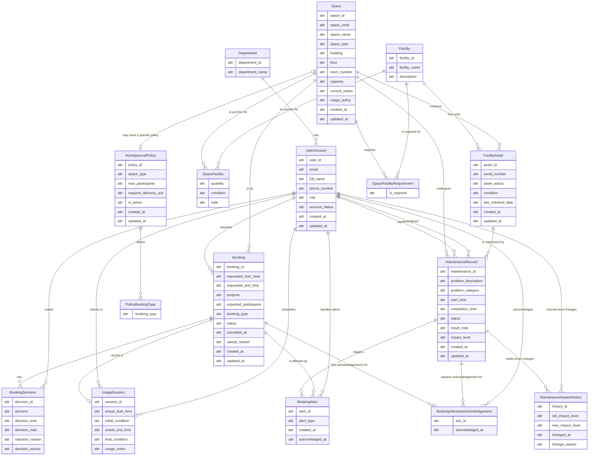
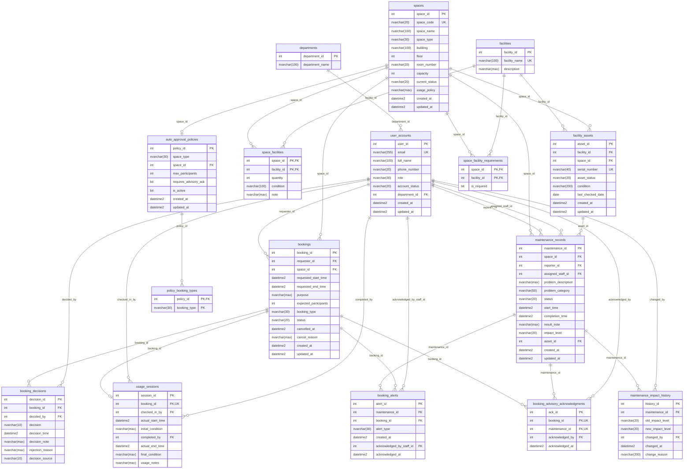

# Step 9: Updated ERD and Logical Design — G08 (Phase 2)

> **Document:** `outputs/09-updated-erd-and-logical-design-G08.md`
> **Phase:** Phase 2 — System Extension (CS486, Group G08)
> **Baseline:** `outputs/02-erd-design-G08.md`, `outputs/03-logical-design-G08.md` (Phase 1, verbatim baseline)
> **Binding analysis:** `outputs/08-requirement-change-analysis-G08.md`
> **Other inputs:** `CS486_Project_Phase02.pdf`, `CAMPUS_SPACE_MANAGEMENT_PROJECT_SPEC_P2.md`, `AGENTS.md`
> **Target DBMS:** Microsoft SQL Server (only permitted DBMS)

---

## 1. Purpose and Scope

This document is the **updated design deliverable** of Phase 2. It extends the Phase 1 baseline — the conceptual ERD (Output 02) and the logical relational schema (Output 03) — to support the **three pillars of Phase 2** defined in Output 08:

1. **Maintenance impact levels** — `maintenance_records.impact_level` (`Advisory` / `OutOfService`) plus the `maintenance_impact_history` escalation audit trail and the `booking_alerts` escalation-consequence list.
2. **Advisory acknowledgements** — `booking_advisory_acknowledgments` as the mandatory link between a booking and every active advisory on its space.
3. **Concurrent booking support** — auto-approval (`auto_approval_policies`, `policy_booking_types`), `booking_decisions.decision_source`, and the filtered index `IX_bookings_space_status_time` as the structural requirement for `SERIALIZABLE` + `WITH (UPDLOCK, HOLDLOCK)` range locking.

**Scope discipline.** Output 09 is a *new* document. No Phase 1 table, column, enum value, or relationship is renamed or dropped; every Phase 1 structure stays verbatim and this document only **overlays** Phase 2 additions. This is a **design deliverable** — no executable DDL (that belongs to Task 10).

**Schema-extension scope at a glance:** 7 new tables (`facility_assets`, `booking_advisory_acknowledgments`, `booking_alerts`, `maintenance_impact_history`, `auto_approval_policies`, `policy_booking_types`, `space_facility_requirements`) and 2 Phase 1 tables extended (`maintenance_records`, `booking_decisions`), matching Output 08 §2.

**Deliverable structure (per the Task 09 command and skill):**
- §2 — **Updated Conceptual ERD** — clean: no FKs, no data types, no PK/FK markers; Home IDs only.
- §3 — **Detailed Logical Schema Diagram** — the full extended schema (Phase 1 + Phase 2 tables) as a Mermaid `erDiagram`: every column in each table box, specific MS SQL Server data types, `PK`/`FK`/`UK` markers on every key, and every relationship line labeled with the actual Foreign Key column name.
- §4 — **Updated Logical Data Dictionary** — exhaustive `Column | Data Type | Constraints (PK/FK/UK/NN) | Description` tables for all 9 Phase 2 affected tables, FK-to-Home-ID traceability, and candidate-key audit.
- §5 — Home ID vs. Visitor ID boundary.
- §6 — Index design (physical structural requirement).
- §7 — Referential integrity (additive FK discipline) and Relationship-to-FK mapping.
- §8 — Derived fact policy.
- §9 — **3NF validation audit** — formal 1NF/2NF/3NF worksheet per the 9 tables, based on the keys and functional dependencies defined in §4.
- §10 — Business-rule enforcement strategy.
- §11 — Traceability to Output 08.
- §12 — Open questions and known limitations.
- §13 — Self-review checklist.

---

## 2. Updated Conceptual ERD (Step 2)

The conceptual ERD preserves the entire Phase 1 diagram from Output 02 unchanged and adds the Phase 2 entities and relationship legs. Per the Step 2 conventions: 2-column boxes with `attr` as a generic placeholder, **no `PK`/`FK` markers, no data types, no indexes, no FK (Visitor ID) columns anywhere** — every connection is a Crow's Foot relationship line. The conceptual ERD is deliberately **clean**: identifiers shown are Home IDs only, as plain descriptive attributes.

### 2.1 Conceptual ERD Diagram

### 2.2 Narrative — New Phase 2 Entities

- **MaintenanceImpactHistory**: an audit trail of every escalation/downgrade of a `MaintenanceRecord`'s `impact_level`. **Home ID:** `history_id`. It carries the two level values (`old_impact_level`, `new_impact_level`), the change time, and a reason. The linking identifiers (`maintenance_id`, `changed_by`) are represented only by relationship lines to `MaintenanceRecord` and `UserAccount` — they do not appear in this box.

- **BookingAlert**: persists the list of bookings affected when a maintenance record escalates to `OutOfService` (`alert_type = 'MaintenanceEscalated'`). **Home ID:** `alert_id`. `created_at`/`acknowledged_at` record lifecycle; `acknowledged_at` is set when staff mark the alert handled. Links to `MaintenanceRecord` and `Booking` are drawn as relationship lines only.

- **BookingAdvisoryAcknowledgement**: an associative entity resolving the M↔N link between `Booking` and `MaintenanceRecord` — one row per (booking, active advisory) confirming the requester acknowledged that advisory. **Home ID:** `ack_id` (surrogate, FK ergonomics only). Carries only the acknowledgement timestamp; all three links (booking, advisory, acknowledging user) are relationship lines.

- **AutoApprovalPolicy**: configuration that marks selected space types (or a specific space) eligible for instant auto-approval. **Home ID:** `policy_id`. Descriptive attributes: `space_type` (nullable), `max_participants`, `requires_advisory_ack`, `is_active`, plus lifecycle metadata. The optional specific-space link to `Space` is a relationship line.

- **PolicyBookingType**: associative entity resolving the M↔N link between `AutoApprovalPolicy` and the allowed `booking_type` values (SQL Server has no array type). **Home ID:** none independent — identity is the pair. Carries only `booking_type`; the link to `AutoApprovalPolicy` is a relationship line.

- **FacilityAsset**: an individual physical unit of a `Facility` type (e.g., "Projector #001"), tracked by `serial_number`. **Home ID:** `asset_id`. Carries `serial_number`, `asset_status`, `condition`, `last_checked_date`, and lifecycle metadata. Links to `Facility` (catalogue type) and `Space` (current location) are relationship lines only.

- **SpaceFacilityRequirement**: marks which facility types are **required** to have at least one available unit for the space to be bookable. **Home ID:** none independent — identity is the pair (`space_id`, `facility_id`). Carries only `is_required`; the two links to `Space` and `Facility` are relationship lines.

**Modified Phase 2 entities:** `MaintenanceRecord` gains the descriptive attribute `impact_level`; `BookingDecision` gains the descriptive attribute `decision_source`. Both keep only their own Home IDs in the box.

### 2.3 New Relationships (Crow's Foot, conceptual)

| Left Entity | Crow's Foot | Right Entity | Explanation |
|---|---|---|---|
| MaintenanceRecord | 1 -- 0..N | MaintenanceImpactHistory | One record has zero or many impact-level change entries. Each entry belongs to exactly one record. |
| MaintenanceRecord | 1 -- 0..N | BookingAlert | One record triggers zero or many escalation alerts. Each alert belongs to exactly one record. |
| Booking | 1 -- 0..N | BookingAlert | One booking is affected by zero or many escalation alerts. Each alert references exactly one booking. |
| Booking | 1 -- 0..N | BookingAdvisoryAcknowledgement | One booking has zero or many advisory acknowledgements. Each ack belongs to exactly one booking. |
| MaintenanceRecord | 1 -- 0..N | BookingAdvisoryAcknowledgement | One record requires acknowledgements from zero or many bookings. Each ack references exactly one record. |
| UserAccount | 1 -- 0..N | BookingAdvisoryAcknowledgement | One user acknowledges zero or many advisories. Each ack is made by exactly one user. |
| Facility | 1 -- 0..N | FacilityAsset | One catalogue facility has zero or many individual units. Each unit is of exactly one facility type. |
| Space | 1 -- 0..N | FacilityAsset | One space contains zero or many units. Each unit currently sits in exactly one space. |
| FacilityAsset | 1 -- 0..N | MaintenanceRecord | One unit is targeted by zero or many maintenance records (0..N); a record may target zero or one unit (space-level records have none). |
| Space | 1 -- 0..N | SpaceFacilityRequirement | One space requires zero or many facility types. Each requirement references exactly one space. |
| Facility | 1 -- 0..N | SpaceFacilityRequirement | One facility type is required by zero or many spaces. Each requirement references exactly one facility type. |
| AutoApprovalPolicy | 1 -- 0..N | PolicyBookingType | One policy allows zero or many booking types. Each allowed type references exactly one policy. |
| Space | 0..1 -- 0..1 | AutoApprovalPolicy | A space may have at most one specific-space override policy; a policy may optionally be scoped to one space. |
| UserAccount | 1 -- 0..N | MaintenanceImpactHistory | One user records zero or many level changes. Each entry is made by exactly one user. |
| UserAccount | 1 -- 0..N | BookingAlert | One staff user handles zero or many alerts. Each handled alert references exactly one staff user. |

**Lifecycle rule applied:** every "many" side uses `0..N` — e.g., a newly created `AutoApprovalPolicy` may initially allow zero booking types; a new `MaintenanceRecord` may initially have no impact-level changes.

---

## 3. Detailed Logical Schema Diagram (Step 3)

Per the Task 09 skill §3.4 (**Logical Schema Diagram Standard**), in addition to the Conceptual ERD, this deliverable MUST include a **Detailed Logical Schema Diagram** as a Mermaid `erDiagram`:

- **Table Boxes:** each box lists **every column** of the table.
- **Physical Markers:** `PK`, `FK`, and `UK` labels appear inside the boxes for every key.
- **Data Types:** each column carries its specific MS SQL Server data type (`int`, `nvarchar(n)` / `nvarchar(max)`, `datetime2`, `bit`, `date`).
- **Relationship Labels:** every relationship line is labeled with the actual Foreign Key column name (e.g., `bookings ||--o{ booking_advisory_acknowledgments : "booking_id"`).
- **Scope:** the diagram shows the **full extended schema** — all 9 Phase 1 tables (verbatim) plus the 7 new Phase 2 tables and the 2 modified Phase 2 tables.

### 3.1 Full Extended Schema Diagram (Phase 1 + Phase 2)

### 3.2 Diagram Conventions

- **PK** = primary key column(s); **FK** = foreign key column; **UK** = unique / candidate key. A column may carry multiple markers (e.g., `int space_id PK, FK` in `space_facilities`, or `int booking_id FK, UK` in `usage_sessions`).
- All 14 Phase 1 relationship lines from Output 03 are preserved **verbatim** (labels identical to Output 03); the Phase 2 lines are added, and every line — Phase 1 or Phase 2 — is labeled with the **actual FK column name** for 100% traceability to the Data Dictionary (§4).
- The two modified Phase 1 tables show their Phase 2 additions inline: `maintenance_records.impact_level`, `maintenance_records.asset_id`, and `booking_decisions.decision_source`. Nothing is renamed or dropped.
- `space_type` in `auto_approval_policies` is a Phase 1 enum reference (no FK — SQL Server enums are CHECK-constrained values); the only FK to `spaces` from that table is `space_id`.

---

## 4. Updated Logical Data Dictionary

The **full Data Dictionary** covers all **9 Phase 2 affected tables** — the 7 new tables plus the 2 modified tables (Phase 1 columns on the modified tables are restated, not omitted). Tables unchanged from Phase 1 (`departments`, `user_accounts`, `spaces`, `facilities`, `space_facilities`, `bookings`, `usage_sessions`) are defined in Output 03 and appear only in the full-schema diagram (§3). Headers per the skill's Logical Mapping Standard:

| Column | Data Type | Constraints (PK/FK/UK/NN) | Description |
|---|---|---|---|

Every FK below is traced back to its Home ID (the column and table where the identifier is defined).

### 4.1 maintenance_records (Phase 1, [Modified])

| Column | Data Type | Constraints (PK/FK/UK/NN) | Description |
|---|---|---|---|
| `maintenance_id` | INT IDENTITY(1,1) | PK, NN | Home ID / surrogate key |
| `space_id` | INT | FK → `spaces.space_id`, NN | Visitor ID — the space needing maintenance |
| `reporter_id` | INT | FK → `user_accounts.user_id`, NN | Visitor ID — who reported the issue |
| `assigned_staff_id` | INT | FK → `user_accounts.user_id` | Visitor ID — staff assigned to fix (NULL until assigned) |
| `problem_description` | NVARCHAR(MAX) | NN | Description of the issue |
| `problem_category` | NVARCHAR(50) | CHECK in ('BrokenProjector','ACFailure','DamagedFurniture','CleaningIssue','NetworkProblem','Other') | Category of the problem |
| `status` | NVARCHAR(20) | NN, DEFAULT 'Reported', CHECK in ('Reported','Assigned','InProgress','Completed','Cancelled') | Maintenance lifecycle status |
| `start_time` | DATETIME2 | NN | When maintenance started |
| `completion_time` | DATETIME2 | CHECK (completion_time IS NULL OR completion_time > start_time) | When maintenance was completed |
| `result_note` | NVARCHAR(MAX) | | Outcome of the maintenance |
| `impact_level` | NVARCHAR(20) | NN, CHECK in ('Advisory','OutOfService') | **[Phase 2]** Maintenance impact level — `OutOfService` blocks booking; `Advisory` only requires acknowledgement. Set on migration via DEFAULT then the DEFAULT is dropped (Task 10) |
| `asset_id` | INT | FK → `facility_assets.asset_id` | **[Phase 2]** Visitor ID — NULL = space-level record (Phase 1 behavior); non-NULL = scoped to one unit. An asset-scoped record never blocks the space by itself |
| `created_at` | DATETIME2 | NN, DEFAULT GETDATE() | Record creation timestamp |
| `updated_at` | DATETIME2 | NN, DEFAULT GETDATE() | Last update timestamp |

### 4.2 booking_decisions (Phase 1, [Modified])

| Column | Data Type | Constraints (PK/FK/UK/NN) | Description |
|---|---|---|---|
| `decision_id` | INT IDENTITY(1,1) | PK, NN | Home ID / surrogate key |
| `booking_id` | INT | FK → `bookings.booking_id`, NN | Visitor ID — the booking being decided |
| `decided_by` | INT | FK → `user_accounts.user_id` | Visitor ID — the staff member who decided. **[Phase 2]** now nullable so `System` decisions can exist; pairing CHECK: `(decision_source = 'System' AND decided_by IS NULL) OR (decision_source = 'Staff' AND decided_by IS NOT NULL)` |
| `decision` | NVARCHAR(10) | NN, CHECK in ('Approved','Rejected') | Approval or rejection |
| `decision_time` | DATETIME2 | NN, DEFAULT GETDATE() | When the decision was made |
| `decision_note` | NVARCHAR(MAX) | | Optional note explaining the decision |
| `rejection_reason` | NVARCHAR(MAX) | CHECK (decision <> 'Rejected' OR rejection_reason IS NOT NULL) | Required when decision = 'Rejected' |
| `decision_source` | NVARCHAR(10) | NN, DEFAULT 'Staff', CHECK in ('Staff','System') | **[Phase 2]** Origin of the decision — 'Staff' (manual approval) or 'System' (auto-approval) |

### 4.3 maintenance_impact_history [new]

| Column | Data Type | Constraints (PK/FK/UK/NN) | Description |
|---|---|---|---|
| `history_id` | INT IDENTITY(1,1) | PK, NN | Home ID / surrogate key |
| `maintenance_id` | INT | FK → `maintenance_records.maintenance_id`, NN | Visitor ID — the maintenance record whose level changed |
| `old_impact_level` | NVARCHAR(20) | CHECK in ('Advisory','OutOfService') | Previous impact level; NULL on the creation (INSERT) row |
| `new_impact_level` | NVARCHAR(20) | NN, CHECK in ('Advisory','OutOfService') | New impact level |
| `changed_by` | INT | FK → `user_accounts.user_id`, NN | Visitor ID — the actor. Resolved via the fallback chain `COALESCE(CONVERT(INT, SESSION_CONTEXT(N'current_user_id')), assigned_staff_id, reporter_id)` on UPDATE and `reporter_id` on INSERT (never NULL/fabricated; Output 08 §2.1) |
| `changed_at` | DATETIME2 | NN | When the level changed |
| `change_reason` | NVARCHAR(200) | | Reason for the escalation/downgrade |

### 4.4 booking_advisory_acknowledgments [new]

| Column | Data Type | Constraints (PK/FK/UK/NN) | Description |
|---|---|---|---|
| `ack_id` | INT IDENTITY(1,1) | PK, NN | Home ID / surrogate key (FK ergonomics only) |
| `booking_id` | INT | FK → `bookings.booking_id`, NN, UK with (`maintenance_id`) | Visitor ID — the booking. Natural composite candidate key `UNIQUE (booking_id, maintenance_id)` — one ack per advisory per booking |
| `maintenance_id` | INT | FK → `maintenance_records.maintenance_id`, NN, UK with (`booking_id`) | Visitor ID — the advisory being acknowledged |
| `acknowledged_by` | INT | FK → `user_accounts.user_id`, NN | Visitor ID — who acknowledged (normally the requester) |
| `acknowledged_at` | DATETIME2 | NN, DEFAULT GETDATE() | When the advisory was acknowledged |

### 4.5 booking_alerts [new]

| Column | Data Type | Constraints (PK/FK/UK/NN) | Description |
|---|---|---|---|
| `alert_id` | INT IDENTITY(1,1) | PK, NN | Home ID / surrogate key |
| `maintenance_id` | INT | FK → `maintenance_records.maintenance_id`, NN | Visitor ID — the escalated maintenance record |
| `booking_id` | INT | FK → `bookings.booking_id`, NN | Visitor ID — the affected booking |
| `alert_type` | NVARCHAR(30) | NN, CHECK in ('MaintenanceEscalated') | Kind of alert (single value today; extensible) |
| `created_at` | DATETIME2 | NN, DEFAULT GETDATE() | When the alert was created |
| `acknowledged_by_staff_id` | INT | FK → `user_accounts.user_id` | Visitor ID — staff member who marked the alert handled |
| `acknowledged_at` | DATETIME2 | | When staff handled the alert (NULL until handled) |

### 4.6 auto_approval_policies [new]

| Column | Data Type | Constraints (PK/FK/UK/NN) | Description |
|---|---|---|---|
| `policy_id` | INT IDENTITY(1,1) | PK, NN | Home ID / surrogate key |
| `space_type` | NVARCHAR(30) | CHECK in ('Auditorium','Classroom','ComputerLaboratory','ProjectLaboratory','MeetingRoom','StudentWorkspace'); exactly-one-of (`space_type`/`space_id`); **filtered UNIQUE index `UQ_auto_approval_policies_active_space_type` on `space_type` WHERE `space_type IS NOT NULL AND is_active = 1`** | Type-level eligibility (NULL when a specific-space override is used). Phase 1 enum reference, no FK. At most **one active** type-level policy per space type |
| `space_id` | INT | FK → `spaces.space_id`; exactly-one-of (`space_type`/`space_id`); **filtered UNIQUE index `UQ_auto_approval_policies_space_id` on `space_id` WHERE `space_id IS NOT NULL`** | Visitor ID — specific-space override. At most one override policy per space |
| `max_participants` | INT | | Cap on eligible request size (NULL = no cap beyond space capacity) |
| `requires_advisory_ack` | BIT | NN, DEFAULT 1 | Whether the policy still requires every active advisory to be acknowledged before auto-approval |
| `is_active` | BIT | NN, DEFAULT 1 | Whether the policy is currently applied |
| `created_at` | DATETIME2 | NN, DEFAULT GETDATE() | Record creation timestamp |
| `updated_at` | DATETIME2 | NN, DEFAULT GETDATE() | Last update timestamp |

**Uniqueness enforcement:** two **filtered UNIQUE indexes** close the "no two identical eligibility targets" gap (SQL Server has no partial `UNIQUE` *constraint* syntax, so these are enforced as filtered unique *indexes*, §6):

- `UQ_auto_approval_policies_space_id` — `UNIQUE (space_id) WHERE space_id IS NOT NULL`: at most one specific-space override policy per space (even when such a policy is inactive, it still owns that space's override slot).
- `UQ_auto_approval_policies_active_space_type` — `UNIQUE (space_type) WHERE space_type IS NOT NULL AND is_active = 1`: at most one **active** type-level policy per space type, so deactivating a policy frees its `space_type` for reuse.

### 4.7 policy_booking_types [new]

| Column | Data Type | Constraints (PK/FK/UK/NN) | Description |
|---|---|---|---|
| `policy_id` | INT | PK (composite with `booking_type`), FK → `auto_approval_policies.policy_id`, NN | Visitor ID — the policy. Junction to the allowed booking types |
| `booking_type` | NVARCHAR(30) | PK (composite with `policy_id`), NN, CHECK matching `CK_bookings_booking_type` | Allowed booking type for the policy (e.g., 'Seminar', 'Meeting') |

### 4.8 facility_assets [new]

| Column | Data Type | Constraints (PK/FK/UK/NN) | Description |
|---|---|---|---|
| `asset_id` | INT IDENTITY(1,1) | PK, NN | Home ID / surrogate key |
| `facility_id` | INT | FK → `facilities.facility_id`, NN | Visitor ID — the catalogue facility type (e.g., 'Projector') |
| `space_id` | INT | FK → `spaces.space_id`, NN | Visitor ID — the space where the unit currently sits |
| `serial_number` | NVARCHAR(40) | UK (UNIQUE), NN | Natural UK — unique physical unit identifier (e.g., 'PRJ-0001') |
| `asset_status` | NVARCHAR(20) | NN, CHECK in ('Available','InUse','UnderMaintenance','Retired') | State of the individual unit |
| `condition` | NVARCHAR(200) | | Physical condition notes |
| `last_checked_date` | DATE | | Date of the last inspection |
| `created_at` | DATETIME2 | NN, DEFAULT GETDATE() | Record creation timestamp |
| `updated_at` | DATETIME2 | NN, DEFAULT GETDATE() | Last update timestamp |

### 4.9 space_facility_requirements [new]

| Column | Data Type | Constraints (PK/FK/UK/NN) | Description |
|---|---|---|---|
| `space_id` | INT | PK (composite with `facility_id`), FK → `spaces.space_id`, NN | Visitor ID — the space |
| `facility_id` | INT | PK (composite with `space_id`), FK → `facilities.facility_id`, NN | Visitor ID — the facility type |
| `is_required` | BIT | NN, DEFAULT 1 | Sparse-list convention: presence in the table means "required"; do not insert `is_required = 0` rows. Supports the required-asset availability block |

---

## 5. Home ID vs. Visitor ID Enforcement Boundary

**Only in the Logical Schema do Visitor (FK) columns exist; the Conceptual ERD shows Home IDs only, via relationship lines.**

- `asset_id` — Home in `facility_assets`; Visitor in `maintenance_records.asset_id`.
- `booking_id` — Home in `bookings`; Visitor in `booking_advisory_acknowledgments.booking_id`, `booking_alerts.booking_id`, `booking_decisions.booking_id`, `usage_sessions.booking_id`.
- `maintenance_id` — Home in `maintenance_records`; Visitor in `maintenance_impact_history.maintenance_id`, `booking_advisory_acknowledgments.maintenance_id`, `booking_alerts.maintenance_id`.
- `facility_id` — Home in `facilities`; Visitor in `facility_assets.facility_id`, `space_facility_requirements.facility_id`, `space_facilities.facility_id`.
- `space_id` — Home in `spaces`; Visitor in `facility_assets.space_id`, `space_facility_requirements.space_id`, `auto_approval_policies.space_id`, `bookings.space_id`, `space_facilities.space_id`, `maintenance_records.space_id`.
- `changed_by`, `acknowledged_by`, `acknowledged_by_staff_id` — Visitor IDs whose Home is `user_accounts.user_id`.

No Phase 1 Home ID changes place; the only cardinality change is `booking_decisions.decided_by` becoming optional (the deciding-user relationship becomes 1 → 0..1) so `decision_source = 'System'` decisions can exist without a staff member.

---

## 6. Candidate Key Audit (natural UKs)

Explicit natural candidate keys, enforced as `UNIQUE` constraints:

| Table | Candidate Key | Type | Rationale |
|---|---|---|---|
| `facility_assets` | `serial_number` | Natural | Unique physical unit identifier; guarantees no two units share a serial. Globally UNIQUE, which makes the space/facility/serial composite redundant — removed |
| `booking_advisory_acknowledgments` | `(booking_id, maintenance_id)` | Composite natural | One acknowledgement per advisory per booking — base the 2NF analysis on this key, not the surrogate `ack_id` |
| `space_facility_requirements` | `(space_id, facility_id)` | Composite (already the PK) | One requirement row per space/facility pair |
| `auto_approval_policies` | `space_id` when set | Natural (enforced) | At most one specific-space override policy per space — **enforced** by filtered UNIQUE index `UQ_auto_approval_policies_space_id` WHERE `space_id IS NOT NULL` (§4.6) |
| `auto_approval_policies` | `space_type` when set (active only) | Natural (enforced) | At most one **active** type-level policy per space type — **enforced** by filtered UNIQUE index `UQ_auto_approval_policies_active_space_type` WHERE `space_type IS NOT NULL AND is_active = 1` (§4.6) |

Phase 1 candidate keys (`user_accounts.email`, `spaces.space_code`, `facilities.facility_name`, `space_facilities (space_id, facility_id)`, `usage_sessions.booking_id`) remain unchanged. The keys audited here are the same keys used in the 3NF audit (§9) — the audit and the Data Dictionary do not disagree.

---

## 7. Index Design (physical structural requirement)

### 7.1 Filtered index — conflict-check range locking

The filtered index **`IX_bookings_space_status_time`** is a **physical structural requirement**, not an optional suggestion:

- **Definition:** non-clustered filtered index on `bookings (space_id, requested_start_time, requested_end_time)` `WHERE status IN ('Approved','CheckedIn')`.
- **Purpose:** it is what enables `SERIALIZABLE` + `WITH (UPDLOCK, HOLDLOCK)` key-range locking on the booking conflict check (Output 08 §5.4–5.5). The conflict check runs `SELECT ... WHERE space_id = @space_id AND status IN ('Approved','CheckedIn') AND requested_start_time < @new_end AND requested_end_time > @new_start` under `SERIALIZABLE` with `UPDLOCK, HOLDLOCK`; the index matches the predicate so SQL Server can take key-range locks (including the gap where a conflicting new row would land) instead of escalating to a table lock. Without it the pattern is still correct, just less concurrent.
- **Design-strategy role:** state the definition and its role here; the `CREATE INDEX` DDL belongs to Task 10 / Task 15.
- **Performance caveat:** while the filtered index is the standard SQL Server approach for the overlap predicate, its performance will be **strictly monitored during Task 15's execution-plan analysis** — the before/after plans and timings on the conflict check (and the room-finder query) will verify that the range-locking pattern delivers its intended selectivity on the large Task 14 dataset. This section records a design *expectation*, not a measured claim; Task 15 is the authority on whether the index shape holds up.

### 7.2 Supporting Phase 2 indexes

| Index | Table | Column(s) | Type | Use case |
|---|---|---|---|---|
| `IX_facility_assets_space_facility_status` | `facility_assets` | `(space_id, facility_id, asset_status)` | Non-clustered | Required-asset availability block (§10) and `space_facility_summary` view aggregation |
| `IX_facility_assets_serial_number` | `facility_assets` | `serial_number` | Unique | Enforces the natural UK; direct lookup by serial |
| `IX_maintenance_records_impact_level` | `maintenance_records` | `(space_id, status, impact_level, start_time, completion_time)` | Non-clustered | The impact-level blocking check and advisory-ack lookup (Output 08 §4.1–4.2) |
| `IX_maintenance_impact_history_mid` | `maintenance_impact_history` | `maintenance_id` | Non-clustered | FK lookup, per-record audit trail |
| `IX_booking_advisory_ack_booking` | `booking_advisory_acknowledgments` | `booking_id` | Non-clustered | Per-booking acknowledgement completeness check |
| `IX_booking_alerts_booking` | `booking_alerts` | `booking_id` | Non-clustered | Report (d) escalation lookup |
| `IX_auto_approval_policies_active` | `auto_approval_policies` | `space_type, space_id, is_active` | Non-clustered | Instant-booking eligibility lookup |

Implementation references Task 15 (index tuning report).

---

## 8. Referential Integrity (additive FK discipline) and Relationship-to-FK Mapping

**Phase 1 FKs remain unchanged.** All 14 Phase 1 FK relationships from Output 03 are preserved exactly — no FK is dropped, renamed, re-targeted, or re-purposed. **Phase 2 FKs are added additively.** The only nullability change is `booking_decisions.decided_by` becoming nullable (Output 08 §2.2).

| # | Left Table | Right Table | Cardinality | FK Column(s) | In Table | Phase |
|---|---|---|---|---|---|---|
| 1 | departments | user_accounts | 1 -- 0..N | `department_id` | user_accounts | Phase 1, unchanged |
| 2 | user_accounts | bookings | 1 -- 0..N | `requester_id` | bookings | Phase 1, unchanged |
| 3 | spaces | bookings | 1 -- 0..N | `space_id` | bookings | Phase 1, unchanged |
| 4 | bookings | booking_decisions | 1 -- 0..N | `booking_id` | booking_decisions | Phase 1, unchanged |
| 5 | user_accounts | booking_decisions | 1 -- 0..N | `decided_by` | booking_decisions | Phase 1, unchanged (FK target stays; only nullability changes) |
| 6 | bookings | usage_sessions | 1 -- 0..1 | `booking_id` (UNIQUE) | usage_sessions | Phase 1, unchanged |
| 7 | user_accounts | usage_sessions | 1 -- 0..N | `checked_in_by` | usage_sessions | Phase 1, unchanged |
| 8 | user_accounts | usage_sessions | 1 -- 0..N | `completed_by` | usage_sessions | Phase 1, unchanged |
| 9 | spaces | space_facilities | 1 -- 0..N | `space_id` | space_facilities | Phase 1, unchanged |
| 10 | facilities | space_facilities | 1 -- 0..N | `facility_id` | space_facilities | Phase 1, unchanged |
| 11 | spaces | maintenance_records | 1 -- 0..N | `space_id` | maintenance_records | Phase 1, unchanged |
| 12 | user_accounts | maintenance_records | 1 -- 0..N | `reporter_id` | maintenance_records | Phase 1, unchanged |
| 13 | user_accounts | maintenance_records | 1 -- 0..N | `assigned_staff_id` | maintenance_records | Phase 1, unchanged |
| 14 | maintenance_records | maintenance_impact_history | 1 -- 0..N | `maintenance_id` | maintenance_impact_history | Phase 2, added |
| 15 | maintenance_records | booking_alerts | 1 -- 0..N | `maintenance_id` | booking_alerts | Phase 2, added |
| 16 | bookings | booking_alerts | 1 -- 0..N | `booking_id` | booking_alerts | Phase 2, added |
| 17 | bookings | booking_advisory_acknowledgments | 1 -- 0..N | `booking_id` | booking_advisory_acknowledgments | Phase 2, added |
| 18 | maintenance_records | booking_advisory_acknowledgments | 1 -- 0..N | `maintenance_id` | booking_advisory_acknowledgments | Phase 2, added |
| 19 | user_accounts | booking_advisory_acknowledgments | 1 -- 0..N | `acknowledged_by` | booking_advisory_acknowledgments | Phase 2, added |
| 20 | facilities | facility_assets | 1 -- 0..N | `facility_id` | facility_assets | Phase 2, added |
| 21 | spaces | facility_assets | 1 -- 0..N | `space_id` | facility_assets | Phase 2, added |
| 22 | facility_assets | maintenance_records | 1 -- 0..N | `asset_id` (NULL = space-level) | maintenance_records | Phase 2, added |
| 23 | spaces | space_facility_requirements | 1 -- 0..N | `space_id` | space_facility_requirements | Phase 2, added |
| 24 | facilities | space_facility_requirements | 1 -- 0..N | `facility_id` | space_facility_requirements | Phase 2, added |
| 25 | auto_approval_policies | policy_booking_types | 1 -- 0..N | `policy_id` | policy_booking_types | Phase 2, added |
| 26 | spaces | auto_approval_policies | 0..1 -- 0..1 | `space_id` | auto_approval_policies | Phase 2, added |
| 27 | user_accounts | maintenance_impact_history | 1 -- 0..N | `changed_by` | maintenance_impact_history | Phase 2, added |
| 28 | user_accounts | booking_alerts | 1 -- 0..N | `acknowledged_by_staff_id` | booking_alerts | Phase 2, added |

---

## 9. 3NF Validation Audit (the 9 tables)

Formal 1NF/2NF/3NF worksheet per relation. Keys referenced are the candidate keys from §6 / §4. The surrogate vs. natural distinction is stated per relation, and 2NF analysis uses the natural key where one exists.

### 9.1 maintenance_records [Modified]

- **FDs:** `maintenance_id → {space_id, reporter_id, assigned_staff_id, problem_description, problem_category, status, start_time, completion_time, result_note, impact_level, asset_id, created_at, updated_at}`. Natural candidates: none beyond the surrogate (transactional entity; identity is purely internal). PK: `maintenance_id`.
- **1NF:** every column atomic and single-valued; no repeating groups — the impact-level history is a separate table, not a comma list. ✓
- **2NF:** single-column PK, no composite key, so no partial dependency is possible. ✓
- **3NF:** no transitive dependency — `impact_level` is a value chosen by staff on this record (not derived from any other table), `asset_id` is a direct FK reference (the asset's own attributes live in `facility_assets`), and no non-key attribute depends on another non-key attribute. ✓
- **Verdict:** 3NF-compliant.

### 9.2 booking_decisions [Modified]

- **FDs:** `decision_id → {booking_id, decided_by, decision, decision_time, decision_note, rejection_reason, decision_source}`. Natural candidates: none. PK: `decision_id`.
- **1NF:** all columns atomic and single-valued. ✓
- **2NF:** single-column PK — no partial dependency. ✓
- **3NF:** `decision_source` is a value on this row (an actor-origin label), `decided_by` a direct FK; the booking's own attributes stay in `bookings`. No transitive dependency. ✓
- **Verdict:** 3NF-compliant. (The pairing CHECK between `decision_source` and `decided_by` is a same-table constraint, not a 3NF concern.)

### 9.3 maintenance_impact_history [new]

- **FDs:** `history_id → {maintenance_id, old_impact_level, new_impact_level, changed_by, changed_at, change_reason}`. Natural candidates: none (multiple changes per record are ordered events; no natural unique pair). PK: `history_id`.
- **1NF:** atomic attributes; one row per level change. ✓
- **2NF:** single-column PK — no partial dependency. ✓
- **3NF:** `old_impact_level`/`new_impact_level` are audited values captured at change time (history, not derived live from the parent), `changed_by`/`changed_at` are event facts. The advisory/record descriptions stay in `maintenance_records`. No transitive dependency. ✓
- **Verdict:** 3NF-compliant.

### 9.4 booking_advisory_acknowledgments [new]

- **FDs (natural key):** `(booking_id, maintenance_id) → {ack_id, acknowledged_by, acknowledged_at}`; surrogate `ack_id → {booking_id, maintenance_id, acknowledged_by, acknowledged_at}`. Natural candidate key: `(booking_id, maintenance_id)`; surrogate PK: `ack_id` (FK ergonomics only).
- **1NF:** atomic attributes — one row per (booking, advisory) pair, no repeating groups. ✓
- **2NF:** with the natural key `(booking_id, maintenance_id)`, the non-key attributes (`acknowledged_by`, `acknowledged_at`) depend on the **whole** pair — neither `booking_id` alone nor `maintenance_id` alone determines who/when an acknowledgement happened. No partial dependency. ✓
- **3NF:** the advisory's descriptive text remains in the parent `maintenance_records`; the ack row stores only keys + actor + timestamp. No transitive dependency. ✓
- **Verdict:** 3NF-compliant (matches the worked sample in Output 08 §1.5).

### 9.5 booking_alerts [new]

- **FDs:** `alert_id → {maintenance_id, booking_id, alert_type, created_at, acknowledged_by_staff_id, acknowledged_at}`. Natural candidates: none (an escalation can legitimately repeat or be re-sent). PK: `alert_id`.
- **1NF:** atomic attributes; one row per (record, booking, alert event). ✓
- **2NF:** single-column PK — no partial dependency. ✓
- **3NF:** the affected booking's details live in `bookings`; the escalated record's details live in `maintenance_records`; the alert row keeps only keys + alert metadata. No transitive dependency. ✓
- **Verdict:** 3NF-compliant.

### 9.6 auto_approval_policies [new]

- **FDs:** `policy_id → {space_type, space_id, max_participants, requires_advisory_ack, is_active, created_at, updated_at}`. Natural candidates: `space_id` when set and `space_type` when active (`is_active = 1`), each **enforced** by the filtered UNIQUE indexes from §4.6/§6. PK: `policy_id`.
- **1NF:** atomic attributes; the allowed booking types are normalized into `policy_booking_types` (no comma/array column). ✓
- **2NF:** single-column PK — no partial dependency. ✓
- **3NF:** `space_type` is an enum reference (Phase 1 values), `space_id` a direct FK; no non-key attribute depends on another non-key attribute. ✓
- **Verdict:** 3NF-compliant.

### 9.7 policy_booking_types [new]

- **FDs (composite PK):** `(policy_id, booking_type) →` (no non-key attributes). The relation is a pure junction — every column is part of the key. PK: `(policy_id, booking_type)`.
- **1NF:** atomic attributes. ✓
- **2NF:** no non-key attributes, so no partial dependency is possible. ✓
- **3NF:** no non-key attributes, so no transitive dependency is possible. ✓
- **Verdict:** 3NF-compliant (trivially).

### 9.8 facility_assets [new]

- **FDs:** `asset_id → {facility_id, space_id, serial_number, asset_status, condition, last_checked_date, created_at, updated_at}`; natural candidate `serial_number` (globally UNIQUE — the space/facility/serial composite is redundant and removed in §6).
- **1NF:** atomic attributes; each unit is its own row (no quantity counts). ✓
- **2NF:** single-column PK — no partial dependency. ✓
- **3NF:** `facility_id` and `space_id` are direct FK references; `asset_status`, `condition`, `last_checked_date` are facts about the unit itself. Unit counts (`total_units`/`available_units`) are **not stored** — they are derived from these rows via the `space_facility_summary` view (§8), so no stored count summarizes `facility_assets` (which would be a 3NF violation). ✓
- **Verdict:** 3NF-compliant.

### 9.9 space_facility_requirements [new]

- **FDs (composite PK):** `(space_id, facility_id) → {is_required}`. PK: `(space_id, facility_id)`.
- **1NF:** atomic attributes. ✓
- **2NF:** `is_required` is a function of the whole pair (a facility type's "required" status for a space is meaningful only for that exact space/facility combination), so no partial dependency on either single attribute. ✓
- **3NF:** `is_required` depends only on the key; no transitive dependency. ✓
- **Verdict:** 3NF-compliant.

**Overall:** all 9 Phase 2 affected relations are 3NF-compliant as designed. The two intentionally derived facts (`space_facility_summary` unit counts, `is_early_checkout`) are computed at query time, never stored (§8). Unresolved corners are flagged in §12 rather than overclaimed.

---

## 10. Business-Rule Enforcement Strategy (design strategy, not code)

| Phase 2 rule | Enforcement strategy (SQL Server) | Task |
|---|---|---|
| `OutOfService` blocks booking for any overlap | Impact-level check on `maintenance_records` — active (`status NOT IN ('Completed','Cancelled')`) with `impact_level = 'OutOfService'` overlapping `[start_time, COALESCE(completion_time, '9999-12-31'))`; executed inside the concurrency-safe procedures. `spaces.current_status` is UI-display only for maintenance (Output 08 §4.1) | 10–13 |
| `Advisory` never blocks; every active advisory acknowledged per booking before `Approved` | `UNIQUE (booking_id, maintenance_id)` + statement order inside the transaction (insert `Pending` → insert acks → update to `Approved`) + trigger `TR_bookings_AdvisoryAckRequired` comparing `COUNT(DISTINCT active advisory)` vs `COUNT(DISTINCT acknowledged)` | 10 |
| Escalation/downgrade audit | `maintenance_impact_history` populated by trigger `TR_maintenance_impact_history` (INSERT records initial level with `old_impact_level = NULL`; UPDATE only on actual value change; `changed_by` fallback chain) | 10 |
| Escalation consequence — affected bookings identifiable | `booking_alerts` populated by trigger `TR_maintenance_escalation` (`alert_type = 'MaintenanceEscalated'`), one row per affected `Approved`/`CheckedIn` booking; manual requester contact stays a staff action | 10, 16 |
| Downgrade lifecycle — unresolved alerts auto-closed | **Business rule:** when a maintenance record is downgraded `OutOfService` → `Advisory`, any related **unresolved** entries in `booking_alerts` (`acknowledged_at IS NULL`) are automatically flagged **Resolved/Closed** — the same `TR_maintenance_escalation` trigger (or the escalation procedure) stamps `acknowledged_at = GETDATE()` and `acknowledged_by_staff_id` with the acting staff on every open alert for that record, because the out-of-service block that justified them has been lifted. The `maintenance_impact_history` row still records the downgrade | 10, 12 |
| Required-asset block | `space_facility_requirements.is_required = 1` with zero `'Available'` units in `facility_assets` for that space + facility blocks `Approved`/`CheckedIn` (trigger `TR_bookings_RequiredAssetCheck`); supported by `IX_facility_assets_space_facility_status` | 10 |
| Concurrency invariant (no overlapping `Approved`/`CheckedIn` bookings, any path) | `SERIALIZABLE` + `WITH (UPDLOCK, HOLDLOCK)` range locking on the shared conflict check in `usp_CreateBooking`/approval procedures, backed by filtered index `IX_bookings_space_status_time`; retry on 1205/1222; `sp_getapplock` alternative; Phase 1 trigger as backstop only | 11–13, 15 |
| Auto-approval | `auto_approval_policies` + `policy_booking_types` evaluated inside the same `SERIALIZABLE` transaction; decision stored in `booking_decisions` with `decision_source = 'System'`. For eligibility, `max_participants` and the `policy_booking_types` set are treated as the **computable subset of the Phase 1 `spaces.usage_policy` free-text** — the Phase 1 text is narrative and not machine-parsed; the policy tables carry the machine-checkable form of those same rules (headcount cap, allowed booking types), so the system computes eligibility from them and only uses `usage_policy` for display | 11–13 |
| Early check-out releases reserved window immediately | Derived fact — booking becomes `Completed`, drops out of the `IN ('Approved','CheckedIn')` blocking filter; `is_early_checkout = (actual_end_time < requested_end_time)` computed at query time, never stored | 12 |

**Statement-level vs. concurrency layering:** the triggers enforce business rules on committed/statement state; the procedures ensure the invariant holds under simultaneity. Both layers coexist (Output 08 §5.5).

---

## 11. Traceability to Output 08

Every Phase 2 design element in this document maps to its source in Output 08:

| Output 08 reference | Design element in Output 09 |
|---|---|
| §2.1 new tables | `maintenance_impact_history`, `booking_advisory_acknowledgments`, `auto_approval_policies`, `policy_booking_types`, `facility_assets`, `space_facility_requirements`, `booking_alerts` (§4.3–4.9) |
| §2.2 modified tables | `maintenance_records.impact_level` + `asset_id`; `booking_decisions.decision_source` + nullable `decided_by` (§4.1–4.2) |
| §2.3 quantity → asset | `facility_assets`; `space_facilities.quantity` retained; `space_facility_summary` view (§8, §10) |
| §3 relationships | Relationship-to-FK mapping rows 14–28 (§8) and the logical diagram lines (§3) |
| §4.1 status vs. impact | Impact-level check strategy (§10) |
| §4.2 advisory acknowledgements | `booking_advisory_acknowledgments` + `UNIQUE (booking_id, maintenance_id)` (§4.4, §9.4) |
| §4.3 escalation/downgrade | `maintenance_impact_history` + `booking_alerts` + `changed_by` fallback (§4.3, §4.5, §10) |
| §4.4 reserved vs. actual | Derived `is_early_checkout`; no new column (§8, §10) |
| §4.5 auto-approval | `auto_approval_policies`, `policy_booking_types`, `decision_source` (§4.2, §4.6–4.7, §10) |
| §4.6 required-asset block | `space_facility_requirements` (§4.9, §10) |
| §5.4–5.5 concurrency | Filtered index `IX_bookings_space_status_time` (§7.1) as the structural requirement; shared conflict-check strategy (§10) |
| §6 traceability matrix | All rows 1–21 reflected in §4, §7, §8, §10 |
| §1.5 3NF mini-validation | Full 9-table audit in §9 |

---

## 12. Open Questions and Known Limitations

1. **Losing request handling** (Output 08 §7-1): if two instant-booking requests race, is the loser auto-rejected or re-queued as `Pending`? Design assumes the shared serialized conflict check decides; product decision pending.
2. **"Required" facility definition** (Output 08 §7-2): what makes a facility `required` is team-invented; `space_facility_requirements` implements it but confirmation is needed before treating as gradeable scope.
3. **No-show auto-release** (Output 08 §7-3): unconfirmed; no design element added.
4. **Downgrade authority** (Output 08 §7-4): who may downgrade `OutOfService` → `Advisory`, and whether downgrade auto-reopens the space, is open. The `maintenance_impact_history` audit trail records it regardless.
5. **Booking-approval vs. escalation race** (Output 08 §7-5): recorded as a known limitation to be addressed during Tasks 11/12 — the `SERIALIZABLE` primitives should be shared across approval and escalation workflows.
6. **Advisory Gap:** advisories created **after a booking is approved but before check-in** are not currently covered by the mandatory acknowledgement flow — `booking_advisory_acknowledgments` and `TR_bookings_AdvisoryAckRequired` gate **approval only**. A mid-window advisory on the space will be shown to the requester at check-in but does not block entry. Flagged for the team; closing it (e.g., ack-at-check-in gate or a follow-up alert) would be a future extension, not part of Tasks 10–13.
7. **`facility_assets` data-generation complexity:** individual asset rows with globally unique serials are **retained as a team design choice** (granular maintenance and required-asset tracking) despite the cost they impose on Task 14's data generator — it must mint consistent serials per unit, map each unit to a space/facility, and keep `asset_status` consistent with the maintenance/booking lifecycle. Accepted cost; acknowledged here as a known risk.
8. **Diagram rendering:** the two Mermaid diagrams (§2, §3) are large; a reviewer should confirm rendering/readability in the target renderer (flagged in prior audits).

---

## 13. Self-Review Checklist

- [x] No Phase 1 table/column renamed or dropped; everything overlays Output 02/03.
- [x] Conceptual ERD: Mermaid Crow's Foot; 2-column `attr` boxes; Home ID only in its defining box; **no Visitor ID/FK** column anywhere.
- [x] No data types, no PK/FK/UK markers, no indexes, no DDL in the conceptual diagram.
- [x] The three pillars present: `maintenance_records` + `maintenance_impact_history` + `booking_alerts`; `booking_advisory_acknowledgments`; and the concurrency elements (`auto_approval_policies`, `policy_booking_types`, `booking_decisions.decision_source`, filtered index `IX_bookings_space_status_time`).
- [x] M–N links resolved via associative entities (2 legs), never a direct M–N line.
- [x] **Detailed Logical Schema Diagram** produced (§3) per skill §3.4: full extended schema (Phase 1 + Phase 2), every column in each box, `PK`/`FK`/`UK` markers on every key, MS SQL Server data types in the boxes, and every relationship line labeled with the actual FK column name.
- [x] Relationship-to-FK mapping matches Output 08 §3; exactly one narrative row per conceptual line; Phase 1 vs Phase 2 rows marked.
- [x] **Logical Mapping Standard:** every one of the 9 affected tables has a Data Dictionary table with headers `Column | Data Type | Constraints (PK/FK/UK/NN) | Description`.
- [x] **FK enforcement:** every FK explicitly traced to its Home ID; no bare FK without a target.
- [x] **Candidate key audit:** natural UKs explicitly named; consistent with the 3NF audit.
- [x] **SQL Server fidelity:** every column has a specific MS SQL Server type (`INT IDENTITY`, `NVARCHAR`, `DATETIME2`, `BIT`, `DATE`); no generic types.
- [x] **Index design:** the filtered index `IX_bookings_space_status_time` recorded as a physical structural requirement for range-locking; performance disclaimer added for Task 15 monitoring (§7.1).
- [x] **Auto-approval uniqueness:** `space_id` (when set) and active `space_type` (when set) each enforced by filtered UNIQUE indexes on `auto_approval_policies` (§4.6, §6).
- [x] **Referential integrity:** all Phase 1 FKs unchanged; Phase 2 FKs added additively.
- [x] `facility_assets` integrated for granular-maintenance tracking.
- [x] Formal 1NF/2NF/3NF audit documented per each of the 9 tables; none overclaimed.
- [x] Unit counts derived via `space_facility_summary`; `is_early_checkout` and all counts never stored.
- [x] Relationship labels in the logical diagram use actual FK column names.
