# Task 13 Concurrency Test Report: Race A (Double Approval)

**Test Objective:** To demonstrate the Time-Of-Check-To-Time-Of-Use (TOCTOU) flaw present in the Phase 1 trigger-only design, and to verify that the Task 12 stored procedures (`SERIALIZABLE` + `UPDLOCK`/`HOLDLOCK`) successfully serialize transactions and preserve the database invariant.

## Part A: Baseline (The Phase 1 Flaw)

**Execution:**
We executed the manual double-approval scenario using the dual-window SSMS methodology. Session A updated the booking status to `Approved` but intentionally delayed its commit for 5 seconds using `WAITFOR DELAY`. During this uncommitted window, Session B executed its check, saw the slot as empty (due to the `READ COMMITTED` isolation level), and also updated its booking to `Approved`.

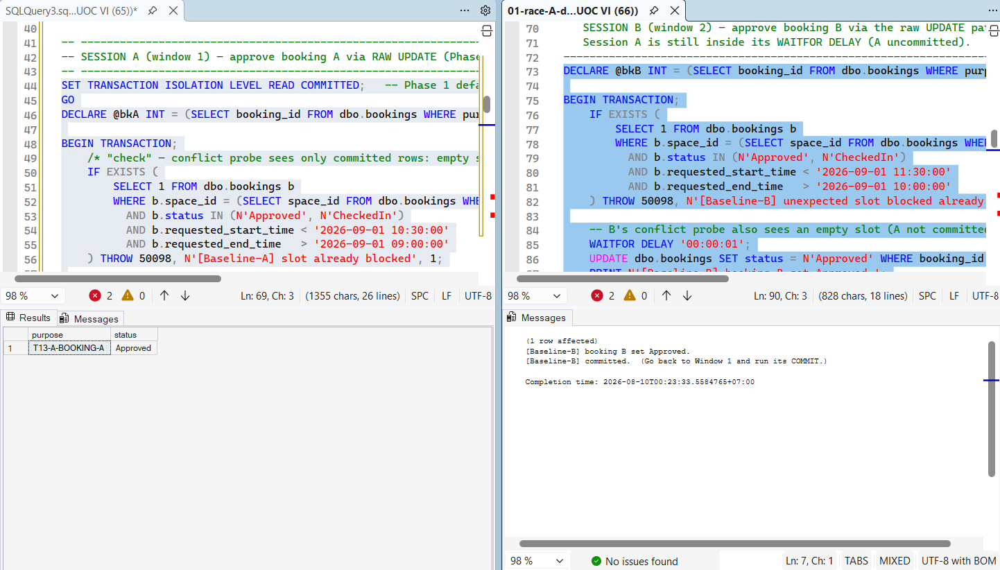

**Verification:**
As shown in the result grid below, both `T13-A-BOOKING-A` and `T13-A-BOOKING-B` successfully achieved the `Approved` status. Because their requested time windows overlap (09:00-10:30 and 10:00-11:30), the core invariant is definitively violated.

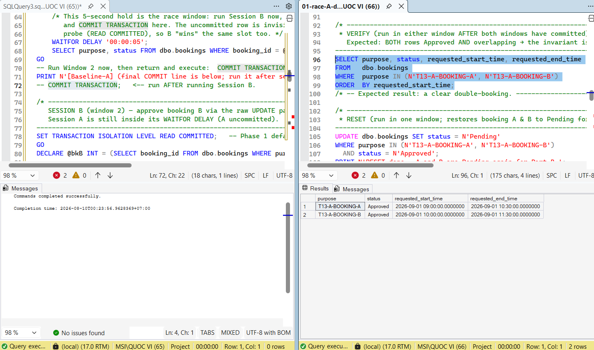

---

## Part B: Prevention (The Task 12 Fix)

**Execution:**
After resetting the bookings to `Pending`, we executed the same concurrent scenario using the `usp_ApproveBooking` stored procedure. Session A successfully acquired the key-range lock and held the outer transaction open for 6 seconds. When Session B attempted to approve the overlapping booking during this wait, it was forced to queue. Once Session A committed, Session B re-evaluated the state, detected the conflict, and correctly failed with **Error 50001: Overlapping Approved/CheckedIn booking exists for this space**. 

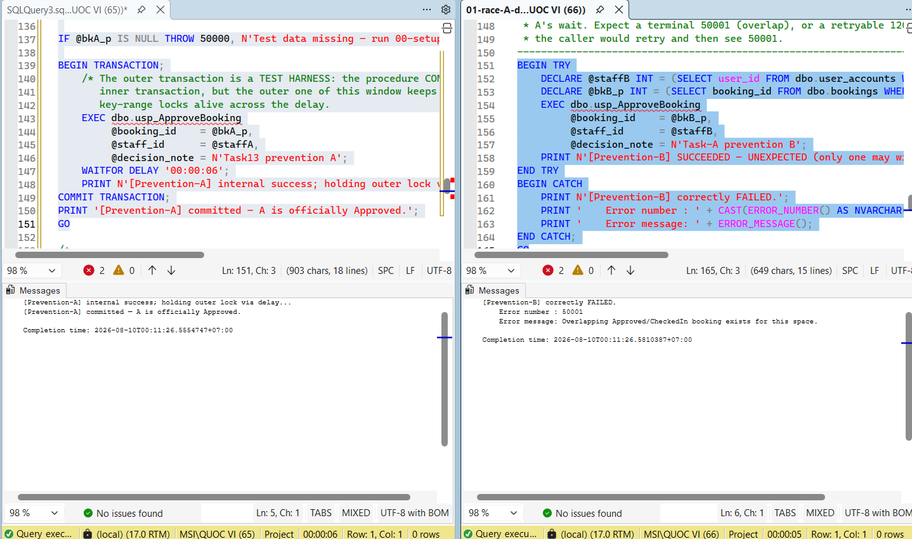

**Verification:**
The final verification confirms that the serialization mechanism worked perfectly. `T13-A-BOOKING-A` was successfully `Approved`, while `T13-A-BOOKING-B` safely remained in the `Pending` state. The invariant was preserved under direct concurrent pressure.

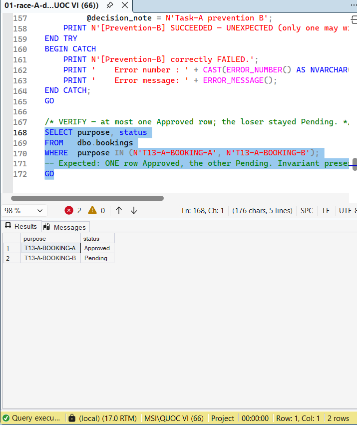

# Task 13 Concurrency Test Report: Race B (Instant vs. Manual)

**Test Objective:** To demonstrate the path-independence of the concurrency invariant. This test proves that the system's flaw allows an auto-approval (instant) request and a manual staff approval to double-book the same space, and verifies that the Task 12 stored procedures (`usp_CreateBookingAutoApproved` and `usp_ApproveBooking`) successfully share the same serialization mechanism to prevent it.

## Part A: Baseline (The Phase 1 Flaw)

**Execution:**
We executed the instant vs. manual scenario using the dual-window SSMS methodology. Session A simulated the instant auto-approval path using raw statements (inserting the booking and flipping it to `Approved`) and delayed its commit. During this uncommitted window, Session B simulated a staff member manually approving an overlapping `Pending` request using a raw `UPDATE`. Because of the `READ COMMITTED` isolation level, Session B's check did not see Session A's uncommitted row, allowing both to succeed.

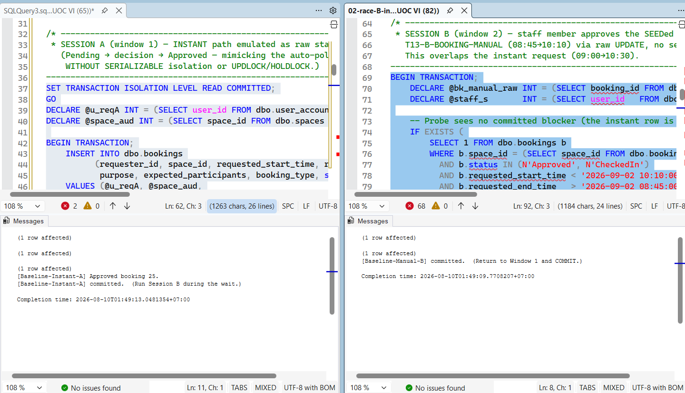

**Verification:**
As shown in the result grid below, both the manual booking (`T13-B-BOOKING-MANUAL`) and the raw instant booking (`T13-B-INSTANT-RAW`) successfully achieved the `Approved` status. Because their requested time windows overlap (08:45-10:10 and 09:00-10:30) on the same space, the invariant is violated across two different business paths.

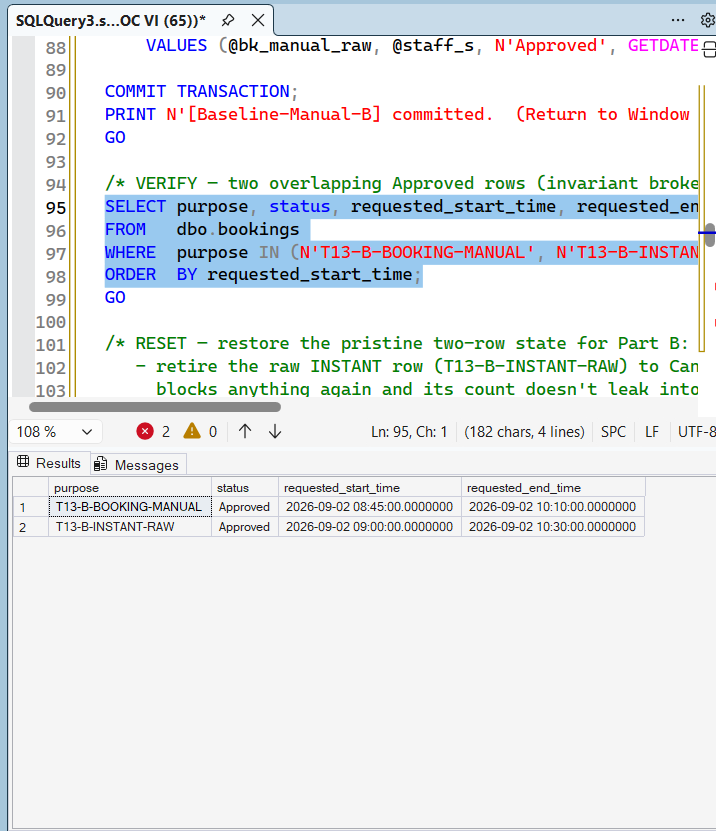

---

## Part B: Prevention (The Task 12 Fix)

**Execution:**
After resetting the manual booking to `Pending` and discarding the raw instant booking, we ran the prevention scenario using the new Task 12 stored procedures. Session A executed `usp_CreateBookingAutoApproved` (the multi-statement instant flow wrapped in a `SERIALIZABLE` transaction) and held its lock. Session B concurrently executed `usp_ApproveBooking` for the manual request. Session B correctly blocked on Session A's key-range lock. Once Session A committed, Session B evaluated the new state and correctly failed with **Error 50001: Overlapping Approved/CheckedIn booking exists for this space.**

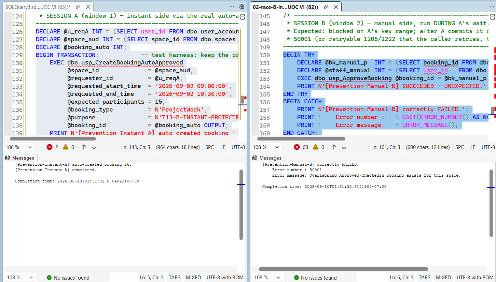

**Verification:**
The final verification confirms that the shared serialization mechanism worked flawlessly across different code paths. The instant request (`T13-B-INSTANT-PROTECTED`) was successfully `Approved`, while the overlapping manual request (`T13-B-BOOKING-MANUAL`) was safely blocked and remained in the `Pending` state. The invariant was fully preserved.

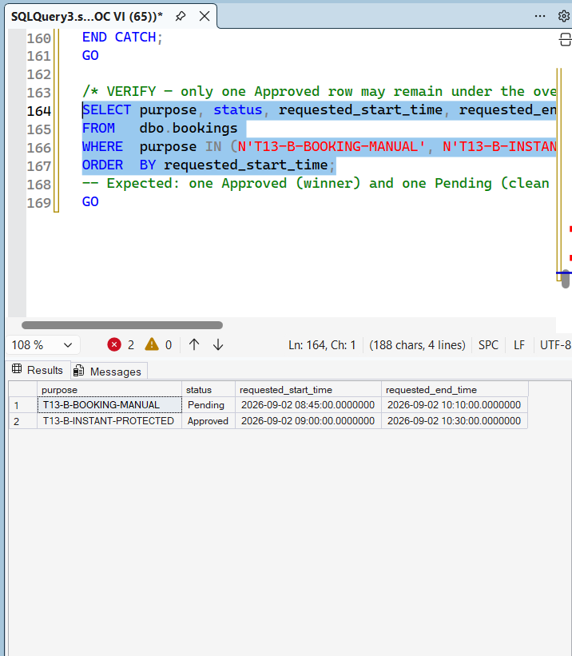

# Task 13 Concurrency Test Report: Race C (Approval vs. Maintenance Escalation)

**Test Objective:** To demonstrate the deadlock and "Missing Alert" flaws that occur when a pending booking is approved at the exact moment its space is escalated to `OutOfService`. This test verifies that the Task 12 lock-ordering rule (which forces both paths to lock the `bookings` table before `maintenance_records`) successfully serializes the transactions and guarantees staff alerts are generated.

## Part A: Baseline (The Phase 1 Flaw)

**Execution:**
We executed the scenario using the dual-window methodology under the default `READ COMMITTED` isolation level. Session A updated the booking status to `Approved` but held its transaction open using a `WAITFOR DELAY`. During this delay, Session B escalated the `Advisory` maintenance record to `OutOfService` and committed immediately. 

Because Session A had not yet committed, Session B's Phase 1 trigger viewed the booking as still `Pending` and bypassed the alert generation logic.

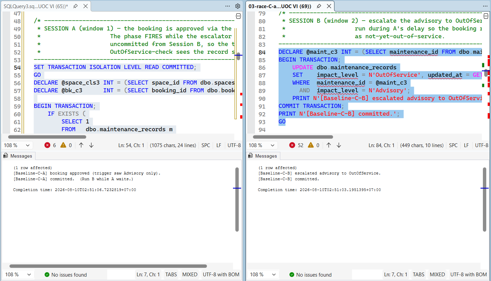

**Verification:**
As shown in the query results below, the TOCTOU flaw successfully blinded the system. The booking achieved an `Approved` status while the space was marked `OutOfService`, but **0** alerts were generated. The system allowed a user into a broken room without notifying facility staff.

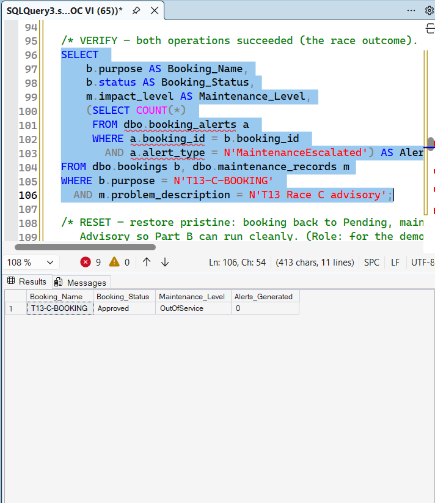

---

## Part B: Prevention (The Task 12 Fix)

**Execution:**
After resetting the test data, we executed the prevention scenario using the Task 12 stored procedures (`usp_ApproveBooking` and `usp_EscalateMaintenance`). Because both procedures strictly acquire the `bookings` key-range lock first (Contract C4), deadlocks are mathematically impossible. The system correctly resolves the race into one of two legal branches:

**Branch 1: Escalation Wins the Lock First**
If the escalation transaction reaches the lock first, the approval transaction is blocked. When the approval transaction resumes, it re-reads the state under `SERIALIZABLE` isolation, detects the new `OutOfService` status, and cleanly aborts with **Error 50002**.

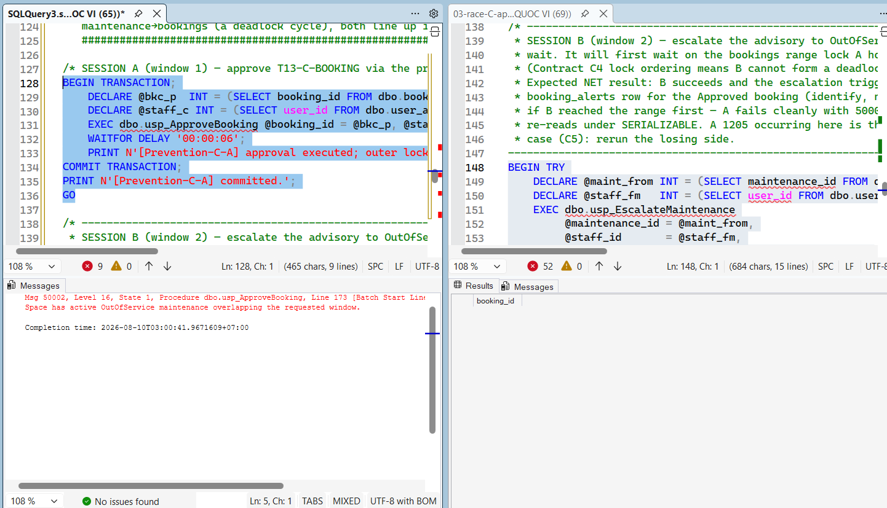

**Branch 2: Approval Wins the Lock First**
If the approval transaction (Session A) locks the range first, the escalation transaction (Session B) queues safely behind it. Once the approval commits, the escalation transaction processes the updated state and properly triggers the `MaintenanceEscalated` alert.

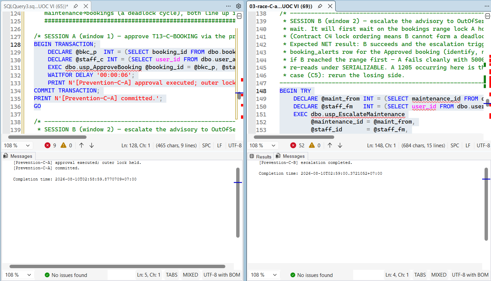

**Verification:**
The post-state verification confirms the serialization fix. The booking was safely `Approved`, and the system successfully generated the `MaintenanceEscalated` alert for `booking_id = 30`. The missing-alert flaw is completely eliminated.

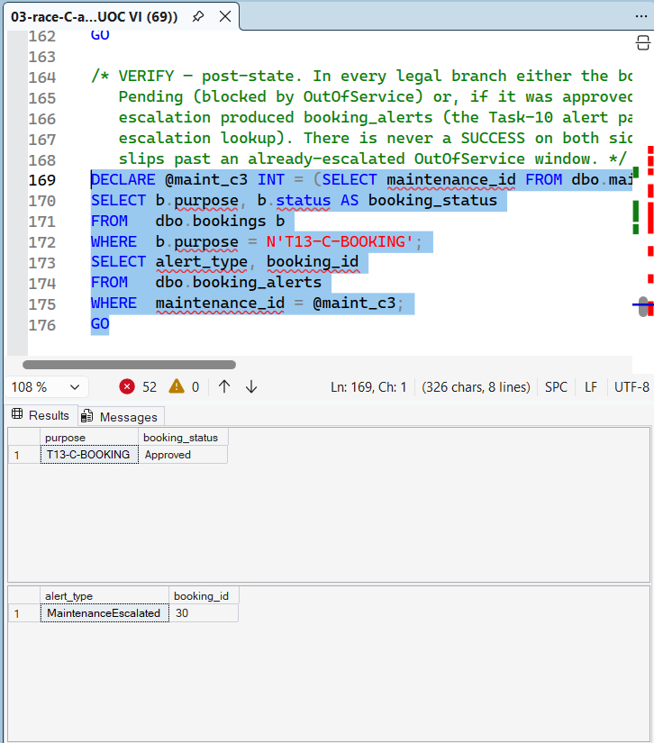

# Task 13 Concurrency Test Report: Early Check-out Verification

**Test Objective:** To verify the Phase 2 [EXTENSION] "reserved vs. actual occupancy time" behavior. This test proves the low-contention design: a booking blocks its full reserved window only while its status is `Approved` or `CheckedIn`. The instant `usp_CompleteBooking` is called (early check-out), the status flips to `Completed`, and the remaining reserved window is immediately released for new bookings without requiring background timers or triggers. 

*Note: This script (`04-early-checkout-verification.sql`) is fully self-driving in a single window and utilizes dynamic `GETDATE()` time anchors, ensuring it executes reliably on any date without hard-coded time dependencies.*

## Execution & Step-by-Step Console Output

**Execution:**
The script executed a precise, 4-step choreography to prove the status-driven concurrency filter:
1. **Step 1:** Created, approved, and checked into the primary booking (`T13-ECO-PRIMARY`) spanning a 3-hour window.
2. **Step 2:** Attempted to book a leftover gap *strictly inside* that 3-hour window. The system correctly **rejected** this request with Error 50001, proving the room is fully blocked while `CheckedIn`.
3. **Step 3:** Executed an early check-out using `usp_CompleteBooking`, immediately stamping the actual end time and flipping the status.
4. **Step 4:** Re-requested the exact same leftover gap. Because the primary booking is now `Completed`, it exited the concurrency blocking filter, and the new request was **successfully approved**.

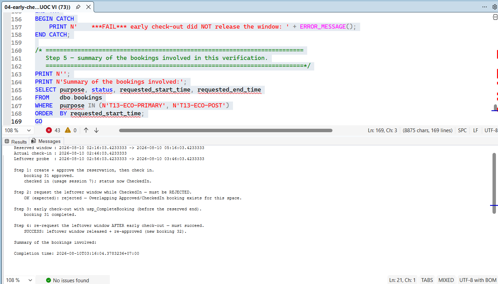

## Verification

**Verification:**
The final summary query confirms the invariant and the business rule. The primary booking (`T13-ECO-PRIMARY`) safely rests in the `Completed` state. Because of the early check-out, the secondary booking (`T13-ECO-POST`) was able to secure an `Approved` status for a time window (02:56 -> 03:46) that falls completely inside the primary booking's originally reserved time (02:16 -> 05:16). 

The status-driven concurrency design functions perfectly.

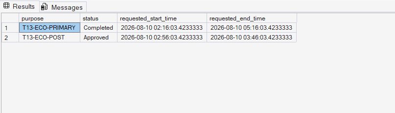